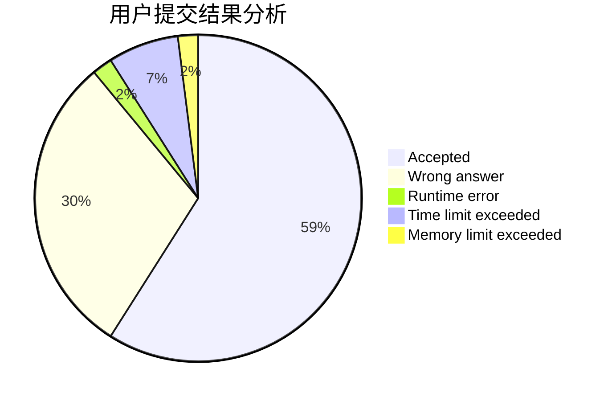
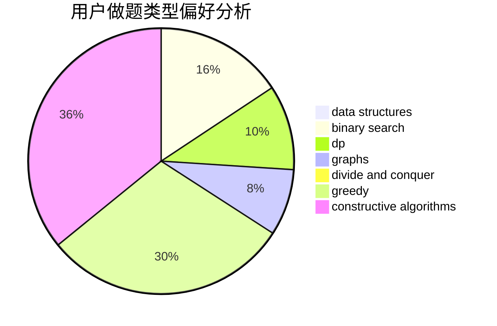
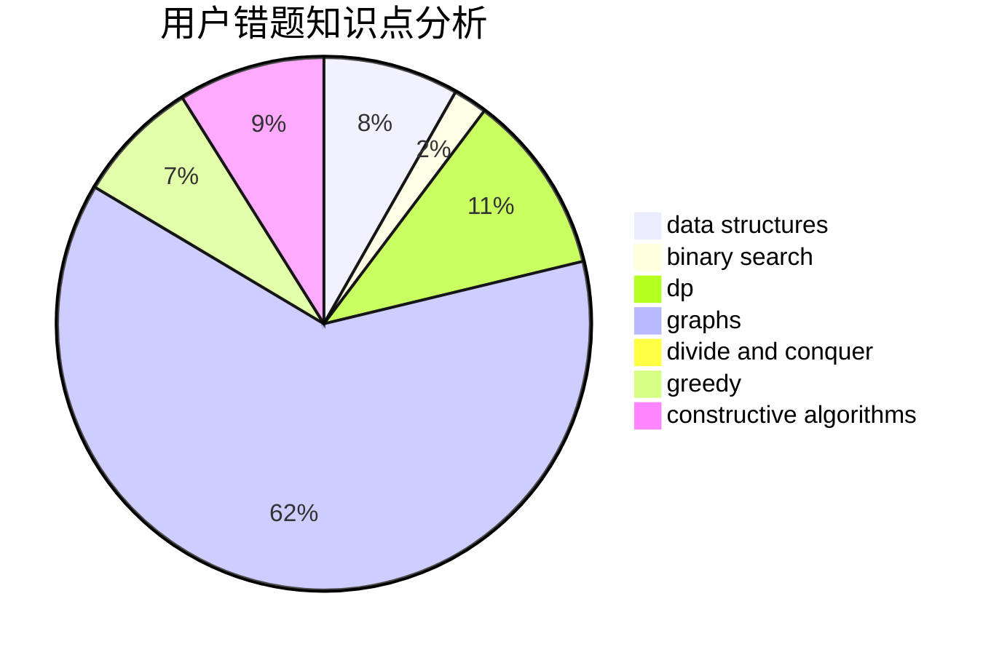

# Drice
<!-- tabs:start -->
#### **用户提交结果分析**

#### **用户做题类型偏好分析**

#### **用户错题知识点分析**

<!-- tabs:end -->
# 推荐题目
[XORwice](http://codeforces.com/problemset/problem/1421/A)		bitmasks,
                        greedy,
                        math		  
[Dreamoon and Sets](http://codeforces.com/problemset/problem/476/D)		constructive algorithms,
                        greedy,
                        math		  
[Circle Coloring](http://codeforces.com/problemset/problem/1408/A)		constructive algorithms		  
[Bricks](http://codeforces.com/problemset/problem/1404/E)		flows,
                        graph matchings,
                        graphs		  
[Excitation of Atoms](http://codeforces.com/problemset/problem/1425/E)		greedy,
                        implementation		  
[Distinguish zero state and plus state without errors](http://codeforces.com/problemset/problem/1002/C2)		nan		  
[The Closest Pair](https://codeforces.com/contest/312/problem/C)		constructive algorithms,
                        implementation		  
[Almost Regular Bracket Sequence](http://codeforces.com/problemset/problem/1095/E)		implementation		  
[A Trivial Problem](http://codeforces.com/problemset/problem/633/B)		brute force,
                        constructive algorithms,
                        math,
                        number theory		  
[Valera and Contest](http://codeforces.com/problemset/problem/369/B)		constructive algorithms,
                        implementation,
                        math		  
<!-- tabs:start -->
#### **data structures**
[Pillars](http://codeforces.com/problemset/problem/474/E)		binary search,
                        data structures,
                        dp,
                        sortings,
                        trees		  
[Range Diameter Sum](http://codeforces.com/problemset/problem/1458/F)		data structures,
                        trees		  
[Lucky Array](http://codeforces.com/problemset/problem/121/E)		data structures		  
[Cells Not Under Attack](http://codeforces.com/problemset/problem/701/B)		data structures,
                        math		  
[Package Delivery](https://codeforces.com/contest/635/problem/E)		data structures,
                        divide and conquer,
                        greedy		  
[Network Coverage](http://codeforces.com/problemset/problem/1373/F)		binary search,
                        constructive algorithms,
                        data structures,
                        greedy		  
[Mice and Holes](http://codeforces.com/problemset/problem/797/F)		data structures,
                        dp,
                        greedy,
                        sortings		  
[Searchlights](http://codeforces.com/problemset/problem/1408/D)		binary search,
                        brute force,
                        data structures,
                        dp,
                        implementation,
                        sortings,
                        two pointers		  
[Orac and LCM](http://codeforces.com/problemset/problem/1349/A)		data structures,
                        math,
                        number theory		  
[Tourists](http://codeforces.com/problemset/problem/487/E)		data structures,
                        dfs and similar,
                        graphs,
                        trees		  
#### **binary search**
[Pillars](http://codeforces.com/problemset/problem/474/E)		binary search,
                        data structures,
                        dp,
                        sortings,
                        trees		  
[Network Coverage](http://codeforces.com/problemset/problem/1373/F)		binary search,
                        constructive algorithms,
                        data structures,
                        greedy		  
[Cycles](https://codeforces.com/contest/233/problem/C)		binary search,
                        constructive algorithms,
                        graphs,
                        greedy		  
[Searchlights](http://codeforces.com/problemset/problem/1408/D)		binary search,
                        brute force,
                        data structures,
                        dp,
                        implementation,
                        sortings,
                        two pointers		  
[Rocket](http://codeforces.com/problemset/problem/1010/B)		binary search,
                        interactive		  
[Maximum width](http://codeforces.com/problemset/problem/1492/C)		binary search,
                        data structures,
                        dp,
                        greedy,
                        two pointers		  
[Pairs](http://codeforces.com/problemset/problem/1463/D)		binary search,
                        constructive algorithms,
                        greedy,
                        two pointers		  
[Old Floppy Drive](http://codeforces.com/problemset/problem/1490/G)		binary search,
                        data structures,
                        math		  
[Odd Mineral Resource](http://codeforces.com/problemset/problem/1479/D)		binary search,
                        bitmasks,
                        brute force,
                        data structures,
                        probabilities,
                        trees		  
[Complicated Computations](http://codeforces.com/problemset/problem/1436/E)		binary search,
                        data structures,
                        two pointers		  
#### **dp**
[Mahmoud and a Message](http://codeforces.com/problemset/problem/766/C)		brute force,
                        dp,
                        greedy,
                        strings		  
[Couple Cover](http://codeforces.com/problemset/problem/691/F)		brute force,
                        dp,
                        number theory		  
[Pillars](http://codeforces.com/problemset/problem/474/E)		binary search,
                        data structures,
                        dp,
                        sortings,
                        trees		  
[Mike and strings](http://codeforces.com/problemset/problem/798/B)		brute force,
                        dp,
                        strings		  
[Monsters and Potions](http://codeforces.com/problemset/problem/1070/G)		brute force,
                        dp,
                        greedy,
                        implementation		  
[Mice and Holes](http://codeforces.com/problemset/problem/797/F)		data structures,
                        dp,
                        greedy,
                        sortings		  
[To Make 1](http://codeforces.com/problemset/problem/1225/G)		bitmasks,
                        constructive algorithms,
                        dp,
                        greedy,
                        number theory		  
[Searchlights](http://codeforces.com/problemset/problem/1408/D)		binary search,
                        brute force,
                        data structures,
                        dp,
                        implementation,
                        sortings,
                        two pointers		  
[Museums Tour](http://codeforces.com/problemset/problem/1137/C)		dp,
                        graphs,
                        implementation		  
[Last minute enhancements](http://codeforces.com/problemset/problem/1466/B)		dp,
                        greedy		  
#### **graph**
[Bricks](http://codeforces.com/problemset/problem/1404/E)		flows,
                        graph matchings,
                        graphs		  
[Capitalism](http://codeforces.com/problemset/problem/1450/E)		constructive algorithms,
                        dfs and similar,
                        graphs,
                        shortest paths		  
[King Escape](http://codeforces.com/problemset/problem/1033/A)		dfs and similar,
                        graphs,
                        implementation		  
[Cycles](https://codeforces.com/contest/233/problem/C)		binary search,
                        constructive algorithms,
                        graphs,
                        greedy		  
[Tourists](http://codeforces.com/problemset/problem/487/E)		data structures,
                        dfs and similar,
                        graphs,
                        trees		  
[Museums Tour](http://codeforces.com/problemset/problem/1137/C)		dp,
                        graphs,
                        implementation		  
[Minimum Ties](http://codeforces.com/problemset/problem/1487/C)		brute force,
                        constructive algorithms,
                        dfs and similar,
                        graphs,
                        greedy,
                        implementation,
                        math		  
[Chef Monocarp](http://codeforces.com/problemset/problem/1437/C)		dp,
                        flows,
                        graph matchings,
                        greedy,
                        math,
                        sortings		  
[Strange Housing](http://codeforces.com/problemset/problem/1470/D)		constructive algorithms,
                        dfs and similar,
                        graph matchings,
                        graphs,
                        greedy		  
[Longest Simple Cycle](http://codeforces.com/problemset/problem/1476/C)		dp,
                        graphs,
                        greedy		  
#### **trees**
[Pillars](http://codeforces.com/problemset/problem/474/E)		binary search,
                        data structures,
                        dp,
                        sortings,
                        trees		  
[Range Diameter Sum](http://codeforces.com/problemset/problem/1458/F)		data structures,
                        trees		  
[Tourists](http://codeforces.com/problemset/problem/487/E)		data structures,
                        dfs and similar,
                        graphs,
                        trees		  
[Odd Mineral Resource](http://codeforces.com/problemset/problem/1479/D)		binary search,
                        bitmasks,
                        brute force,
                        data structures,
                        probabilities,
                        trees		  
[Yet Another Card Deck](http://codeforces.com/problemset/problem/1511/C)		brute force,
                        data structures,
                        implementation,
                        trees		  
[Diameter Cuts](http://codeforces.com/problemset/problem/1499/F)		combinatorics,
                        dfs and similar,
                        dp,
                        trees		  
[Fib-tree](http://codeforces.com/problemset/problem/1491/E)		brute force,
                        dfs and similar,
                        divide and conquer,
                        number theory,
                        trees		  
[13th Labour of Heracles](http://codeforces.com/problemset/problem/1466/D)		data structures,
                        greedy,
                        sortings,
                        trees		  
[BFS Trees](http://codeforces.com/problemset/problem/1495/D)		combinatorics,
                        dfs and similar,
                        graphs,
                        math,
                        shortest paths,
                        trees		  
[Sum of Prefix Sums](http://codeforces.com/problemset/problem/1303/G)		data structures,
                        divide and conquer,
                        geometry,
                        trees		  
#### **divide and conquer**
[Package Delivery](https://codeforces.com/contest/635/problem/E)		data structures,
                        divide and conquer,
                        greedy		  
[Divide and Summarize](http://codeforces.com/problemset/problem/1461/D)		binary search,
                        brute force,
                        data structures,
                        divide and conquer,
                        implementation,
                        sortings		  
[Song of the Sirens](http://codeforces.com/problemset/problem/1466/G)		combinatorics,
                        divide and conquer,
                        hashing,
                        math,
                        string suffix structures,
                        strings		  
[Permutation Transformation](http://codeforces.com/problemset/problem/1490/D)		dfs and similar,
                        divide and conquer,
                        implementation		  
[Skyline Photo](https://codeforces.com/contest/1483/problem/C)		data structures,
                        divide and conquer,
                        dp		  
[Fib-tree](http://codeforces.com/problemset/problem/1491/E)		brute force,
                        dfs and similar,
                        divide and conquer,
                        number theory,
                        trees		  
[Sum of Prefix Sums](http://codeforces.com/problemset/problem/1303/G)		data structures,
                        divide and conquer,
                        geometry,
                        trees		  
[Dogeforces](http://codeforces.com/problemset/problem/1494/D)		constructive algorithms,
                        data structures,
                        dfs and similar,
                        divide and conquer,
                        dsu,
                        greedy,
                        sortings,
                        trees		  
[Logistical Questions](http://codeforces.com/problemset/problem/566/C)		dfs and similar,
                        divide and conquer,
                        trees		  
[Fruit Sequences](http://codeforces.com/problemset/problem/1428/F)		binary search,
                        data structures,
                        divide and conquer,
                        dp,
                        two pointers		  
#### **greedy**
[Dreamoon and Sets](http://codeforces.com/problemset/problem/476/D)		constructive algorithms,
                        greedy,
                        math		  
[XORwice](http://codeforces.com/problemset/problem/1421/A)		bitmasks,
                        greedy,
                        math		  
[Excitation of Atoms](http://codeforces.com/problemset/problem/1425/E)		greedy,
                        implementation		  
[Mahmoud and a Message](http://codeforces.com/problemset/problem/766/C)		brute force,
                        dp,
                        greedy,
                        strings		  
[Accordion](http://codeforces.com/problemset/problem/1101/B)		greedy,
                        implementation		  
[Monsters and Potions](http://codeforces.com/problemset/problem/1070/G)		brute force,
                        dp,
                        greedy,
                        implementation		  
[Package Delivery](https://codeforces.com/contest/635/problem/E)		data structures,
                        divide and conquer,
                        greedy		  
[Network Coverage](http://codeforces.com/problemset/problem/1373/F)		binary search,
                        constructive algorithms,
                        data structures,
                        greedy		  
[Mice and Holes](http://codeforces.com/problemset/problem/797/F)		data structures,
                        dp,
                        greedy,
                        sortings		  
[To Make 1](http://codeforces.com/problemset/problem/1225/G)		bitmasks,
                        constructive algorithms,
                        dp,
                        greedy,
                        number theory		  
#### **constructive algorithms**
[Dreamoon and Sets](http://codeforces.com/problemset/problem/476/D)		constructive algorithms,
                        greedy,
                        math		  
[Circle Coloring](http://codeforces.com/problemset/problem/1408/A)		constructive algorithms		  
[The Closest Pair](https://codeforces.com/contest/312/problem/C)		constructive algorithms,
                        implementation		  
[A Trivial Problem](http://codeforces.com/problemset/problem/633/B)		brute force,
                        constructive algorithms,
                        math,
                        number theory		  
[Valera and Contest](http://codeforces.com/problemset/problem/369/B)		constructive algorithms,
                        implementation,
                        math		  
[Capitalism](http://codeforces.com/problemset/problem/1450/E)		constructive algorithms,
                        dfs and similar,
                        graphs,
                        shortest paths		  
[Network Coverage](http://codeforces.com/problemset/problem/1373/F)		binary search,
                        constructive algorithms,
                        data structures,
                        greedy		  
[To Make 1](http://codeforces.com/problemset/problem/1225/G)		bitmasks,
                        constructive algorithms,
                        dp,
                        greedy,
                        number theory		  
[Restore Array](http://codeforces.com/problemset/problem/1028/E)		constructive algorithms		  
[Cycles](https://codeforces.com/contest/233/problem/C)		binary search,
                        constructive algorithms,
                        graphs,
                        greedy		  
#### **sortings**
[Pillars](http://codeforces.com/problemset/problem/474/E)		binary search,
                        data structures,
                        dp,
                        sortings,
                        trees		  
[Mice and Holes](http://codeforces.com/problemset/problem/797/F)		data structures,
                        dp,
                        greedy,
                        sortings		  
[Searchlights](http://codeforces.com/problemset/problem/1408/D)		binary search,
                        brute force,
                        data structures,
                        dp,
                        implementation,
                        sortings,
                        two pointers		  
[A Simple Task](http://codeforces.com/problemset/problem/558/E)		data structures,
                        sortings,
                        strings		  
[Diamond Miner](https://codeforces.com/contest/1496/problem/C)		geometry,
                        greedy,
                        math,
                        sortings		  
[Meximization](http://codeforces.com/problemset/problem/1497/A)		brute force,
                        data structures,
                        greedy,
                        sortings		  
[Avoiding Zero](http://codeforces.com/problemset/problem/1427/A)		math,
                        sortings		  
[Divide and Summarize](http://codeforces.com/problemset/problem/1461/D)		binary search,
                        brute force,
                        data structures,
                        divide and conquer,
                        implementation,
                        sortings		  
[Chef Monocarp](http://codeforces.com/problemset/problem/1437/C)		dp,
                        flows,
                        graph matchings,
                        greedy,
                        math,
                        sortings		  
[Replacing Elements](http://codeforces.com/problemset/problem/1473/A)		greedy,
                        implementation,
                        math,
                        sortings		  
<!-- tabs:end -->
