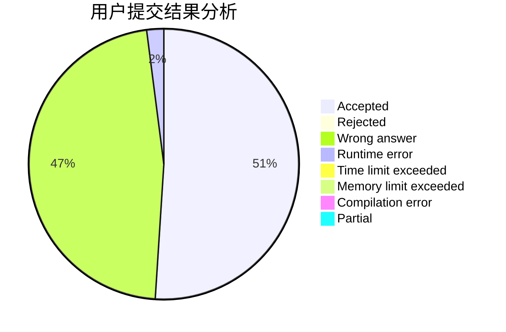
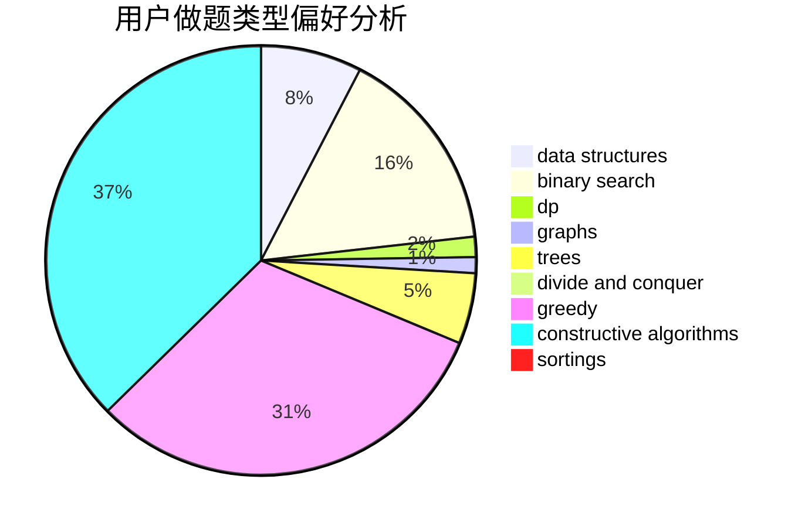
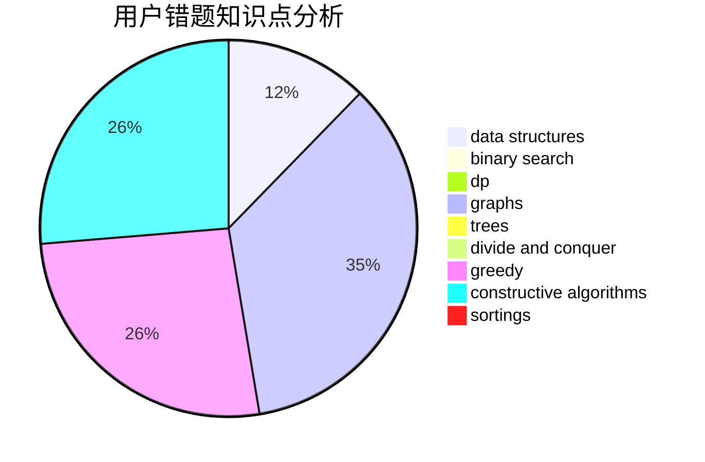

# DrumWashingMachine
<!-- tabs:start -->
#### **用户提交结果分析**

#### **用户做题类型偏好分析**

#### **用户错题知识点分析**

<!-- tabs:end -->
# 推荐题目
[1380B](http://codeforces.com/problemset/problem/1380/B)		greedy		  
[798C](http://codeforces.com/problemset/problem/798/C)		dp,
                        greedy,
                        number theory		  
[1082F](http://codeforces.com/problemset/problem/1082/F)		dp,
                        strings,
                        trees		  
[492C](http://codeforces.com/problemset/problem/492/C)		greedy,
                        sortings		  
[1099D](https://codeforces.com/contest/1099/problem/D)		constructive algorithms,
                        dfs and similar,
                        greedy,
                        trees		  
[621C](http://codeforces.com/problemset/problem/621/C)		combinatorics,
                        math,
                        number theory,
                        probabilities		  
[697B](http://codeforces.com/problemset/problem/697/B)		brute force,
                        implementation,
                        math,
                        strings		  
[18C](http://codeforces.com/problemset/problem/18/C)		data structures,
                        implementation		  
[367C](http://codeforces.com/problemset/problem/367/C)		graphs,
                        greedy,
                        sortings		  
[722C](http://codeforces.com/problemset/problem/722/C)		data structures,
                        dsu		  
<!-- tabs:start -->
#### **data structures**
[18C](http://codeforces.com/problemset/problem/18/C)		data structures,
                        implementation		  
[722C](http://codeforces.com/problemset/problem/722/C)		data structures,
                        dsu		  
[1140G](http://codeforces.com/problemset/problem/1140/G)		data structures,
                        divide and conquer,
                        shortest paths,
                        trees		  
[1447F1](https://codeforces.com/contest/1447/problem/F1)		data structures,
                        greedy		  
[798E](http://codeforces.com/problemset/problem/798/E)		constructive algorithms,
                        data structures,
                        graphs,
                        sortings		  
[696D](http://codeforces.com/problemset/problem/696/D)		data structures,
                        dp,
                        matrices,
                        strings		  
[547B](http://codeforces.com/problemset/problem/547/B)		binary search,
                        data structures,
                        dp,
                        dsu		  
[343D](http://codeforces.com/problemset/problem/343/D)		data structures,
                        dfs and similar,
                        graphs,
                        trees		  
[459D](http://codeforces.com/problemset/problem/459/D)		data structures,
                        divide and conquer,
                        sortings		  
[1073G](http://codeforces.com/problemset/problem/1073/G)		data structures,
                        string suffix structures		  
#### **binary search**
[1345F](https://codeforces.com/contest/1345/problem/F)		binary search,
                        greedy,
                        math		  
[715B](http://codeforces.com/problemset/problem/715/B)		binary search,
                        constructive algorithms,
                        graphs,
                        shortest paths		  
[547B](http://codeforces.com/problemset/problem/547/B)		binary search,
                        data structures,
                        dp,
                        dsu		  
[1492C](http://codeforces.com/problemset/problem/1492/C)		binary search,
                        data structures,
                        dp,
                        greedy,
                        two pointers		  
[1463D](http://codeforces.com/problemset/problem/1463/D)		binary search,
                        constructive algorithms,
                        greedy,
                        two pointers		  
[1490G](http://codeforces.com/problemset/problem/1490/G)		binary search,
                        data structures,
                        math		  
[1479D](http://codeforces.com/problemset/problem/1479/D)		binary search,
                        bitmasks,
                        brute force,
                        data structures,
                        probabilities,
                        trees		  
[1436E](http://codeforces.com/problemset/problem/1436/E)		binary search,
                        data structures,
                        two pointers		  
[1461D](http://codeforces.com/problemset/problem/1461/D)		binary search,
                        brute force,
                        data structures,
                        divide and conquer,
                        implementation,
                        sortings		  
[1493C](http://codeforces.com/problemset/problem/1493/C)		binary search,
                        brute force,
                        constructive algorithms,
                        greedy,
                        strings		  
#### **dp**
[798C](http://codeforces.com/problemset/problem/798/C)		dp,
                        greedy,
                        number theory		  
[1082F](http://codeforces.com/problemset/problem/1082/F)		dp,
                        strings,
                        trees		  
[1367F1](http://codeforces.com/problemset/problem/1367/F1)		dp,
                        greedy,
                        two pointers		  
[696D](http://codeforces.com/problemset/problem/696/D)		data structures,
                        dp,
                        matrices,
                        strings		  
[1444D](http://codeforces.com/problemset/problem/1444/D)		constructive algorithms,
                        dp,
                        geometry		  
[547B](http://codeforces.com/problemset/problem/547/B)		binary search,
                        data structures,
                        dp,
                        dsu		  
[1295C](http://codeforces.com/problemset/problem/1295/C)		dp,
                        greedy,
                        strings		  
[295D](http://codeforces.com/problemset/problem/295/D)		combinatorics,
                        dp		  
[1108D](http://codeforces.com/problemset/problem/1108/D)		constructive algorithms,
                        dp,
                        greedy		  
[730J](http://codeforces.com/problemset/problem/730/J)		dp		  
#### **graph**
[367C](http://codeforces.com/problemset/problem/367/C)		graphs,
                        greedy,
                        sortings		  
[798E](http://codeforces.com/problemset/problem/798/E)		constructive algorithms,
                        data structures,
                        graphs,
                        sortings		  
[715B](http://codeforces.com/problemset/problem/715/B)		binary search,
                        constructive algorithms,
                        graphs,
                        shortest paths		  
[343D](http://codeforces.com/problemset/problem/343/D)		data structures,
                        dfs and similar,
                        graphs,
                        trees		  
[580C](http://codeforces.com/problemset/problem/580/C)		dfs and similar,
                        graphs,
                        trees		  
[487E](http://codeforces.com/problemset/problem/487/E)		data structures,
                        dfs and similar,
                        graphs,
                        trees		  
[1487C](http://codeforces.com/problemset/problem/1487/C)		brute force,
                        constructive algorithms,
                        dfs and similar,
                        graphs,
                        greedy,
                        implementation,
                        math		  
[1437C](http://codeforces.com/problemset/problem/1437/C)		dp,
                        flows,
                        graph matchings,
                        greedy,
                        math,
                        sortings		  
[1470D](http://codeforces.com/problemset/problem/1470/D)		constructive algorithms,
                        dfs and similar,
                        graph matchings,
                        graphs,
                        greedy		  
[1476C](http://codeforces.com/problemset/problem/1476/C)		dp,
                        graphs,
                        greedy		  
#### **trees**
[1082F](http://codeforces.com/problemset/problem/1082/F)		dp,
                        strings,
                        trees		  
[1099D](https://codeforces.com/contest/1099/problem/D)		constructive algorithms,
                        dfs and similar,
                        greedy,
                        trees		  
[1140G](http://codeforces.com/problemset/problem/1140/G)		data structures,
                        divide and conquer,
                        shortest paths,
                        trees		  
[343D](http://codeforces.com/problemset/problem/343/D)		data structures,
                        dfs and similar,
                        graphs,
                        trees		  
[580C](http://codeforces.com/problemset/problem/580/C)		dfs and similar,
                        graphs,
                        trees		  
[487E](http://codeforces.com/problemset/problem/487/E)		data structures,
                        dfs and similar,
                        graphs,
                        trees		  
[1479D](http://codeforces.com/problemset/problem/1479/D)		binary search,
                        bitmasks,
                        brute force,
                        data structures,
                        probabilities,
                        trees		  
[1511C](http://codeforces.com/problemset/problem/1511/C)		brute force,
                        data structures,
                        implementation,
                        trees		  
[1499F](http://codeforces.com/problemset/problem/1499/F)		combinatorics,
                        dfs and similar,
                        dp,
                        trees		  
[1491E](http://codeforces.com/problemset/problem/1491/E)		brute force,
                        dfs and similar,
                        divide and conquer,
                        number theory,
                        trees		  
#### **divide and conquer**
[1140G](http://codeforces.com/problemset/problem/1140/G)		data structures,
                        divide and conquer,
                        shortest paths,
                        trees		  
[459D](http://codeforces.com/problemset/problem/459/D)		data structures,
                        divide and conquer,
                        sortings		  
[1461D](http://codeforces.com/problemset/problem/1461/D)		binary search,
                        brute force,
                        data structures,
                        divide and conquer,
                        implementation,
                        sortings		  
[1466G](http://codeforces.com/problemset/problem/1466/G)		combinatorics,
                        divide and conquer,
                        hashing,
                        math,
                        string suffix structures,
                        strings		  
[1490D](http://codeforces.com/problemset/problem/1490/D)		dfs and similar,
                        divide and conquer,
                        implementation		  
[1483C](https://codeforces.com/contest/1483/problem/C)		data structures,
                        divide and conquer,
                        dp		  
[1491E](http://codeforces.com/problemset/problem/1491/E)		brute force,
                        dfs and similar,
                        divide and conquer,
                        number theory,
                        trees		  
[1303G](http://codeforces.com/problemset/problem/1303/G)		data structures,
                        divide and conquer,
                        geometry,
                        trees		  
[1494D](http://codeforces.com/problemset/problem/1494/D)		constructive algorithms,
                        data structures,
                        dfs and similar,
                        divide and conquer,
                        dsu,
                        greedy,
                        sortings,
                        trees		  
[1482E](http://codeforces.com/problemset/problem/1482/E)		data structures,
                        divide and conquer,
                        dp		  
#### **greedy**
[1380B](http://codeforces.com/problemset/problem/1380/B)		greedy		  
[798C](http://codeforces.com/problemset/problem/798/C)		dp,
                        greedy,
                        number theory		  
[492C](http://codeforces.com/problemset/problem/492/C)		greedy,
                        sortings		  
[1099D](https://codeforces.com/contest/1099/problem/D)		constructive algorithms,
                        dfs and similar,
                        greedy,
                        trees		  
[367C](http://codeforces.com/problemset/problem/367/C)		graphs,
                        greedy,
                        sortings		  
[1447F1](https://codeforces.com/contest/1447/problem/F1)		data structures,
                        greedy		  
[1345F](https://codeforces.com/contest/1345/problem/F)		binary search,
                        greedy,
                        math		  
[1367F1](http://codeforces.com/problemset/problem/1367/F1)		dp,
                        greedy,
                        two pointers		  
[1295C](http://codeforces.com/problemset/problem/1295/C)		dp,
                        greedy,
                        strings		  
[1203F1](http://codeforces.com/problemset/problem/1203/F1)		greedy		  
#### **constructive algorithms**
[1099D](https://codeforces.com/contest/1099/problem/D)		constructive algorithms,
                        dfs and similar,
                        greedy,
                        trees		  
[798E](http://codeforces.com/problemset/problem/798/E)		constructive algorithms,
                        data structures,
                        graphs,
                        sortings		  
[798D](http://codeforces.com/problemset/problem/798/D)		constructive algorithms,
                        sortings		  
[715B](http://codeforces.com/problemset/problem/715/B)		binary search,
                        constructive algorithms,
                        graphs,
                        shortest paths		  
[1444D](http://codeforces.com/problemset/problem/1444/D)		constructive algorithms,
                        dp,
                        geometry		  
[1108D](http://codeforces.com/problemset/problem/1108/D)		constructive algorithms,
                        dp,
                        greedy		  
[1493A](http://codeforces.com/problemset/problem/1493/A)		constructive algorithms,
                        greedy		  
[1463D](http://codeforces.com/problemset/problem/1463/D)		binary search,
                        constructive algorithms,
                        greedy,
                        two pointers		  
[1456B](https://codeforces.com/contest/1456/problem/B)		bitmasks,
                        brute force,
                        constructive algorithms		  
[1492D](http://codeforces.com/problemset/problem/1492/D)		bitmasks,
                        constructive algorithms,
                        greedy,
                        math		  
#### **sortings**
[492C](http://codeforces.com/problemset/problem/492/C)		greedy,
                        sortings		  
[367C](http://codeforces.com/problemset/problem/367/C)		graphs,
                        greedy,
                        sortings		  
[798E](http://codeforces.com/problemset/problem/798/E)		constructive algorithms,
                        data structures,
                        graphs,
                        sortings		  
[798D](http://codeforces.com/problemset/problem/798/D)		constructive algorithms,
                        sortings		  
[459D](http://codeforces.com/problemset/problem/459/D)		data structures,
                        divide and conquer,
                        sortings		  
[1493D](http://codeforces.com/problemset/problem/1493/D)		brute force,
                        data structures,
                        hashing,
                        implementation,
                        math,
                        number theory,
                        sortings,
                        two pointers		  
[1496C](https://codeforces.com/contest/1496/problem/C)		geometry,
                        greedy,
                        math,
                        sortings		  
[1495A](http://codeforces.com/problemset/problem/1495/A)		geometry,
                        greedy,
                        math,
                        sortings		  
[1497A](http://codeforces.com/problemset/problem/1497/A)		brute force,
                        data structures,
                        greedy,
                        sortings		  
[1427A](http://codeforces.com/problemset/problem/1427/A)		math,
                        sortings		  
<!-- tabs:end -->
