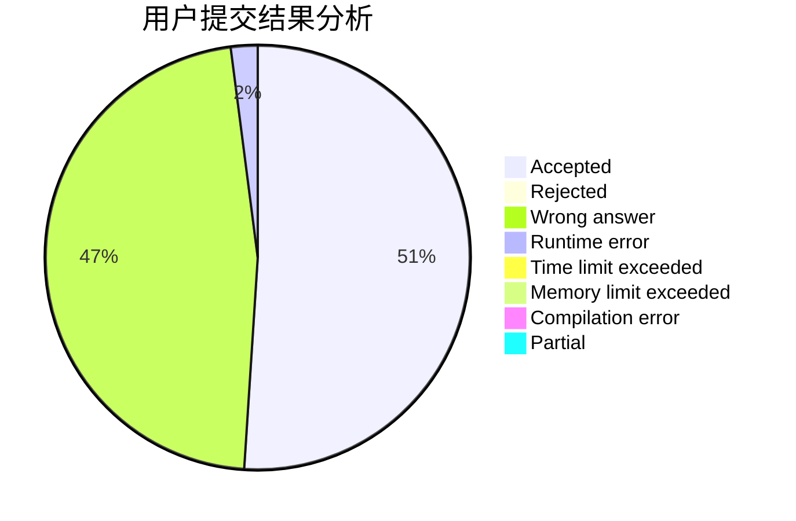
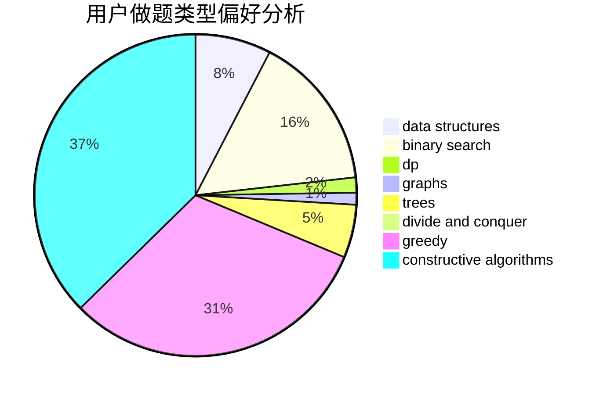
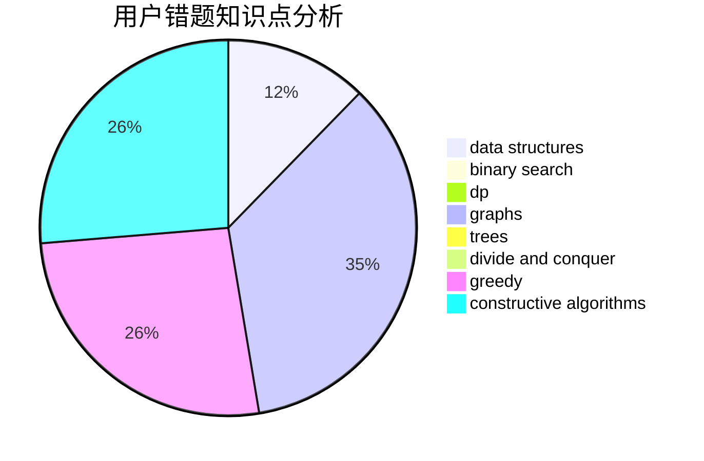

# DrumWashingMachine
<!-- tabs:start -->
#### **用户提交结果分析**

#### **用户做题类型偏好分析**

#### **用户错题知识点分析**

<!-- tabs:end -->
# 推荐题目
[Universal Solution](http://codeforces.com/problemset/problem/1380/B)		greedy		  
[Mike and gcd problem](http://codeforces.com/problemset/problem/798/C)		dp,
                        greedy,
                        number theory		  
[Speed Dial](http://codeforces.com/problemset/problem/1082/F)		dp,
                        strings,
                        trees		  
[Vanya and Exams](http://codeforces.com/problemset/problem/492/C)		greedy,
                        sortings		  
[Sum in the tree](https://codeforces.com/contest/1099/problem/D)		constructive algorithms,
                        dfs and similar,
                        greedy,
                        trees		  
[Wet Shark and Flowers](http://codeforces.com/problemset/problem/621/C)		combinatorics,
                        math,
                        number theory,
                        probabilities		  
[Barnicle](http://codeforces.com/problemset/problem/697/B)		brute force,
                        implementation,
                        math,
                        strings		  
[Stripe](http://codeforces.com/problemset/problem/18/C)		data structures,
                        implementation		  
[Sereja and the Arrangement of Numbers](http://codeforces.com/problemset/problem/367/C)		graphs,
                        greedy,
                        sortings		  
[Destroying Array](http://codeforces.com/problemset/problem/722/C)		data structures,
                        dsu		  
<!-- tabs:start -->
#### **data structures**
[Stripe](http://codeforces.com/problemset/problem/18/C)		data structures,
                        implementation		  
[Destroying Array](http://codeforces.com/problemset/problem/722/C)		data structures,
                        dsu		  
[Double Tree](http://codeforces.com/problemset/problem/1140/G)		data structures,
                        divide and conquer,
                        shortest paths,
                        trees		  
[Frequency Problem (Easy Version)](https://codeforces.com/contest/1447/problem/F1)		data structures,
                        greedy		  
[Mike and code of a permutation](http://codeforces.com/problemset/problem/798/E)		constructive algorithms,
                        data structures,
                        graphs,
                        sortings		  
[Legen...](http://codeforces.com/problemset/problem/696/D)		data structures,
                        dp,
                        matrices,
                        strings		  
[Mike and Feet](http://codeforces.com/problemset/problem/547/B)		binary search,
                        data structures,
                        dp,
                        dsu		  
[Water Tree](http://codeforces.com/problemset/problem/343/D)		data structures,
                        dfs and similar,
                        graphs,
                        trees		  
[Pashmak and Parmida's problem](http://codeforces.com/problemset/problem/459/D)		data structures,
                        divide and conquer,
                        sortings		  
[Yet Another LCP Problem](http://codeforces.com/problemset/problem/1073/G)		data structures,
                        string suffix structures		  
#### **binary search**
[Résumé Review](https://codeforces.com/contest/1345/problem/F)		binary search,
                        greedy,
                        math		  
[Complete The Graph](http://codeforces.com/problemset/problem/715/B)		binary search,
                        constructive algorithms,
                        graphs,
                        shortest paths		  
[Mike and Feet](http://codeforces.com/problemset/problem/547/B)		binary search,
                        data structures,
                        dp,
                        dsu		  
[Maximum width](http://codeforces.com/problemset/problem/1492/C)		binary search,
                        data structures,
                        dp,
                        greedy,
                        two pointers		  
[Pairs](http://codeforces.com/problemset/problem/1463/D)		binary search,
                        constructive algorithms,
                        greedy,
                        two pointers		  
[Old Floppy Drive](http://codeforces.com/problemset/problem/1490/G)		binary search,
                        data structures,
                        math		  
[Odd Mineral Resource](http://codeforces.com/problemset/problem/1479/D)		binary search,
                        bitmasks,
                        brute force,
                        data structures,
                        probabilities,
                        trees		  
[Complicated Computations](http://codeforces.com/problemset/problem/1436/E)		binary search,
                        data structures,
                        two pointers		  
[Divide and Summarize](http://codeforces.com/problemset/problem/1461/D)		binary search,
                        brute force,
                        data structures,
                        divide and conquer,
                        implementation,
                        sortings		  
[K-beautiful Strings](http://codeforces.com/problemset/problem/1493/C)		binary search,
                        brute force,
                        constructive algorithms,
                        greedy,
                        strings		  
#### **dp**
[Mike and gcd problem](http://codeforces.com/problemset/problem/798/C)		dp,
                        greedy,
                        number theory		  
[Speed Dial](http://codeforces.com/problemset/problem/1082/F)		dp,
                        strings,
                        trees		  
[Flying Sort (Easy Version)](http://codeforces.com/problemset/problem/1367/F1)		dp,
                        greedy,
                        two pointers		  
[Legen...](http://codeforces.com/problemset/problem/696/D)		data structures,
                        dp,
                        matrices,
                        strings		  
[Rectangular Polyline](http://codeforces.com/problemset/problem/1444/D)		constructive algorithms,
                        dp,
                        geometry		  
[Mike and Feet](http://codeforces.com/problemset/problem/547/B)		binary search,
                        data structures,
                        dp,
                        dsu		  
[Obtain The String](http://codeforces.com/problemset/problem/1295/C)		dp,
                        greedy,
                        strings		  
[Greg and Caves](http://codeforces.com/problemset/problem/295/D)		combinatorics,
                        dp		  
[Diverse Garland](http://codeforces.com/problemset/problem/1108/D)		constructive algorithms,
                        dp,
                        greedy		  
[Bottles](http://codeforces.com/problemset/problem/730/J)		dp		  
#### **graph**
[Sereja and the Arrangement of Numbers](http://codeforces.com/problemset/problem/367/C)		graphs,
                        greedy,
                        sortings		  
[Mike and code of a permutation](http://codeforces.com/problemset/problem/798/E)		constructive algorithms,
                        data structures,
                        graphs,
                        sortings		  
[Complete The Graph](http://codeforces.com/problemset/problem/715/B)		binary search,
                        constructive algorithms,
                        graphs,
                        shortest paths		  
[Water Tree](http://codeforces.com/problemset/problem/343/D)		data structures,
                        dfs and similar,
                        graphs,
                        trees		  
[Kefa and Park](http://codeforces.com/problemset/problem/580/C)		dfs and similar,
                        graphs,
                        trees		  
[Tourists](http://codeforces.com/problemset/problem/487/E)		data structures,
                        dfs and similar,
                        graphs,
                        trees		  
[Minimum Ties](http://codeforces.com/problemset/problem/1487/C)		brute force,
                        constructive algorithms,
                        dfs and similar,
                        graphs,
                        greedy,
                        implementation,
                        math		  
[Chef Monocarp](http://codeforces.com/problemset/problem/1437/C)		dp,
                        flows,
                        graph matchings,
                        greedy,
                        math,
                        sortings		  
[Strange Housing](http://codeforces.com/problemset/problem/1470/D)		constructive algorithms,
                        dfs and similar,
                        graph matchings,
                        graphs,
                        greedy		  
[Longest Simple Cycle](http://codeforces.com/problemset/problem/1476/C)		dp,
                        graphs,
                        greedy		  
#### **trees**
[Speed Dial](http://codeforces.com/problemset/problem/1082/F)		dp,
                        strings,
                        trees		  
[Sum in the tree](https://codeforces.com/contest/1099/problem/D)		constructive algorithms,
                        dfs and similar,
                        greedy,
                        trees		  
[Double Tree](http://codeforces.com/problemset/problem/1140/G)		data structures,
                        divide and conquer,
                        shortest paths,
                        trees		  
[Water Tree](http://codeforces.com/problemset/problem/343/D)		data structures,
                        dfs and similar,
                        graphs,
                        trees		  
[Kefa and Park](http://codeforces.com/problemset/problem/580/C)		dfs and similar,
                        graphs,
                        trees		  
[Tourists](http://codeforces.com/problemset/problem/487/E)		data structures,
                        dfs and similar,
                        graphs,
                        trees		  
[Odd Mineral Resource](http://codeforces.com/problemset/problem/1479/D)		binary search,
                        bitmasks,
                        brute force,
                        data structures,
                        probabilities,
                        trees		  
[Yet Another Card Deck](http://codeforces.com/problemset/problem/1511/C)		brute force,
                        data structures,
                        implementation,
                        trees		  
[Diameter Cuts](http://codeforces.com/problemset/problem/1499/F)		combinatorics,
                        dfs and similar,
                        dp,
                        trees		  
[Fib-tree](http://codeforces.com/problemset/problem/1491/E)		brute force,
                        dfs and similar,
                        divide and conquer,
                        number theory,
                        trees		  
#### **divide and conquer**
[Double Tree](http://codeforces.com/problemset/problem/1140/G)		data structures,
                        divide and conquer,
                        shortest paths,
                        trees		  
[Pashmak and Parmida's problem](http://codeforces.com/problemset/problem/459/D)		data structures,
                        divide and conquer,
                        sortings		  
[Divide and Summarize](http://codeforces.com/problemset/problem/1461/D)		binary search,
                        brute force,
                        data structures,
                        divide and conquer,
                        implementation,
                        sortings		  
[Song of the Sirens](http://codeforces.com/problemset/problem/1466/G)		combinatorics,
                        divide and conquer,
                        hashing,
                        math,
                        string suffix structures,
                        strings		  
[Permutation Transformation](http://codeforces.com/problemset/problem/1490/D)		dfs and similar,
                        divide and conquer,
                        implementation		  
[Skyline Photo](https://codeforces.com/contest/1483/problem/C)		data structures,
                        divide and conquer,
                        dp		  
[Fib-tree](http://codeforces.com/problemset/problem/1491/E)		brute force,
                        dfs and similar,
                        divide and conquer,
                        number theory,
                        trees		  
[Sum of Prefix Sums](http://codeforces.com/problemset/problem/1303/G)		data structures,
                        divide and conquer,
                        geometry,
                        trees		  
[Dogeforces](http://codeforces.com/problemset/problem/1494/D)		constructive algorithms,
                        data structures,
                        dfs and similar,
                        divide and conquer,
                        dsu,
                        greedy,
                        sortings,
                        trees		  
[Skyline Photo](http://codeforces.com/problemset/problem/1482/E)		data structures,
                        divide and conquer,
                        dp		  
#### **greedy**
[Universal Solution](http://codeforces.com/problemset/problem/1380/B)		greedy		  
[Mike and gcd problem](http://codeforces.com/problemset/problem/798/C)		dp,
                        greedy,
                        number theory		  
[Vanya and Exams](http://codeforces.com/problemset/problem/492/C)		greedy,
                        sortings		  
[Sum in the tree](https://codeforces.com/contest/1099/problem/D)		constructive algorithms,
                        dfs and similar,
                        greedy,
                        trees		  
[Sereja and the Arrangement of Numbers](http://codeforces.com/problemset/problem/367/C)		graphs,
                        greedy,
                        sortings		  
[Frequency Problem (Easy Version)](https://codeforces.com/contest/1447/problem/F1)		data structures,
                        greedy		  
[Résumé Review](https://codeforces.com/contest/1345/problem/F)		binary search,
                        greedy,
                        math		  
[Flying Sort (Easy Version)](http://codeforces.com/problemset/problem/1367/F1)		dp,
                        greedy,
                        two pointers		  
[Obtain The String](http://codeforces.com/problemset/problem/1295/C)		dp,
                        greedy,
                        strings		  
[Complete the Projects (easy version)](http://codeforces.com/problemset/problem/1203/F1)		greedy		  
#### **constructive algorithms**
[Sum in the tree](https://codeforces.com/contest/1099/problem/D)		constructive algorithms,
                        dfs and similar,
                        greedy,
                        trees		  
[Mike and code of a permutation](http://codeforces.com/problemset/problem/798/E)		constructive algorithms,
                        data structures,
                        graphs,
                        sortings		  
[Mike and distribution](http://codeforces.com/problemset/problem/798/D)		constructive algorithms,
                        sortings		  
[Complete The Graph](http://codeforces.com/problemset/problem/715/B)		binary search,
                        constructive algorithms,
                        graphs,
                        shortest paths		  
[Rectangular Polyline](http://codeforces.com/problemset/problem/1444/D)		constructive algorithms,
                        dp,
                        geometry		  
[Diverse Garland](http://codeforces.com/problemset/problem/1108/D)		constructive algorithms,
                        dp,
                        greedy		  
[Anti-knapsack](http://codeforces.com/problemset/problem/1493/A)		constructive algorithms,
                        greedy		  
[Pairs](http://codeforces.com/problemset/problem/1463/D)		binary search,
                        constructive algorithms,
                        greedy,
                        two pointers		  
[XOR-gun](https://codeforces.com/contest/1456/problem/B)		bitmasks,
                        brute force,
                        constructive algorithms		  
[Genius's Gambit](http://codeforces.com/problemset/problem/1492/D)		bitmasks,
                        constructive algorithms,
                        greedy,
                        math		  
#### **sortings**
[Vanya and Exams](http://codeforces.com/problemset/problem/492/C)		greedy,
                        sortings		  
[Sereja and the Arrangement of Numbers](http://codeforces.com/problemset/problem/367/C)		graphs,
                        greedy,
                        sortings		  
[Mike and code of a permutation](http://codeforces.com/problemset/problem/798/E)		constructive algorithms,
                        data structures,
                        graphs,
                        sortings		  
[Mike and distribution](http://codeforces.com/problemset/problem/798/D)		constructive algorithms,
                        sortings		  
[Pashmak and Parmida's problem](http://codeforces.com/problemset/problem/459/D)		data structures,
                        divide and conquer,
                        sortings		  
[GCD of an Array](http://codeforces.com/problemset/problem/1493/D)		brute force,
                        data structures,
                        hashing,
                        implementation,
                        math,
                        number theory,
                        sortings,
                        two pointers		  
[Diamond Miner](https://codeforces.com/contest/1496/problem/C)		geometry,
                        greedy,
                        math,
                        sortings		  
[Diamond Miner](http://codeforces.com/problemset/problem/1495/A)		geometry,
                        greedy,
                        math,
                        sortings		  
[Meximization](http://codeforces.com/problemset/problem/1497/A)		brute force,
                        data structures,
                        greedy,
                        sortings		  
[Avoiding Zero](http://codeforces.com/problemset/problem/1427/A)		math,
                        sortings		  
<!-- tabs:end -->
