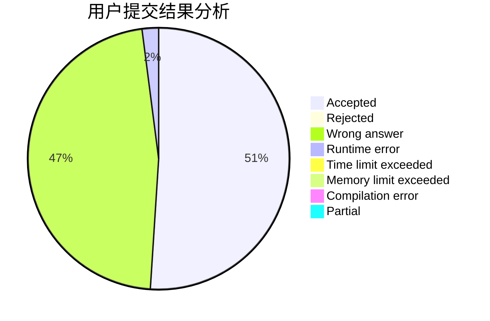
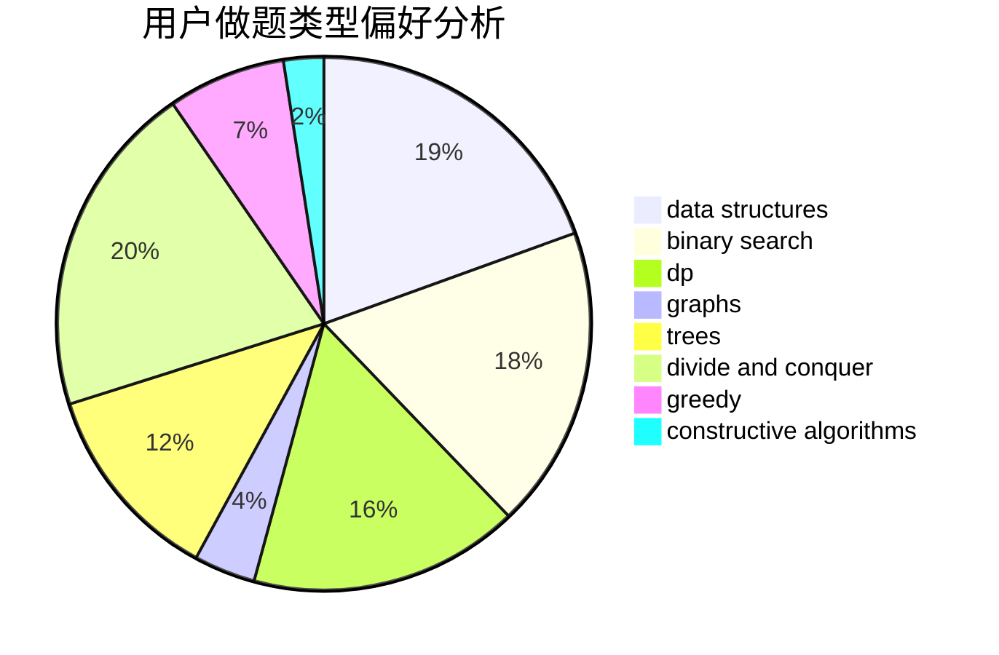
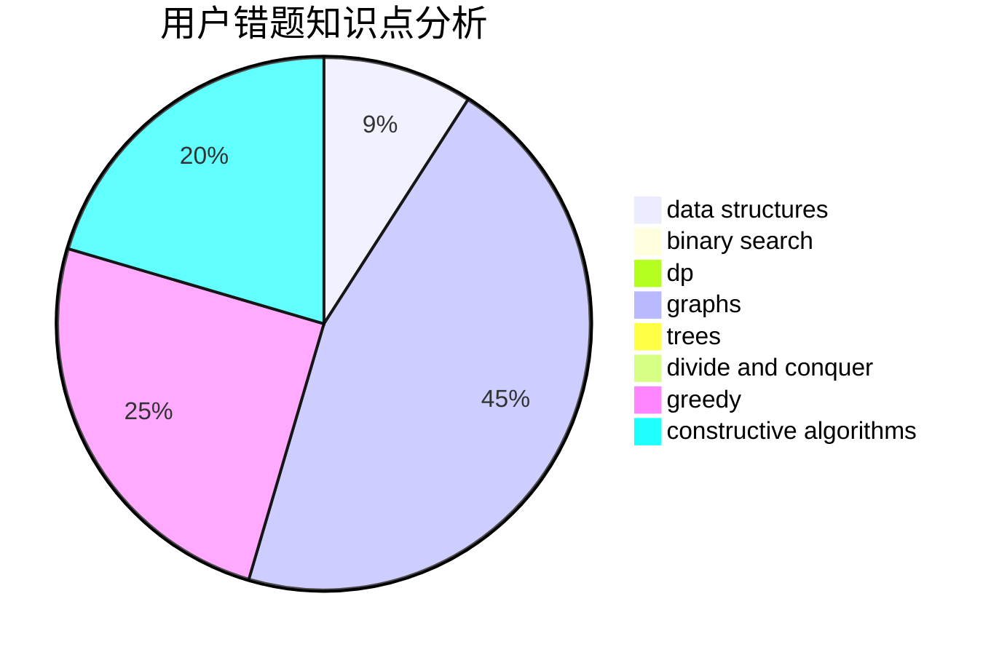

# DrumWashingMachine

<!-- tabs:start -->

#### **用户提交结果分析**

#### **用户做题类型偏好分析**

#### **用户错题知识点分析**

<!-- tabs:end -->
# 推荐题目
[1389E](https://codeforces.com/contest/1389/problem/E)		math,
                        number theory		  
[109A](https://codeforces.com/contest/109/problem/A)		brute force,
                        implementation		  
[1208D](https://codeforces.com/contest/1208/problem/D)		binary search,
                        data structures,
                        greedy,
                        implementation		  
[739D](https://codeforces.com/contest/739/problem/D)		graph matchings		  
[1083B](https://codeforces.com/contest/1083/problem/B)		greedy,
                        strings		  
[713E](https://codeforces.com/contest/713/problem/E)		binary search,
                        dp		  
[733D](https://codeforces.com/contest/733/problem/D)		data structures,
                        hashing		  
[812C](https://codeforces.com/contest/812/problem/C)		binary search,
                        sortings		  
[749A](https://codeforces.com/contest/749/problem/A)		greedy,
                        implementation,
                        math,
                        number theory		  
[813B](https://codeforces.com/contest/813/problem/B)		brute force,
                        math		  
