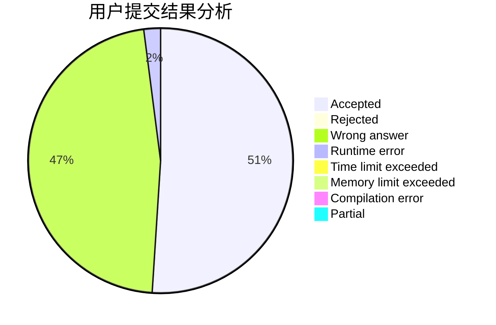
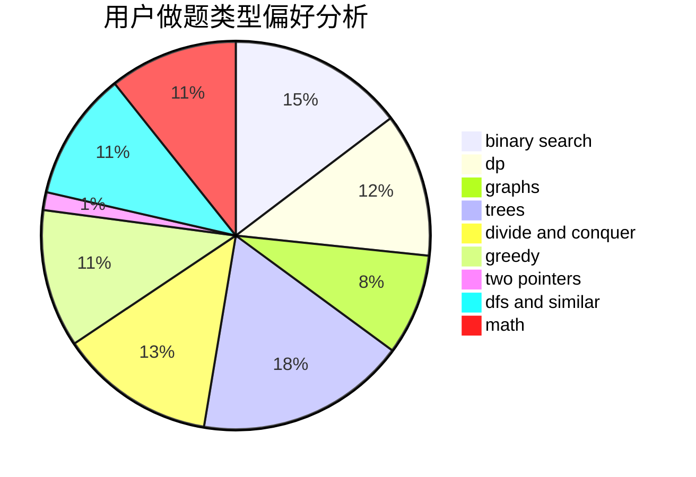

# DrumWashingMachine

<!-- tabs:start -->

#### **用户提交结果分析**

#### **用户做题类型偏好分析**

<!-- tabs:end -->
# 推荐题目
[1389E](https://codeforces.com/contest/1389/problem/E)
[109A](https://codeforces.com/contest/109/problem/A)
[1208D](https://codeforces.com/contest/1208/problem/D)
[739D](https://codeforces.com/contest/739/problem/D)
[1083B](https://codeforces.com/contest/1083/problem/B)
[713E](https://codeforces.com/contest/713/problem/E)
[733D](https://codeforces.com/contest/733/problem/D)
[812C](https://codeforces.com/contest/812/problem/C)
[749A](https://codeforces.com/contest/749/problem/A)
[813B](https://codeforces.com/contest/813/problem/B)
