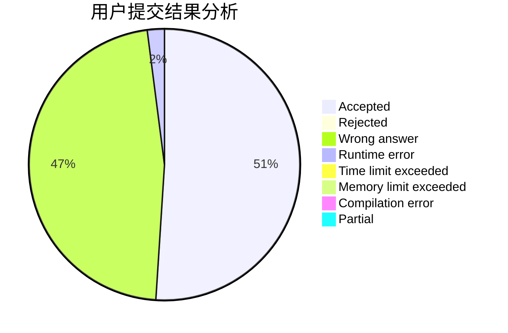
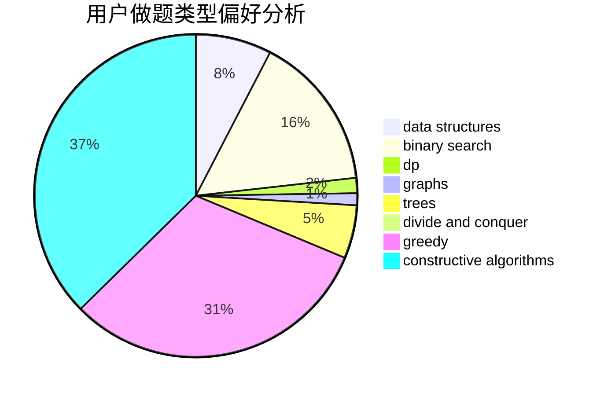
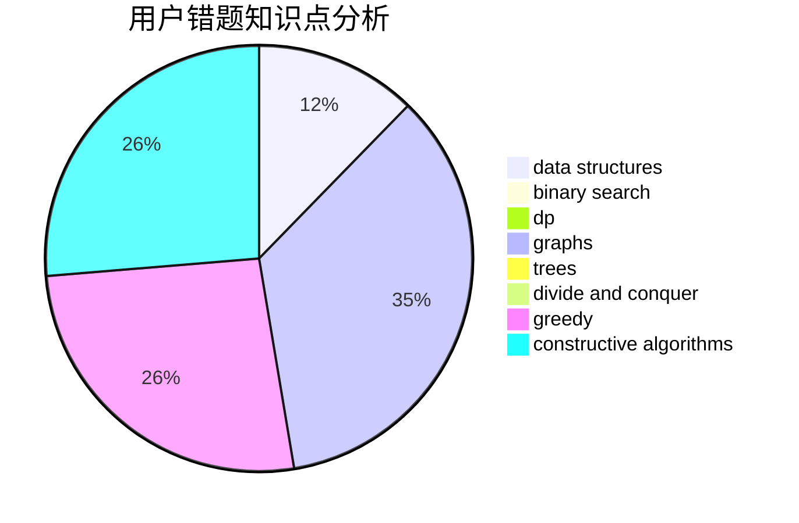

# DrumWashingMachine

<!-- tabs:start -->

#### **用户提交结果分析**

#### **用户做题类型偏好分析**

#### **用户错题知识点分析**

<!-- tabs:end -->
# 推荐题目
[1380B](https://codeforces.com/contest/1380/problem/B)		greedy		  
[1099D](https://codeforces.com/contest/1099/problem/D)		dsu,graphs,sortings,trees		  
[1203F1](https://codeforces.com/contest/1203F/problem/1)		greedy		  
[722C](https://codeforces.com/contest/722/problem/C)		data structures,
                        dsu		  
[1082F](https://codeforces.com/contest/1082/problem/F)		dp,
                        strings,
                        trees		  
[697B](https://codeforces.com/contest/697/problem/B)		brute force,
                        implementation,
                        math,
                        strings		  
[715B](https://codeforces.com/contest/715/problem/B)		binary search,
                        constructive algorithms,
                        graphs,
                        shortest paths		  
[798C](https://codeforces.com/contest/798/problem/C)		dp,
                        greedy,
                        number theory		  
[730J](https://codeforces.com/contest/730/problem/J)		dp		  
[799A](https://codeforces.com/contest/799/problem/A)		brute force,
                        implementation		  
