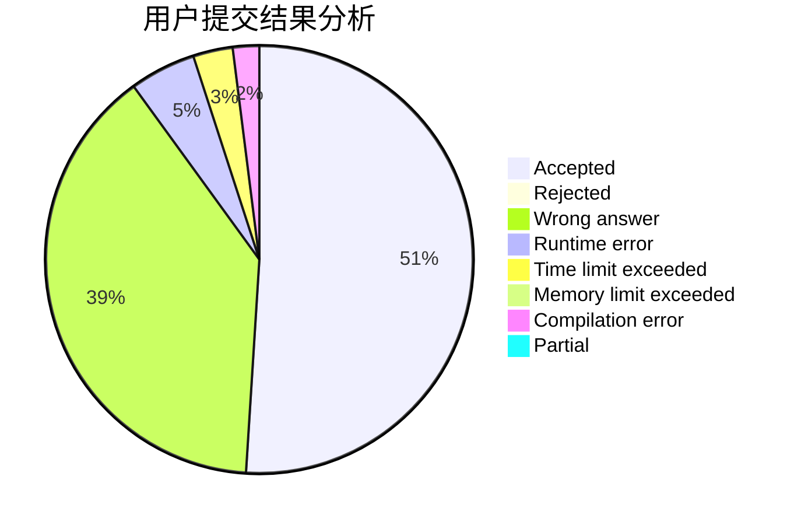
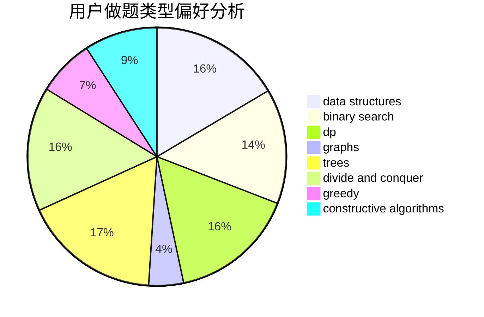

# Dubhep

<!-- tabs:start -->

#### **用户提交结果分析**

#### **用户做题类型偏好分析**

#### **用户错题知识点分析**

<!-- tabs:end -->
# 推荐题目
[1061E](https://codeforces.com/contest/1061/problem/E)		flows,
                        graphs		  
[1316B](https://codeforces.com/contest/1316/problem/B)		brute force,
                        constructive algorithms,
                        implementation,
                        sortings,
                        strings		  
[1082F](https://codeforces.com/contest/1082/problem/F)		dp,
                        strings,
                        trees		  
[448B](https://codeforces.com/contest/448/problem/B)		implementation,
                        strings		  
[706A](https://codeforces.com/contest/706/problem/A)		brute force,
                        geometry,
                        implementation		  
[352E](https://codeforces.com/contest/352/problem/E)		dsu,graphs,sortings,trees		  
[441E](https://codeforces.com/contest/441/problem/E)		bitmasks,
                        dp,
                        math,
                        probabilities		  
[165C](https://codeforces.com/contest/165/problem/C)		binary search,
                        brute force,
                        dp,
                        math,
                        strings,
                        two pointers		  
[43B](https://codeforces.com/contest/43/problem/B)		implementation,
                        strings		  
[791D](https://codeforces.com/contest/791/problem/D)		dsu,graphs,sortings,trees		  
