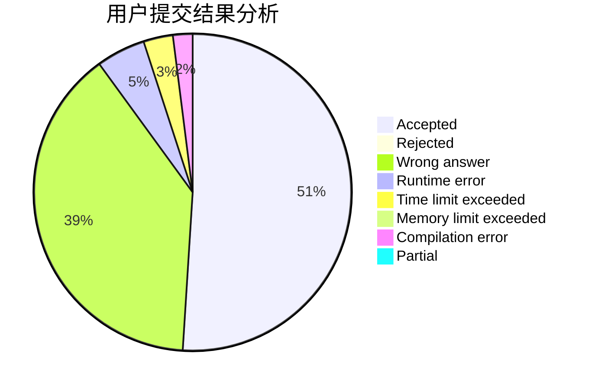
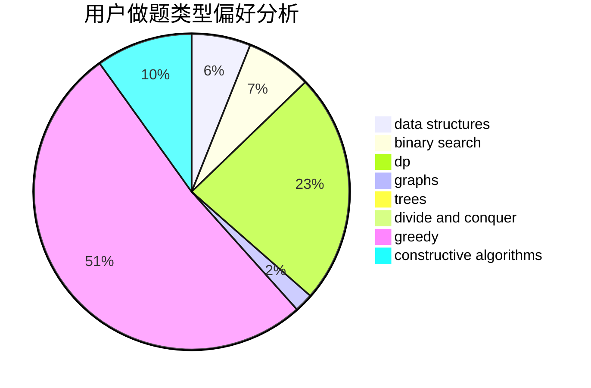

# Dubhep

<!-- tabs:start -->

#### **用户提交结果分析**

#### **用户做题类型偏好分析**

#### **用户错题知识点分析**

<!-- tabs:end -->
# 推荐题目
[1061A](https://codeforces.com/contest/1061/problem/A)		greedy,
                        implementation,
                        math		  
[1307F](https://codeforces.com/contest/1307/problem/F)		dfs and similar,
                        dsu,
                        trees		  
[1082C](https://codeforces.com/contest/1082/problem/C)		greedy,
                        sortings		  
[424E](https://codeforces.com/contest/424/problem/E)		dfs and similar,
                        dp,
                        probabilities		  
[682A](https://codeforces.com/contest/682/problem/A)		constructive algorithms,
                        math,
                        number theory		  
[321C](https://codeforces.com/contest/321/problem/C)		constructive algorithms,
                        dfs and similar,
                        divide and conquer,
                        greedy,
                        trees		  
[416E](https://codeforces.com/contest/416/problem/E)		dp,
                        graphs,
                        shortest paths		  
[1510F](https://codeforces.com/contest/1510/problem/F)		nan		  
[414E](https://codeforces.com/contest/414/problem/E)		data structures		  
[771E](https://codeforces.com/contest/771/problem/E)		dp,
                        greedy		  
