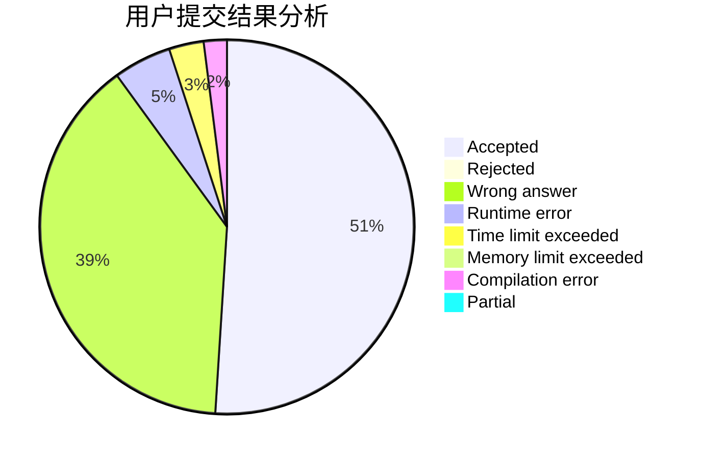
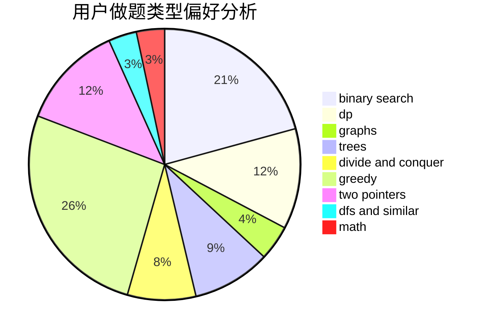

# Dubhep

<!-- tabs:start -->

#### **用户提交结果分析**

#### **用户做题类型偏好分析**

<!-- tabs:end -->
# 推荐题目
[1061E](https://codeforces.com/contest/1061/problem/E)
[1316B](https://codeforces.com/contest/1316/problem/B)
[1082F](https://codeforces.com/contest/1082/problem/F)
[448B](https://codeforces.com/contest/448/problem/B)
[706A](https://codeforces.com/contest/706/problem/A)
[352E](https://codeforces.com/contest/352/problem/E)
[441E](https://codeforces.com/contest/441/problem/E)
[165C](https://codeforces.com/contest/165/problem/C)
[43B](https://codeforces.com/contest/43/problem/B)
[791D](https://codeforces.com/contest/791/problem/D)
