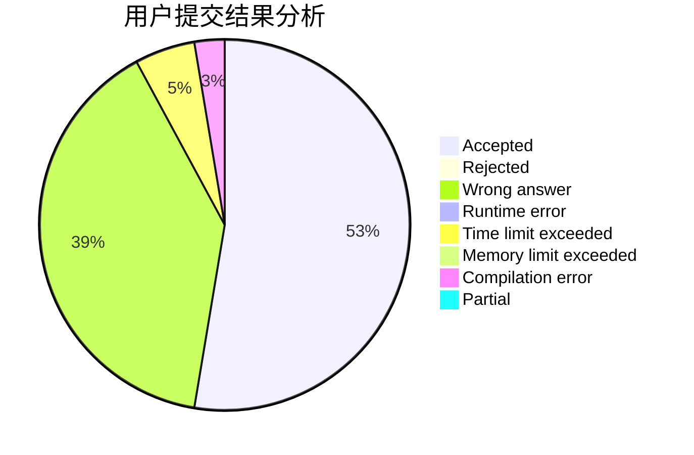
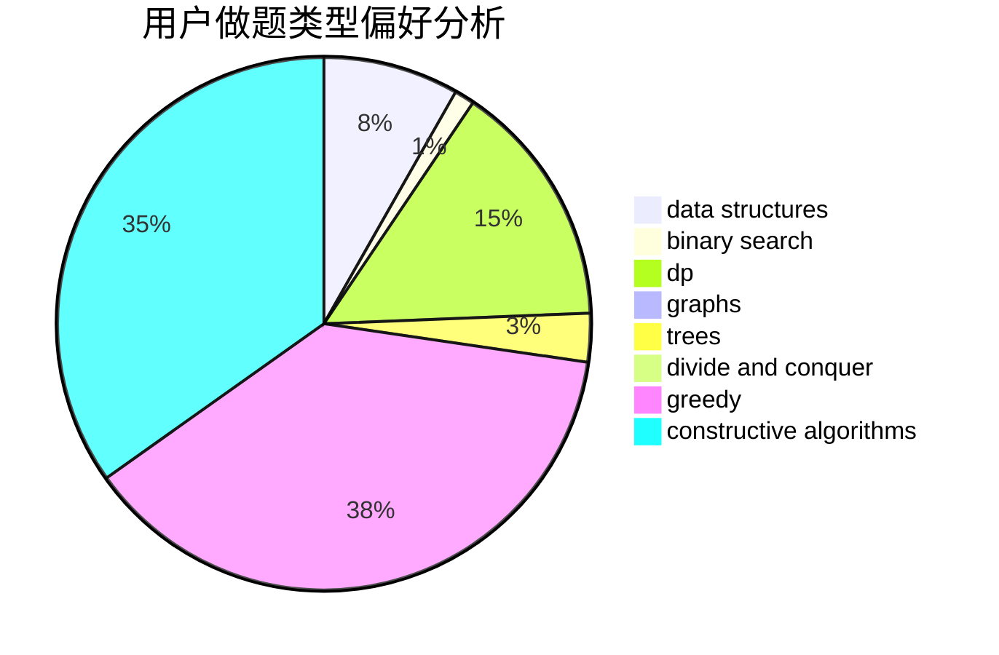

# Dumbledore6

<!-- tabs:start -->

#### **用户提交结果分析**

#### **用户做题类型偏好分析**

#### **用户错题知识点分析**

<!-- tabs:end -->
# 推荐题目
[1216D](https://codeforces.com/contest/1216/problem/D)		math		  
[799F](https://codeforces.com/contest/799/problem/F)		data structures		  
[630F](https://codeforces.com/contest/630/problem/F)		combinatorics,
                        math		  
[1352B](https://codeforces.com/contest/1352/problem/B)		constructive algorithms,
                        math		  
[1039C](https://codeforces.com/contest/1039/problem/C)		dfs and similar,
                        dsu,
                        graphs,
                        math,
                        sortings		  
[1144D](https://codeforces.com/contest/1144/problem/D)		constructive algorithms,
                        greedy		  
[241D](https://codeforces.com/contest/241/problem/D)		nan		  
[1071C](https://codeforces.com/contest/1071/problem/C)		dsu,graphs,sortings,trees		  
[482C](https://codeforces.com/contest/482/problem/C)		bitmasks,
                        dp,
                        probabilities		  
[360D](https://codeforces.com/contest/360/problem/D)		number theory		  
