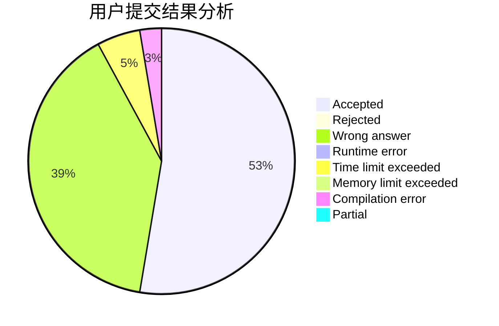
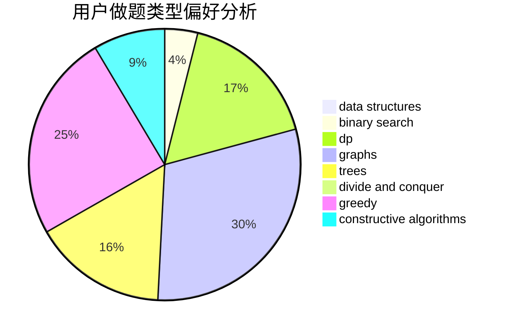

# Dumbledore6

<!-- tabs:start -->

#### **用户提交结果分析**

#### **用户做题类型偏好分析**

#### **用户错题知识点分析**

<!-- tabs:end -->
# 推荐题目
[1223A](https://codeforces.com/contest/1223/problem/A)		math		  
[813F](https://codeforces.com/contest/813/problem/F)		data structures,
                        dsu,
                        graphs		  
[660B](https://codeforces.com/contest/660/problem/B)		implementation		  
[1358F](https://codeforces.com/contest/1358/problem/F)		binary search,
                        constructive algorithms,
                        greedy,
                        implementation		  
[103A](https://codeforces.com/contest/103/problem/A)		greedy,
                        implementation,
                        math		  
[1146E](https://codeforces.com/contest/1146/problem/E)		bitmasks,
                        data structures,
                        divide and conquer,
                        implementation		  
[263A](https://codeforces.com/contest/263/problem/A)		implementation		  
[1072B](https://codeforces.com/contest/1072/problem/B)		dsu,graphs,sortings,trees		  
[501A](https://codeforces.com/contest/501/problem/A)		implementation		  
[388E](https://codeforces.com/contest/388/problem/E)		geometry		  
