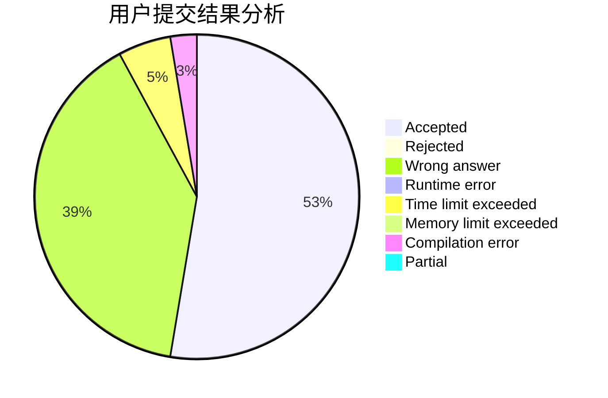
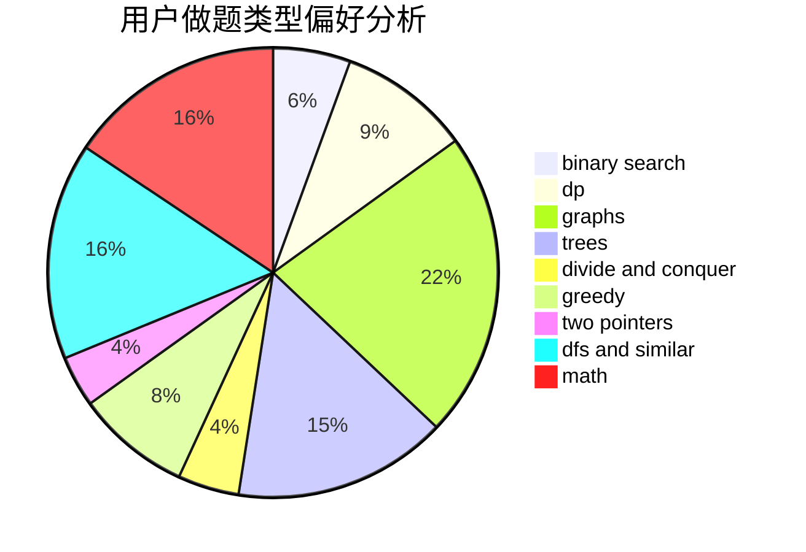

# Dumbledore6

<!-- tabs:start -->

#### **用户提交结果分析**

#### **用户做题类型偏好分析**

<!-- tabs:end -->
# 推荐题目
[1223A](https://codeforces.com/contest/1223/problem/A)
[813F](https://codeforces.com/contest/813/problem/F)
[660B](https://codeforces.com/contest/660/problem/B)
[1358F](https://codeforces.com/contest/1358/problem/F)
[103A](https://codeforces.com/contest/103/problem/A)
[1146E](https://codeforces.com/contest/1146/problem/E)
[263A](https://codeforces.com/contest/263/problem/A)
[1072B](https://codeforces.com/contest/1072/problem/B)
[501A](https://codeforces.com/contest/501/problem/A)
[388E](https://codeforces.com/contest/388/problem/E)
