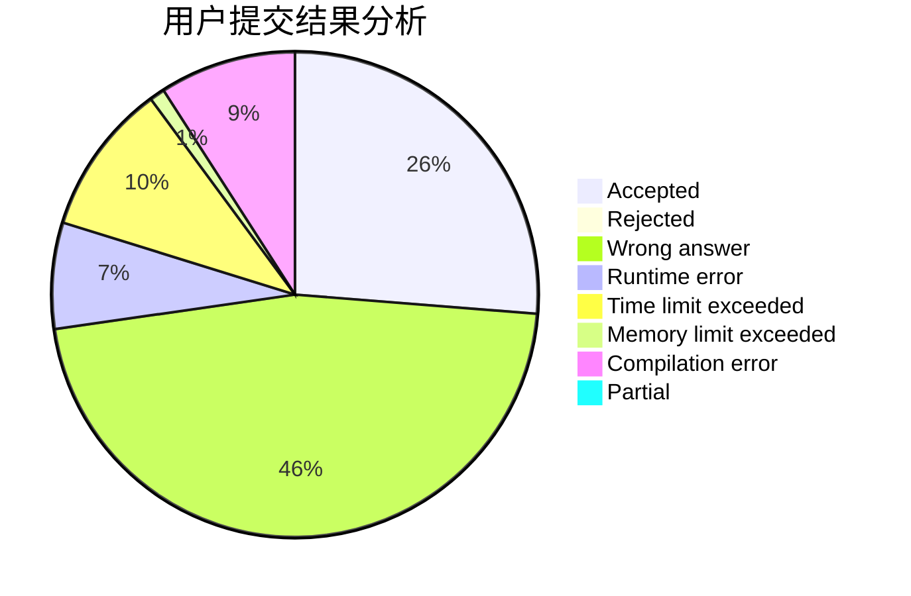
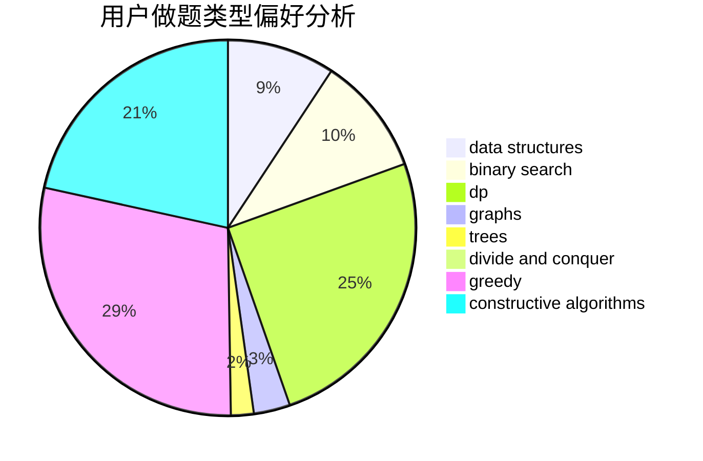
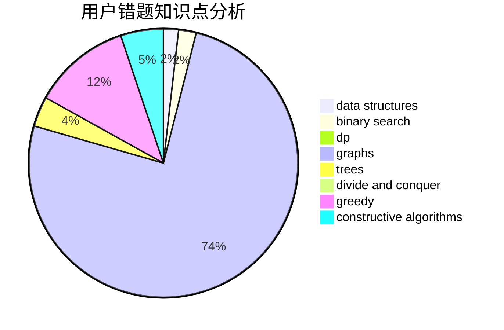

# Dvelpro
<!-- tabs:start -->
#### **用户提交结果分析**

#### **用户做题类型偏好分析**

#### **用户错题知识点分析**

<!-- tabs:end -->
# 推荐题目
[Shurikens](https://codeforces.com/contest/1435/problem/D)		data structures,
                        greedy,
                        implementation		  
[Is It Rated?](http://codeforces.com/problemset/problem/1510/I)		greedy,
                        interactive,
                        math,
                        probabilities		  
[Memory Manager](http://codeforces.com/problemset/problem/7/B)		implementation		  
[Mirror Box](http://codeforces.com/problemset/problem/578/F)		matrices,
                        trees		  
[Bear and Prime 100](https://codeforces.com/contest/680/problem/C)		constructive algorithms,
                        interactive,
                        math		  
[Roads not only in Berland](http://codeforces.com/problemset/problem/25/D)		dsu,
                        graphs,
                        trees		  
[Dwarves, Hats and Extrasensory Abilities](https://codeforces.com/contest/1064/problem/E)		binary search,
                        constructive algorithms,
                        geometry,
                        interactive		  
[Line](http://codeforces.com/problemset/problem/7/C)		math,
                        number theory		  
[Monsters and Diamonds](http://codeforces.com/problemset/problem/325/C)		dfs and similar,
                        graphs,
                        shortest paths		  
[Dreamoon and Notepad](http://codeforces.com/problemset/problem/477/E)		data structures		  
<!-- tabs:start -->
#### **data structures**
[Shurikens](https://codeforces.com/contest/1435/problem/D)		data structures,
                        greedy,
                        implementation		  
[Dreamoon and Notepad](http://codeforces.com/problemset/problem/477/E)		data structures		  
[Cd and pwd commands](http://codeforces.com/problemset/problem/158/C)		*special problem,
                        data structures,
                        implementation		  
[Water Tree](http://codeforces.com/problemset/problem/343/D)		data structures,
                        dfs and similar,
                        graphs,
                        trees		  
[One Occurrence](http://codeforces.com/problemset/problem/1000/F)		data structures,
                        divide and conquer		  
[Lorenzo Von Matterhorn](https://codeforces.com/contest/697/problem/C)		brute force,
                        data structures,
                        implementation,
                        trees		  
[Bakery](http://codeforces.com/problemset/problem/1468/B)		data structures,
                        dsu		  
[World of Darkraft: Battle for Azathoth](http://codeforces.com/problemset/problem/1320/C)		brute force,
                        data structures,
                        sortings		  
[Tricky and Clever Password](http://codeforces.com/problemset/problem/30/E)		binary search,
                        constructive algorithms,
                        data structures,
                        greedy,
                        hashing,
                        strings		  
[Cleaning](http://codeforces.com/problemset/problem/1474/D)		data structures,
                        dp,
                        greedy,
                        math		  
#### **binary search**
[Dwarves, Hats and Extrasensory Abilities](https://codeforces.com/contest/1064/problem/E)		binary search,
                        constructive algorithms,
                        geometry,
                        interactive		  
[Bombing](http://codeforces.com/problemset/problem/50/D)		binary search,
                        dp,
                        probabilities		  
[Maximum Value](http://codeforces.com/problemset/problem/484/B)		binary search,
                        math,
                        sortings,
                        two pointers		  
[Mixing Water](http://codeforces.com/problemset/problem/1359/C)		binary search,
                        math		  
[Tricky and Clever Password](http://codeforces.com/problemset/problem/30/E)		binary search,
                        constructive algorithms,
                        data structures,
                        greedy,
                        hashing,
                        strings		  
[Perfect Team](http://codeforces.com/problemset/problem/1221/C)		binary search,
                        math		  
[Maximum width](http://codeforces.com/problemset/problem/1492/C)		binary search,
                        data structures,
                        dp,
                        greedy,
                        two pointers		  
[Pairs](http://codeforces.com/problemset/problem/1463/D)		binary search,
                        constructive algorithms,
                        greedy,
                        two pointers		  
[Old Floppy Drive](http://codeforces.com/problemset/problem/1490/G)		binary search,
                        data structures,
                        math		  
[Odd Mineral Resource](http://codeforces.com/problemset/problem/1479/D)		binary search,
                        bitmasks,
                        brute force,
                        data structures,
                        probabilities,
                        trees		  
#### **dp**
[Games with Rectangle](http://codeforces.com/problemset/problem/128/C)		combinatorics,
                        dp		  
[Bombing](http://codeforces.com/problemset/problem/50/D)		binary search,
                        dp,
                        probabilities		  
[Serval and Bonus Problem](http://codeforces.com/problemset/problem/1153/F)		combinatorics,
                        dp,
                        math,
                        probabilities		  
[What Has Dirichlet Got to Do with That?](http://codeforces.com/problemset/problem/39/E)		dp,
                        games		  
[Nastya and Scoreboard](http://codeforces.com/problemset/problem/1340/B)		bitmasks,
                        dp,
                        graphs,
                        greedy		  
[Little Elephant and Retro Strings](http://codeforces.com/problemset/problem/204/D)		dp		  
[Pavel and Triangles](http://codeforces.com/problemset/problem/1119/E)		brute force,
                        dp,
                        fft,
                        greedy,
                        ternary search		  
[Student's Camp](http://codeforces.com/problemset/problem/708/E)		dp,
                        math		  
[Cleaning](http://codeforces.com/problemset/problem/1474/D)		data structures,
                        dp,
                        greedy,
                        math		  
[Maximum width](http://codeforces.com/problemset/problem/1492/C)		binary search,
                        data structures,
                        dp,
                        greedy,
                        two pointers		  
#### **graph**
[Roads not only in Berland](http://codeforces.com/problemset/problem/25/D)		dsu,
                        graphs,
                        trees		  
[Monsters and Diamonds](http://codeforces.com/problemset/problem/325/C)		dfs and similar,
                        graphs,
                        shortest paths		  
[Palindrome XOR](https://codeforces.com/contest/1161/problem/D)		dfs and similar,
                        graphs		  
[Directing Edges](http://codeforces.com/problemset/problem/1385/E)		constructive algorithms,
                        dfs and similar,
                        graphs		  
[Water Tree](http://codeforces.com/problemset/problem/343/D)		data structures,
                        dfs and similar,
                        graphs,
                        trees		  
[Nastya and Scoreboard](http://codeforces.com/problemset/problem/1340/B)		bitmasks,
                        dp,
                        graphs,
                        greedy		  
[Minimum Ties](http://codeforces.com/problemset/problem/1487/C)		brute force,
                        constructive algorithms,
                        dfs and similar,
                        graphs,
                        greedy,
                        implementation,
                        math		  
[Chef Monocarp](http://codeforces.com/problemset/problem/1437/C)		dp,
                        flows,
                        graph matchings,
                        greedy,
                        math,
                        sortings		  
[Strange Housing](http://codeforces.com/problemset/problem/1470/D)		constructive algorithms,
                        dfs and similar,
                        graph matchings,
                        graphs,
                        greedy		  
[Longest Simple Cycle](http://codeforces.com/problemset/problem/1476/C)		dp,
                        graphs,
                        greedy		  
#### **trees**
[Mirror Box](http://codeforces.com/problemset/problem/578/F)		matrices,
                        trees		  
[Roads not only in Berland](http://codeforces.com/problemset/problem/25/D)		dsu,
                        graphs,
                        trees		  
[Water Tree](http://codeforces.com/problemset/problem/343/D)		data structures,
                        dfs and similar,
                        graphs,
                        trees		  
[Lorenzo Von Matterhorn](https://codeforces.com/contest/697/problem/C)		brute force,
                        data structures,
                        implementation,
                        trees		  
[Odd Mineral Resource](http://codeforces.com/problemset/problem/1479/D)		binary search,
                        bitmasks,
                        brute force,
                        data structures,
                        probabilities,
                        trees		  
[Yet Another Card Deck](http://codeforces.com/problemset/problem/1511/C)		brute force,
                        data structures,
                        implementation,
                        trees		  
[Diameter Cuts](http://codeforces.com/problemset/problem/1499/F)		combinatorics,
                        dfs and similar,
                        dp,
                        trees		  
[Fib-tree](http://codeforces.com/problemset/problem/1491/E)		brute force,
                        dfs and similar,
                        divide and conquer,
                        number theory,
                        trees		  
[13th Labour of Heracles](http://codeforces.com/problemset/problem/1466/D)		data structures,
                        greedy,
                        sortings,
                        trees		  
[BFS Trees](http://codeforces.com/problemset/problem/1495/D)		combinatorics,
                        dfs and similar,
                        graphs,
                        math,
                        shortest paths,
                        trees		  
#### **divide and conquer**
[One Occurrence](http://codeforces.com/problemset/problem/1000/F)		data structures,
                        divide and conquer		  
[Divide and Summarize](http://codeforces.com/problemset/problem/1461/D)		binary search,
                        brute force,
                        data structures,
                        divide and conquer,
                        implementation,
                        sortings		  
[Song of the Sirens](http://codeforces.com/problemset/problem/1466/G)		combinatorics,
                        divide and conquer,
                        hashing,
                        math,
                        string suffix structures,
                        strings		  
[Permutation Transformation](http://codeforces.com/problemset/problem/1490/D)		dfs and similar,
                        divide and conquer,
                        implementation		  
[Skyline Photo](https://codeforces.com/contest/1483/problem/C)		data structures,
                        divide and conquer,
                        dp		  
[Fib-tree](http://codeforces.com/problemset/problem/1491/E)		brute force,
                        dfs and similar,
                        divide and conquer,
                        number theory,
                        trees		  
[Sum of Prefix Sums](http://codeforces.com/problemset/problem/1303/G)		data structures,
                        divide and conquer,
                        geometry,
                        trees		  
[Dogeforces](http://codeforces.com/problemset/problem/1494/D)		constructive algorithms,
                        data structures,
                        dfs and similar,
                        divide and conquer,
                        dsu,
                        greedy,
                        sortings,
                        trees		  
[Skyline Photo](http://codeforces.com/problemset/problem/1482/E)		data structures,
                        divide and conquer,
                        dp		  
[Logistical Questions](http://codeforces.com/problemset/problem/566/C)		dfs and similar,
                        divide and conquer,
                        trees		  
#### **greedy**
[Shurikens](https://codeforces.com/contest/1435/problem/D)		data structures,
                        greedy,
                        implementation		  
[Is It Rated?](http://codeforces.com/problemset/problem/1510/I)		greedy,
                        interactive,
                        math,
                        probabilities		  
[Andrey and Problem](http://codeforces.com/problemset/problem/442/B)		greedy,
                        math,
                        probabilities		  
[Johnny and Another Rating Drop](http://codeforces.com/problemset/problem/1362/C)		bitmasks,
                        greedy,
                        math		  
[Gargari and Bishops](http://codeforces.com/problemset/problem/463/C)		greedy,
                        hashing,
                        implementation		  
[Nastya and Scoreboard](http://codeforces.com/problemset/problem/1340/B)		bitmasks,
                        dp,
                        graphs,
                        greedy		  
[Mislove Has Lost an Array](http://codeforces.com/problemset/problem/1204/B)		greedy,
                        math		  
[Tricky and Clever Password](http://codeforces.com/problemset/problem/30/E)		binary search,
                        constructive algorithms,
                        data structures,
                        greedy,
                        hashing,
                        strings		  
[Pavel and Triangles](http://codeforces.com/problemset/problem/1119/E)		brute force,
                        dp,
                        fft,
                        greedy,
                        ternary search		  
[Cleaning](http://codeforces.com/problemset/problem/1474/D)		data structures,
                        dp,
                        greedy,
                        math		  
#### **constructive algorithms**
[Bear and Prime 100](https://codeforces.com/contest/680/problem/C)		constructive algorithms,
                        interactive,
                        math		  
[Dwarves, Hats and Extrasensory Abilities](https://codeforces.com/contest/1064/problem/E)		binary search,
                        constructive algorithms,
                        geometry,
                        interactive		  
[Kalevitch and Chess](http://codeforces.com/problemset/problem/7/A)		brute force,
                        constructive algorithms		  
[Square Table](http://codeforces.com/problemset/problem/417/E)		constructive algorithms,
                        math,
                        probabilities		  
[Directing Edges](http://codeforces.com/problemset/problem/1385/E)		constructive algorithms,
                        dfs and similar,
                        graphs		  
[Necklace](http://codeforces.com/problemset/problem/613/C)		constructive algorithms,
                        math		  
[All the Vowels Please](http://codeforces.com/problemset/problem/1166/B)		constructive algorithms,
                        math,
                        number theory		  
[Tricky and Clever Password](http://codeforces.com/problemset/problem/30/E)		binary search,
                        constructive algorithms,
                        data structures,
                        greedy,
                        hashing,
                        strings		  
[Dice Tower](http://codeforces.com/problemset/problem/1266/B)		constructive algorithms,
                        math		  
[Anti-knapsack](http://codeforces.com/problemset/problem/1493/A)		constructive algorithms,
                        greedy		  
#### **sortings**
[World of Darkraft: Battle for Azathoth](http://codeforces.com/problemset/problem/1320/C)		brute force,
                        data structures,
                        sortings		  
[Maximum Value](http://codeforces.com/problemset/problem/484/B)		binary search,
                        math,
                        sortings,
                        two pointers		  
[The Smallest String Concatenation](http://codeforces.com/problemset/problem/632/C)		sortings,
                        strings		  
[Diamond Miner](https://codeforces.com/contest/1496/problem/C)		geometry,
                        greedy,
                        math,
                        sortings		  
[Diamond Miner](http://codeforces.com/problemset/problem/1495/A)		geometry,
                        greedy,
                        math,
                        sortings		  
[Meximization](http://codeforces.com/problemset/problem/1497/A)		brute force,
                        data structures,
                        greedy,
                        sortings		  
[Avoiding Zero](http://codeforces.com/problemset/problem/1427/A)		math,
                        sortings		  
[Divide and Summarize](http://codeforces.com/problemset/problem/1461/D)		binary search,
                        brute force,
                        data structures,
                        divide and conquer,
                        implementation,
                        sortings		  
[Chef Monocarp](http://codeforces.com/problemset/problem/1437/C)		dp,
                        flows,
                        graph matchings,
                        greedy,
                        math,
                        sortings		  
[Replacing Elements](http://codeforces.com/problemset/problem/1473/A)		greedy,
                        implementation,
                        math,
                        sortings		  
<!-- tabs:end -->
