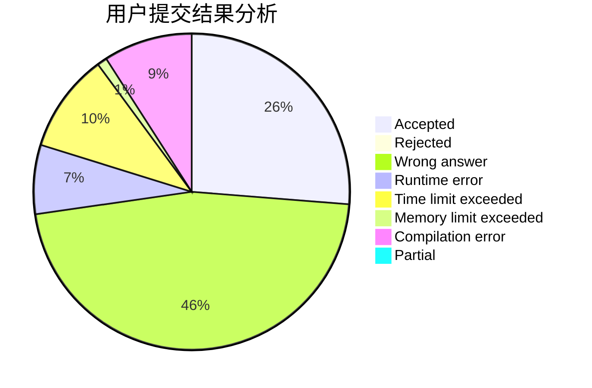
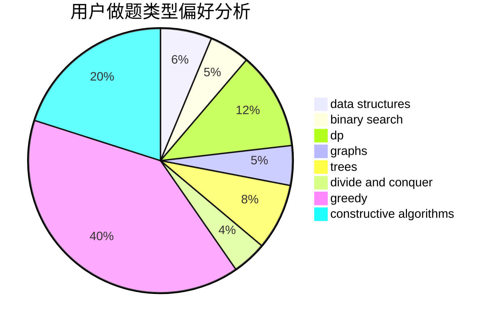
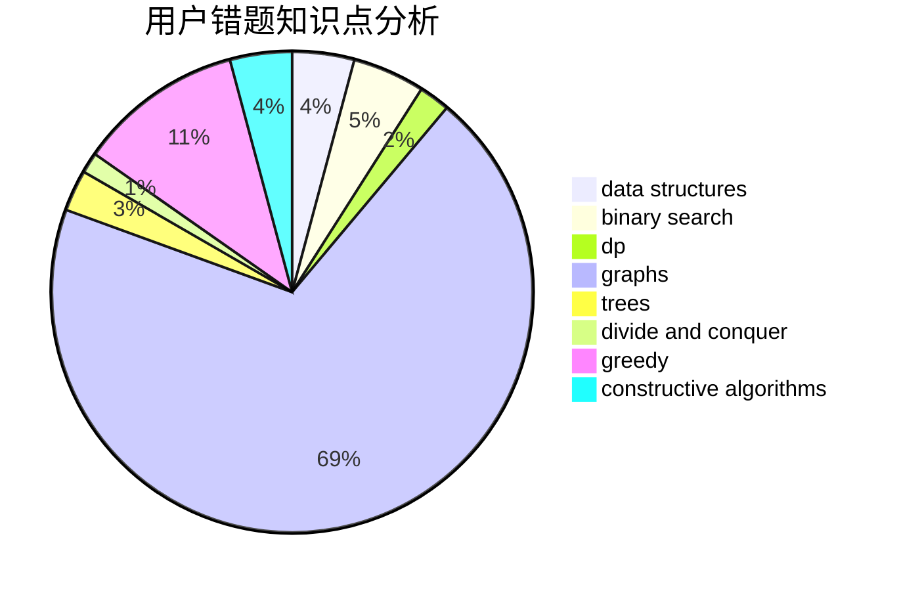

# Dvelpro

<!-- tabs:start -->

#### **用户提交结果分析**

#### **用户做题类型偏好分析**

#### **用户错题知识点分析**

<!-- tabs:end -->
# 推荐题目
[1445D](https://codeforces.com/contest/1445/problem/D)		dsu,graphs,sortings,trees		  
[1000F](https://codeforces.com/contest/1000/problem/F)		data structures,
                        divide and conquer		  
[1169A](https://codeforces.com/contest/1169/problem/A)		implementation,
                        math		  
[714A](https://codeforces.com/contest/714/problem/A)		implementation,
                        math		  
[497E](https://codeforces.com/contest/497/problem/E)		dp,
                        matrices		  
[814D](https://codeforces.com/contest/814/problem/D)		dfs and similar,
                        dp,
                        geometry,
                        greedy,
                        trees		  
[277D](https://codeforces.com/contest/277/problem/D)		dp,
                        probabilities		  
[814C](https://codeforces.com/contest/814/problem/C)		brute force,
                        dp,
                        strings,
                        two pointers		  
[1065B](https://codeforces.com/contest/1065/problem/B)		constructive algorithms,
                        graphs		  
[398C](https://codeforces.com/contest/398/problem/C)		constructive algorithms		  
