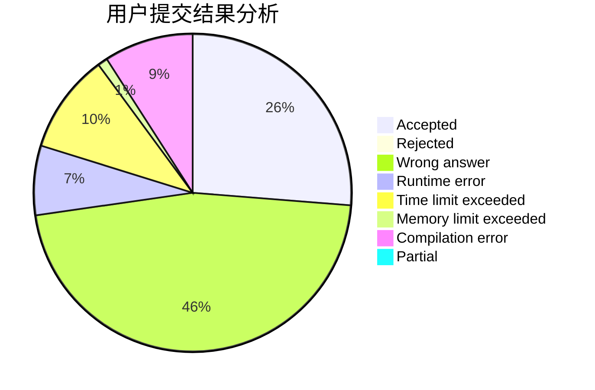
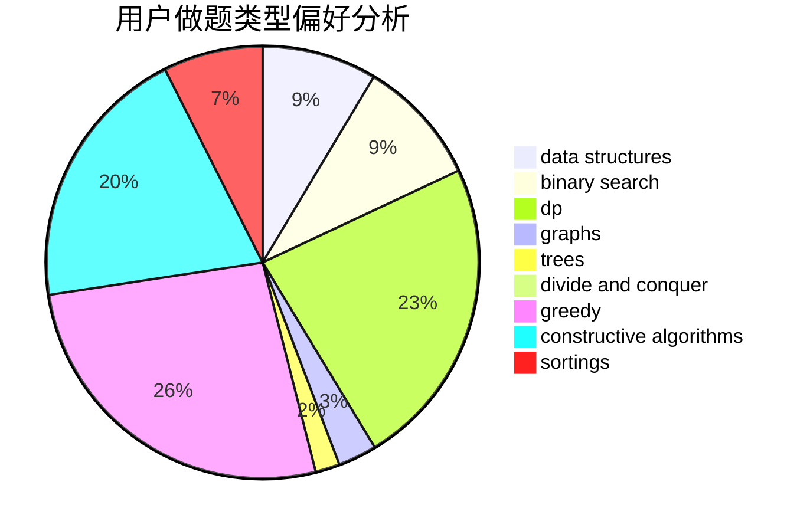
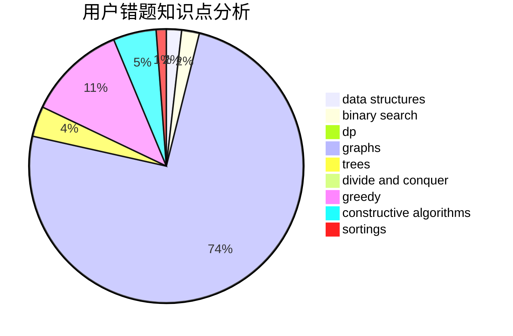

# Dvelpro
<!-- tabs:start -->
#### **用户提交结果分析**

#### **用户做题类型偏好分析**

#### **用户错题知识点分析**

<!-- tabs:end -->
# 推荐题目
[1435D](https://codeforces.com/contest/1435/problem/D)		data structures,
                        greedy,
                        implementation		  
[1510I](http://codeforces.com/problemset/problem/1510/I)		greedy,
                        interactive,
                        math,
                        probabilities		  
[7B](http://codeforces.com/problemset/problem/7/B)		implementation		  
[578F](http://codeforces.com/problemset/problem/578/F)		matrices,
                        trees		  
[680C](https://codeforces.com/contest/680/problem/C)		constructive algorithms,
                        interactive,
                        math		  
[25D](http://codeforces.com/problemset/problem/25/D)		dsu,
                        graphs,
                        trees		  
[1064E](https://codeforces.com/contest/1064/problem/E)		binary search,
                        constructive algorithms,
                        geometry,
                        interactive		  
[7C](http://codeforces.com/problemset/problem/7/C)		math,
                        number theory		  
[325C](http://codeforces.com/problemset/problem/325/C)		dfs and similar,
                        graphs,
                        shortest paths		  
[477E](http://codeforces.com/problemset/problem/477/E)		data structures		  
<!-- tabs:start -->
#### **data structures**
[1435D](https://codeforces.com/contest/1435/problem/D)		data structures,
                        greedy,
                        implementation		  
[477E](http://codeforces.com/problemset/problem/477/E)		data structures		  
[158C](http://codeforces.com/problemset/problem/158/C)		*special problem,
                        data structures,
                        implementation		  
[343D](http://codeforces.com/problemset/problem/343/D)		data structures,
                        dfs and similar,
                        graphs,
                        trees		  
[1000F](http://codeforces.com/problemset/problem/1000/F)		data structures,
                        divide and conquer		  
[697C](https://codeforces.com/contest/697/problem/C)		brute force,
                        data structures,
                        implementation,
                        trees		  
[1468B](http://codeforces.com/problemset/problem/1468/B)		data structures,
                        dsu		  
[1320C](http://codeforces.com/problemset/problem/1320/C)		brute force,
                        data structures,
                        sortings		  
[30E](http://codeforces.com/problemset/problem/30/E)		binary search,
                        constructive algorithms,
                        data structures,
                        greedy,
                        hashing,
                        strings		  
[1474D](http://codeforces.com/problemset/problem/1474/D)		data structures,
                        dp,
                        greedy,
                        math		  
#### **binary search**
[1064E](https://codeforces.com/contest/1064/problem/E)		binary search,
                        constructive algorithms,
                        geometry,
                        interactive		  
[50D](http://codeforces.com/problemset/problem/50/D)		binary search,
                        dp,
                        probabilities		  
[484B](http://codeforces.com/problemset/problem/484/B)		binary search,
                        math,
                        sortings,
                        two pointers		  
[1359C](http://codeforces.com/problemset/problem/1359/C)		binary search,
                        math		  
[30E](http://codeforces.com/problemset/problem/30/E)		binary search,
                        constructive algorithms,
                        data structures,
                        greedy,
                        hashing,
                        strings		  
[1221C](http://codeforces.com/problemset/problem/1221/C)		binary search,
                        math		  
[1492C](http://codeforces.com/problemset/problem/1492/C)		binary search,
                        data structures,
                        dp,
                        greedy,
                        two pointers		  
[1463D](http://codeforces.com/problemset/problem/1463/D)		binary search,
                        constructive algorithms,
                        greedy,
                        two pointers		  
[1490G](http://codeforces.com/problemset/problem/1490/G)		binary search,
                        data structures,
                        math		  
[1479D](http://codeforces.com/problemset/problem/1479/D)		binary search,
                        bitmasks,
                        brute force,
                        data structures,
                        probabilities,
                        trees		  
#### **dp**
[128C](http://codeforces.com/problemset/problem/128/C)		combinatorics,
                        dp		  
[50D](http://codeforces.com/problemset/problem/50/D)		binary search,
                        dp,
                        probabilities		  
[1153F](http://codeforces.com/problemset/problem/1153/F)		combinatorics,
                        dp,
                        math,
                        probabilities		  
[39E](http://codeforces.com/problemset/problem/39/E)		dp,
                        games		  
[1340B](http://codeforces.com/problemset/problem/1340/B)		bitmasks,
                        dp,
                        graphs,
                        greedy		  
[204D](http://codeforces.com/problemset/problem/204/D)		dp		  
[1119E](http://codeforces.com/problemset/problem/1119/E)		brute force,
                        dp,
                        fft,
                        greedy,
                        ternary search		  
[708E](http://codeforces.com/problemset/problem/708/E)		dp,
                        math		  
[1474D](http://codeforces.com/problemset/problem/1474/D)		data structures,
                        dp,
                        greedy,
                        math		  
[1492C](http://codeforces.com/problemset/problem/1492/C)		binary search,
                        data structures,
                        dp,
                        greedy,
                        two pointers		  
#### **graph**
[25D](http://codeforces.com/problemset/problem/25/D)		dsu,
                        graphs,
                        trees		  
[325C](http://codeforces.com/problemset/problem/325/C)		dfs and similar,
                        graphs,
                        shortest paths		  
[1161D](https://codeforces.com/contest/1161/problem/D)		dfs and similar,
                        graphs		  
[1385E](http://codeforces.com/problemset/problem/1385/E)		constructive algorithms,
                        dfs and similar,
                        graphs		  
[343D](http://codeforces.com/problemset/problem/343/D)		data structures,
                        dfs and similar,
                        graphs,
                        trees		  
[1340B](http://codeforces.com/problemset/problem/1340/B)		bitmasks,
                        dp,
                        graphs,
                        greedy		  
[1487C](http://codeforces.com/problemset/problem/1487/C)		brute force,
                        constructive algorithms,
                        dfs and similar,
                        graphs,
                        greedy,
                        implementation,
                        math		  
[1437C](http://codeforces.com/problemset/problem/1437/C)		dp,
                        flows,
                        graph matchings,
                        greedy,
                        math,
                        sortings		  
[1470D](http://codeforces.com/problemset/problem/1470/D)		constructive algorithms,
                        dfs and similar,
                        graph matchings,
                        graphs,
                        greedy		  
[1476C](http://codeforces.com/problemset/problem/1476/C)		dp,
                        graphs,
                        greedy		  
#### **trees**
[578F](http://codeforces.com/problemset/problem/578/F)		matrices,
                        trees		  
[25D](http://codeforces.com/problemset/problem/25/D)		dsu,
                        graphs,
                        trees		  
[343D](http://codeforces.com/problemset/problem/343/D)		data structures,
                        dfs and similar,
                        graphs,
                        trees		  
[697C](https://codeforces.com/contest/697/problem/C)		brute force,
                        data structures,
                        implementation,
                        trees		  
[1479D](http://codeforces.com/problemset/problem/1479/D)		binary search,
                        bitmasks,
                        brute force,
                        data structures,
                        probabilities,
                        trees		  
[1511C](http://codeforces.com/problemset/problem/1511/C)		brute force,
                        data structures,
                        implementation,
                        trees		  
[1499F](http://codeforces.com/problemset/problem/1499/F)		combinatorics,
                        dfs and similar,
                        dp,
                        trees		  
[1491E](http://codeforces.com/problemset/problem/1491/E)		brute force,
                        dfs and similar,
                        divide and conquer,
                        number theory,
                        trees		  
[1466D](http://codeforces.com/problemset/problem/1466/D)		data structures,
                        greedy,
                        sortings,
                        trees		  
[1495D](http://codeforces.com/problemset/problem/1495/D)		combinatorics,
                        dfs and similar,
                        graphs,
                        math,
                        shortest paths,
                        trees		  
#### **divide and conquer**
[1000F](http://codeforces.com/problemset/problem/1000/F)		data structures,
                        divide and conquer		  
[1461D](http://codeforces.com/problemset/problem/1461/D)		binary search,
                        brute force,
                        data structures,
                        divide and conquer,
                        implementation,
                        sortings		  
[1466G](http://codeforces.com/problemset/problem/1466/G)		combinatorics,
                        divide and conquer,
                        hashing,
                        math,
                        string suffix structures,
                        strings		  
[1490D](http://codeforces.com/problemset/problem/1490/D)		dfs and similar,
                        divide and conquer,
                        implementation		  
[1483C](https://codeforces.com/contest/1483/problem/C)		data structures,
                        divide and conquer,
                        dp		  
[1491E](http://codeforces.com/problemset/problem/1491/E)		brute force,
                        dfs and similar,
                        divide and conquer,
                        number theory,
                        trees		  
[1303G](http://codeforces.com/problemset/problem/1303/G)		data structures,
                        divide and conquer,
                        geometry,
                        trees		  
[1494D](http://codeforces.com/problemset/problem/1494/D)		constructive algorithms,
                        data structures,
                        dfs and similar,
                        divide and conquer,
                        dsu,
                        greedy,
                        sortings,
                        trees		  
[1482E](http://codeforces.com/problemset/problem/1482/E)		data structures,
                        divide and conquer,
                        dp		  
[566C](http://codeforces.com/problemset/problem/566/C)		dfs and similar,
                        divide and conquer,
                        trees		  
#### **greedy**
[1435D](https://codeforces.com/contest/1435/problem/D)		data structures,
                        greedy,
                        implementation		  
[1510I](http://codeforces.com/problemset/problem/1510/I)		greedy,
                        interactive,
                        math,
                        probabilities		  
[442B](http://codeforces.com/problemset/problem/442/B)		greedy,
                        math,
                        probabilities		  
[1362C](http://codeforces.com/problemset/problem/1362/C)		bitmasks,
                        greedy,
                        math		  
[463C](http://codeforces.com/problemset/problem/463/C)		greedy,
                        hashing,
                        implementation		  
[1340B](http://codeforces.com/problemset/problem/1340/B)		bitmasks,
                        dp,
                        graphs,
                        greedy		  
[1204B](http://codeforces.com/problemset/problem/1204/B)		greedy,
                        math		  
[30E](http://codeforces.com/problemset/problem/30/E)		binary search,
                        constructive algorithms,
                        data structures,
                        greedy,
                        hashing,
                        strings		  
[1119E](http://codeforces.com/problemset/problem/1119/E)		brute force,
                        dp,
                        fft,
                        greedy,
                        ternary search		  
[1474D](http://codeforces.com/problemset/problem/1474/D)		data structures,
                        dp,
                        greedy,
                        math		  
#### **constructive algorithms**
[680C](https://codeforces.com/contest/680/problem/C)		constructive algorithms,
                        interactive,
                        math		  
[1064E](https://codeforces.com/contest/1064/problem/E)		binary search,
                        constructive algorithms,
                        geometry,
                        interactive		  
[7A](http://codeforces.com/problemset/problem/7/A)		brute force,
                        constructive algorithms		  
[417E](http://codeforces.com/problemset/problem/417/E)		constructive algorithms,
                        math,
                        probabilities		  
[1385E](http://codeforces.com/problemset/problem/1385/E)		constructive algorithms,
                        dfs and similar,
                        graphs		  
[613C](http://codeforces.com/problemset/problem/613/C)		constructive algorithms,
                        math		  
[1166B](http://codeforces.com/problemset/problem/1166/B)		constructive algorithms,
                        math,
                        number theory		  
[30E](http://codeforces.com/problemset/problem/30/E)		binary search,
                        constructive algorithms,
                        data structures,
                        greedy,
                        hashing,
                        strings		  
[1266B](http://codeforces.com/problemset/problem/1266/B)		constructive algorithms,
                        math		  
[1493A](http://codeforces.com/problemset/problem/1493/A)		constructive algorithms,
                        greedy		  
#### **sortings**
[1320C](http://codeforces.com/problemset/problem/1320/C)		brute force,
                        data structures,
                        sortings		  
[484B](http://codeforces.com/problemset/problem/484/B)		binary search,
                        math,
                        sortings,
                        two pointers		  
[632C](http://codeforces.com/problemset/problem/632/C)		sortings,
                        strings		  
[1496C](https://codeforces.com/contest/1496/problem/C)		geometry,
                        greedy,
                        math,
                        sortings		  
[1495A](http://codeforces.com/problemset/problem/1495/A)		geometry,
                        greedy,
                        math,
                        sortings		  
[1497A](http://codeforces.com/problemset/problem/1497/A)		brute force,
                        data structures,
                        greedy,
                        sortings		  
[1427A](http://codeforces.com/problemset/problem/1427/A)		math,
                        sortings		  
[1461D](http://codeforces.com/problemset/problem/1461/D)		binary search,
                        brute force,
                        data structures,
                        divide and conquer,
                        implementation,
                        sortings		  
[1437C](http://codeforces.com/problemset/problem/1437/C)		dp,
                        flows,
                        graph matchings,
                        greedy,
                        math,
                        sortings		  
[1473A](http://codeforces.com/problemset/problem/1473/A)		greedy,
                        implementation,
                        math,
                        sortings		  
<!-- tabs:end -->
