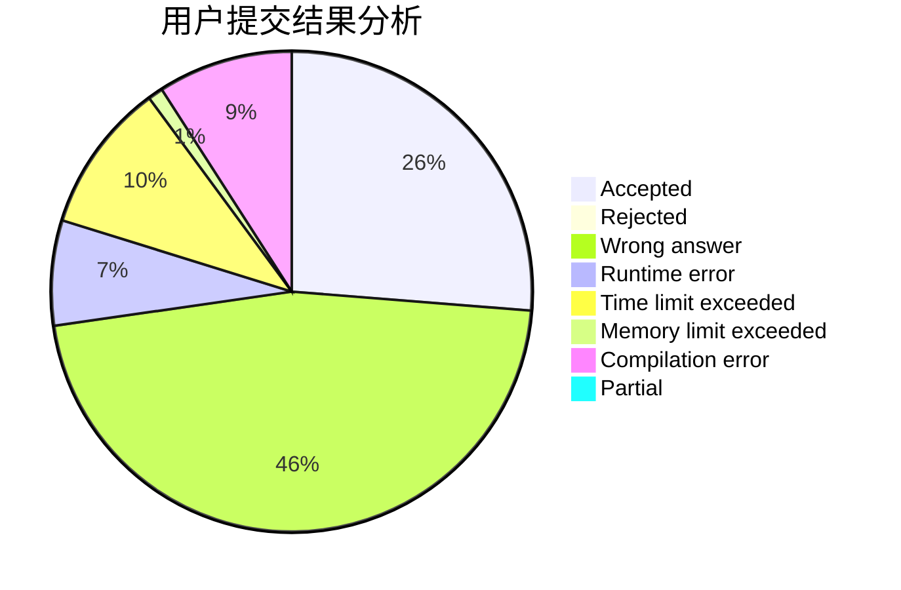
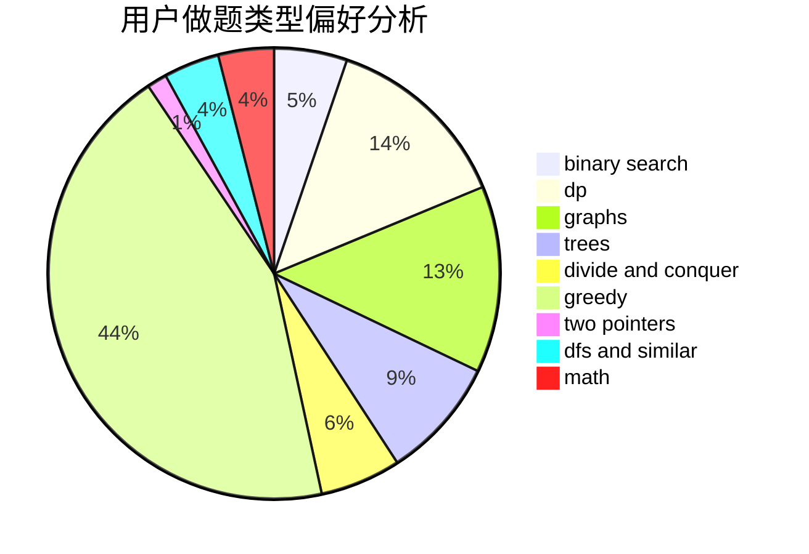

# Dvelpro

<!-- tabs:start -->

#### **用户提交结果分析**

#### **用户做题类型偏好分析**

<!-- tabs:end -->
# 推荐题目
[1445D](https://codeforces.com/contest/1445/problem/D)
[1000F](https://codeforces.com/contest/1000/problem/F)
[1169A](https://codeforces.com/contest/1169/problem/A)
[714A](https://codeforces.com/contest/714/problem/A)
[497E](https://codeforces.com/contest/497/problem/E)
[814D](https://codeforces.com/contest/814/problem/D)
[277D](https://codeforces.com/contest/277/problem/D)
[814C](https://codeforces.com/contest/814/problem/C)
[1065B](https://codeforces.com/contest/1065/problem/B)
[398C](https://codeforces.com/contest/398/problem/C)
