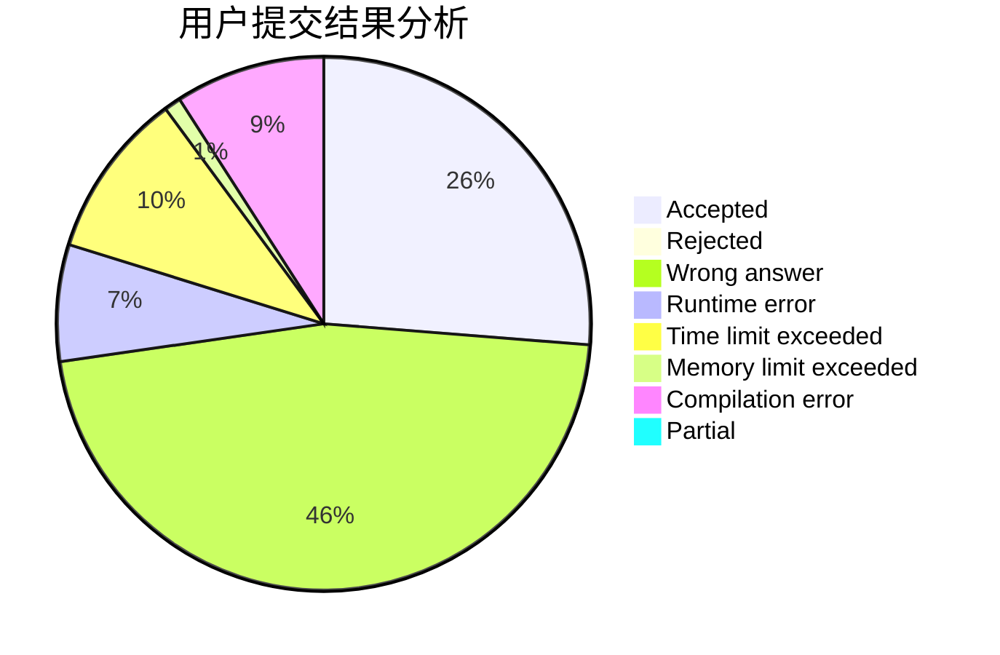
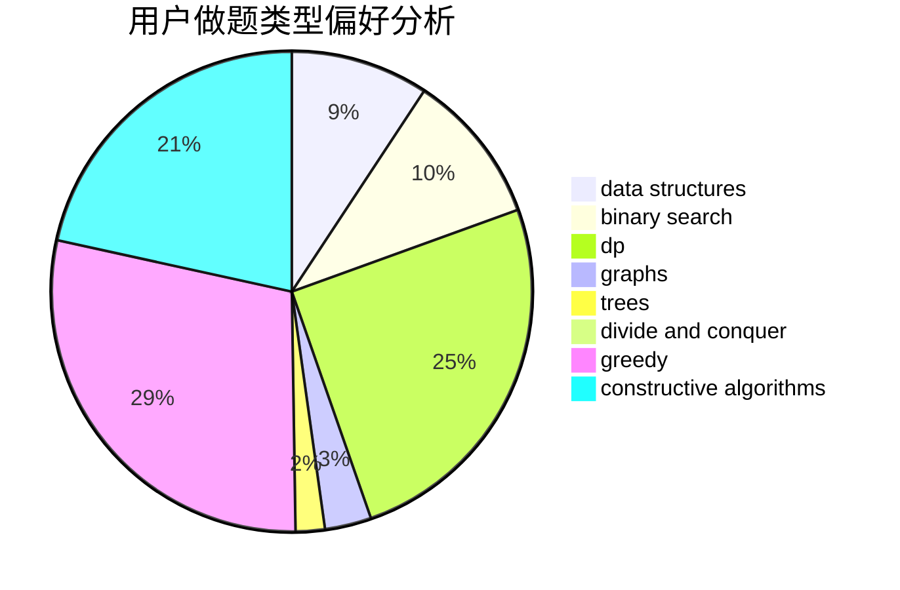
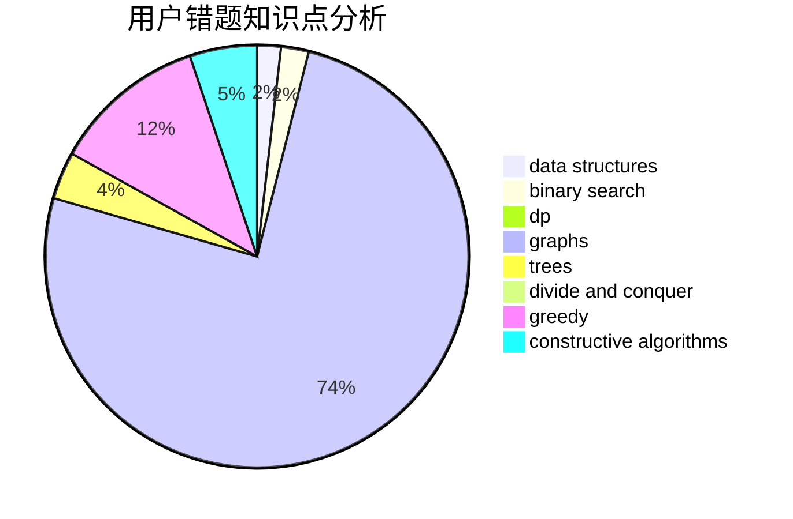

# Dvelpro

<!-- tabs:start -->

#### **用户提交结果分析**

#### **用户做题类型偏好分析**

#### **用户错题知识点分析**

<!-- tabs:end -->
# 推荐题目
[1435D](https://codeforces.com/contest/1435/problem/D)		dsu,graphs,sortings,trees		  
[1000F](https://codeforces.com/contest/1000/problem/F)		data structures,
                        divide and conquer		  
[1166B](https://codeforces.com/contest/1166/problem/B)		constructive algorithms,
                        math,
                        number theory		  
[697C](https://codeforces.com/contest/697/problem/C)		dsu,graphs,sortings,trees		  
[477E](https://codeforces.com/contest/477/problem/E)		data structures		  
[7C](https://codeforces.com/contest/7/problem/C)		math,
                        number theory		  
[25D](https://codeforces.com/contest/25/problem/D)		dsu,
                        graphs,
                        trees		  
[7B](https://codeforces.com/contest/7/problem/B)		implementation		  
[1064E](https://codeforces.com/contest/1064/problem/E)		dsu,graphs,sortings,trees		  
[367D](https://codeforces.com/contest/367/problem/D)		bitmasks,
                        dfs and similar		  
