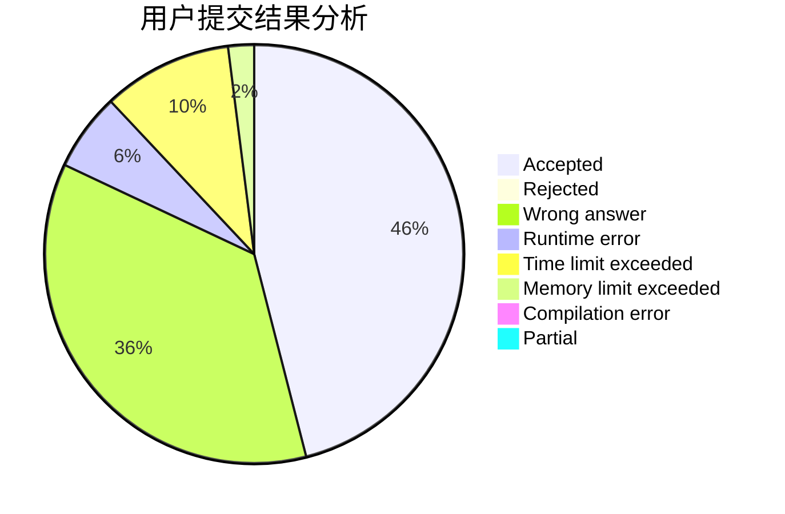
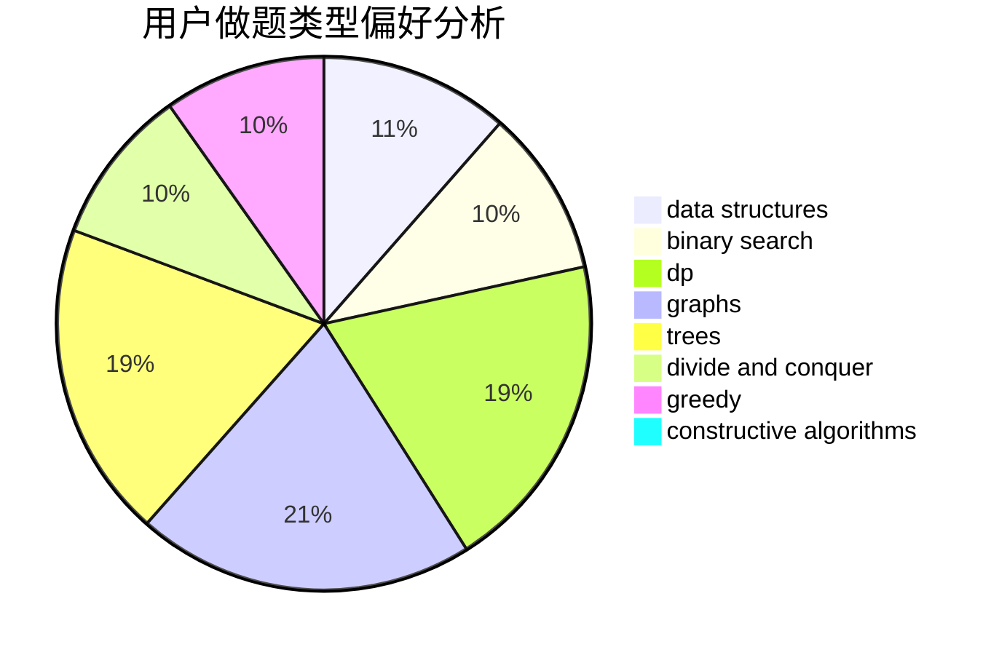

# Dylj

<!-- tabs:start -->

#### **用户提交结果分析**

#### **用户做题类型偏好分析**

#### **用户错题知识点分析**

<!-- tabs:end -->
# 推荐题目
[1314F](https://codeforces.com/contest/1314/problem/F)		dsu,graphs,sortings,trees		  
[199E](https://codeforces.com/contest/199/problem/E)		dsu,graphs,sortings,trees		  
[815A](https://codeforces.com/contest/815/problem/A)		brute force,
                        greedy,
                        implementation		  
[1148H](https://codeforces.com/contest/1148/problem/H)		data structures		  
[814E](https://codeforces.com/contest/814/problem/E)		combinatorics,
                        dp,
                        graphs,
                        shortest paths		  
[341C](https://codeforces.com/contest/341/problem/C)		dsu,graphs,sortings,trees		  
[71B](https://codeforces.com/contest/71/problem/B)		implementation,
                        math		  
[605B](https://codeforces.com/contest/605/problem/B)		constructive algorithms,
                        data structures,
                        graphs		  
[618B](https://codeforces.com/contest/618/problem/B)		constructive algorithms		  
[675B](https://codeforces.com/contest/675/problem/B)		brute force,
                        constructive algorithms,
                        math		  
