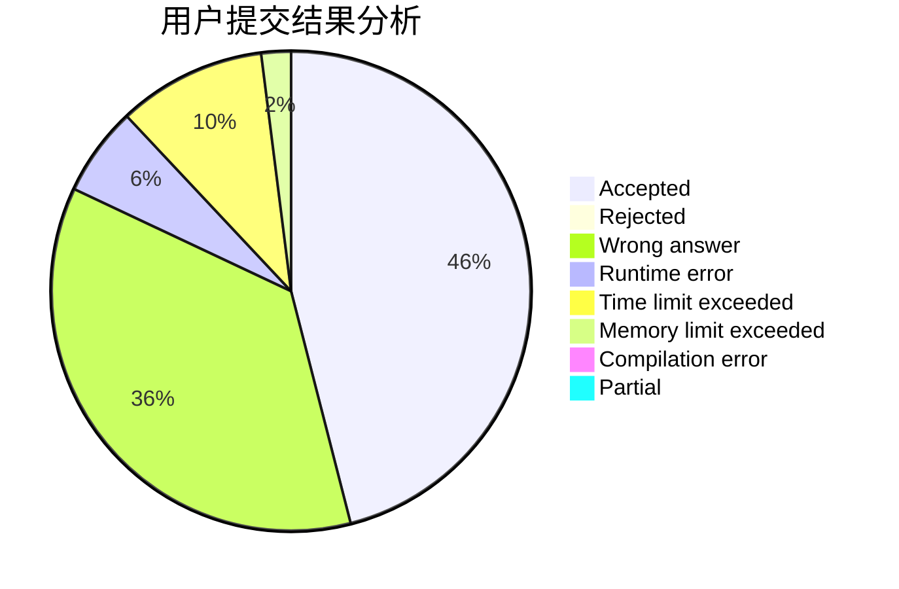
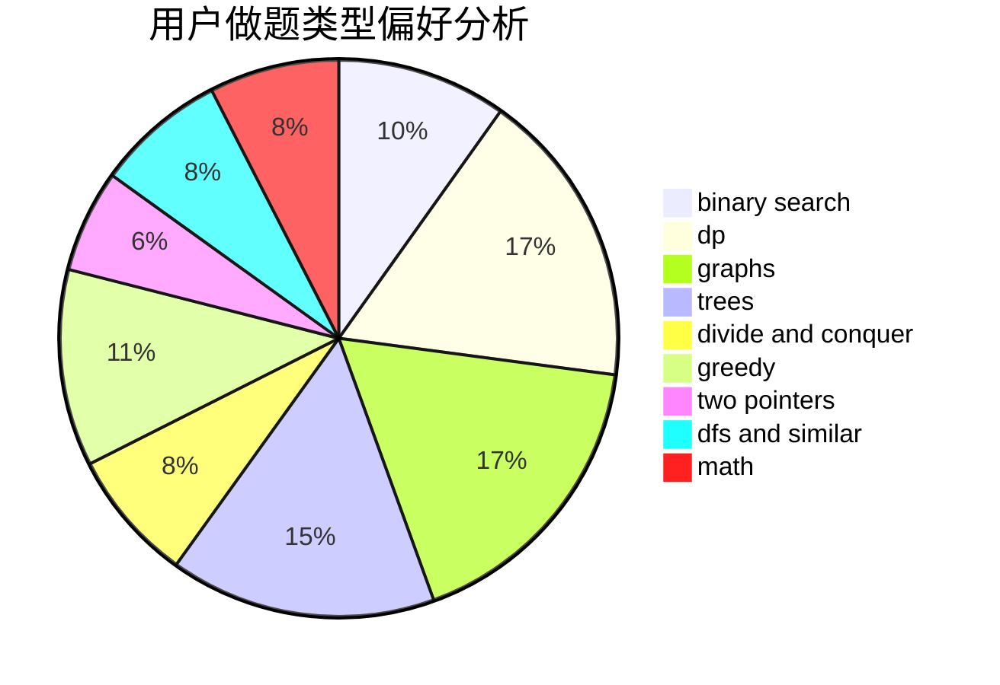

# Dylj

<!-- tabs:start -->

#### **用户提交结果分析**

#### **用户做题类型偏好分析**

<!-- tabs:end -->
# 推荐题目
[1314F](https://codeforces.com/contest/1314/problem/F)
[199E](https://codeforces.com/contest/199/problem/E)
[815A](https://codeforces.com/contest/815/problem/A)
[1148H](https://codeforces.com/contest/1148/problem/H)
[814E](https://codeforces.com/contest/814/problem/E)
[341C](https://codeforces.com/contest/341/problem/C)
[71B](https://codeforces.com/contest/71/problem/B)
[605B](https://codeforces.com/contest/605/problem/B)
[618B](https://codeforces.com/contest/618/problem/B)
[675B](https://codeforces.com/contest/675/problem/B)
