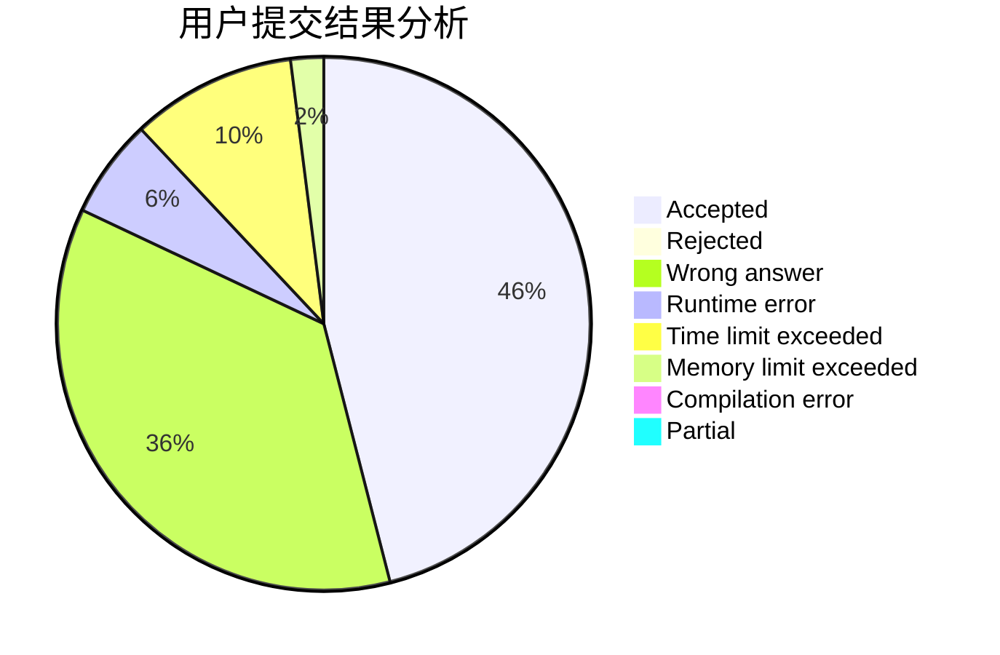
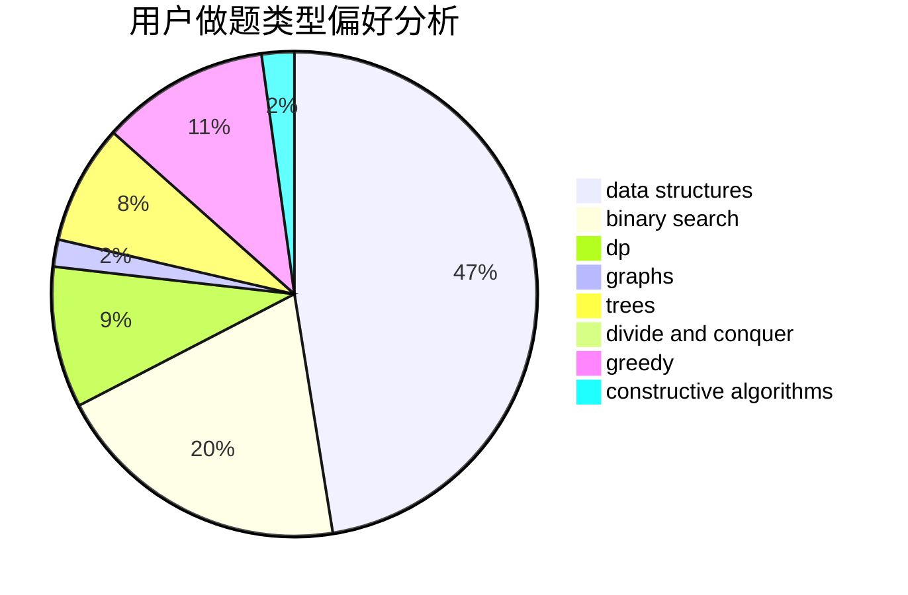

# Dylj

<!-- tabs:start -->

#### **用户提交结果分析**

#### **用户做题类型偏好分析**

#### **用户错题知识点分析**

<!-- tabs:end -->
# 推荐题目
[1305G](https://codeforces.com/contest/1305/problem/G)		bitmasks,
                        brute force,
                        dp,
                        dsu,
                        graphs		  
[171G](https://codeforces.com/contest/171/problem/G)		*special problem		  
[7E](https://codeforces.com/contest/7/problem/E)		dp,
                        expression parsing,
                        implementation		  
[1147A](https://codeforces.com/contest/1147/problem/A)		graphs		  
[7D](https://codeforces.com/contest/7/problem/D)		hashing,
                        strings		  
[316C2](https://codeforces.com/contest/316C/problem/2)		flows,
                        graph matchings		  
[701E](https://codeforces.com/contest/701/problem/E)		dsu,graphs,sortings,trees		  
[584E](https://codeforces.com/contest/584/problem/E)		constructive algorithms,
                        greedy,
                        math		  
[59A](https://codeforces.com/contest/59/problem/A)		implementation,
                        strings		  
[651B](https://codeforces.com/contest/651/problem/B)		greedy,
                        sortings		  
