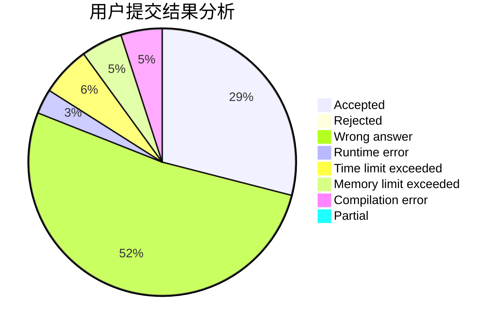
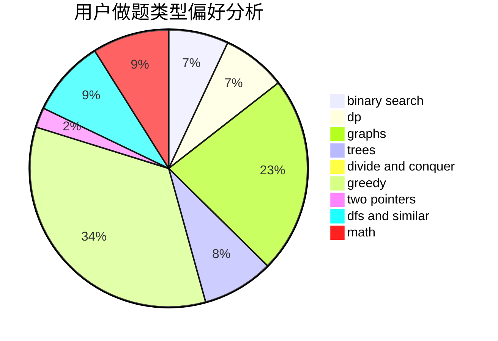

# Dyswan

<!-- tabs:start -->

#### **用户提交结果分析**

#### **用户做题类型偏好分析**

<!-- tabs:end -->
# 推荐题目
[1187E](https://codeforces.com/contest/1187/problem/E)
[58E](https://codeforces.com/contest/58/problem/E)
[160D](https://codeforces.com/contest/160/problem/D)
[1191A](https://codeforces.com/contest/1191/problem/A)
[815B](https://codeforces.com/contest/815/problem/B)
[780E](https://codeforces.com/contest/780/problem/E)
[447A](https://codeforces.com/contest/447/problem/A)
[5131](https://codeforces.com/contest/513/problem/1)
[103B](https://codeforces.com/contest/103/problem/B)
[1495E](https://codeforces.com/contest/1495/problem/E)
