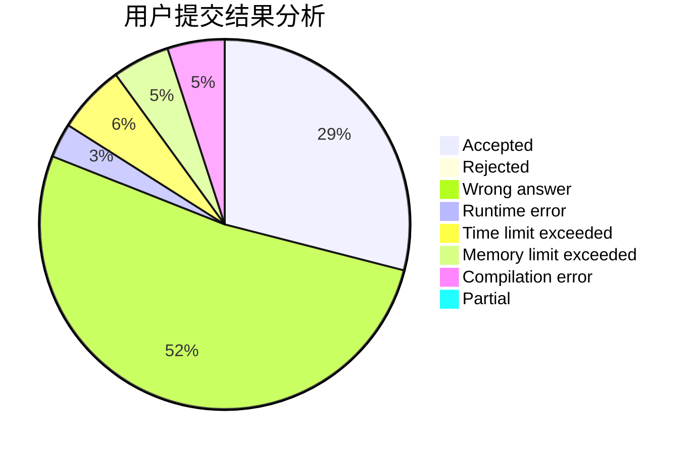
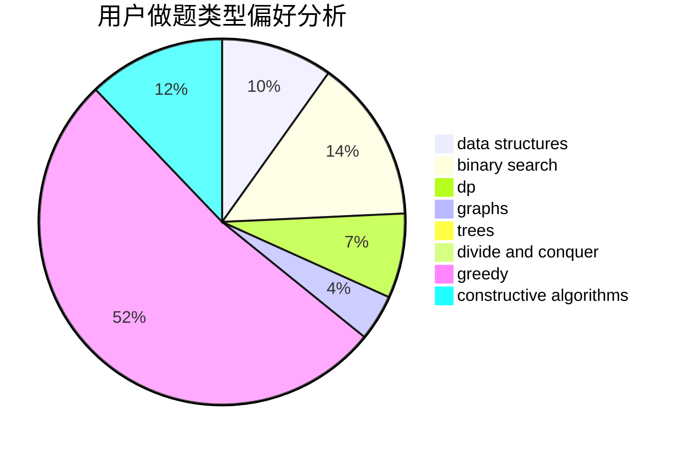
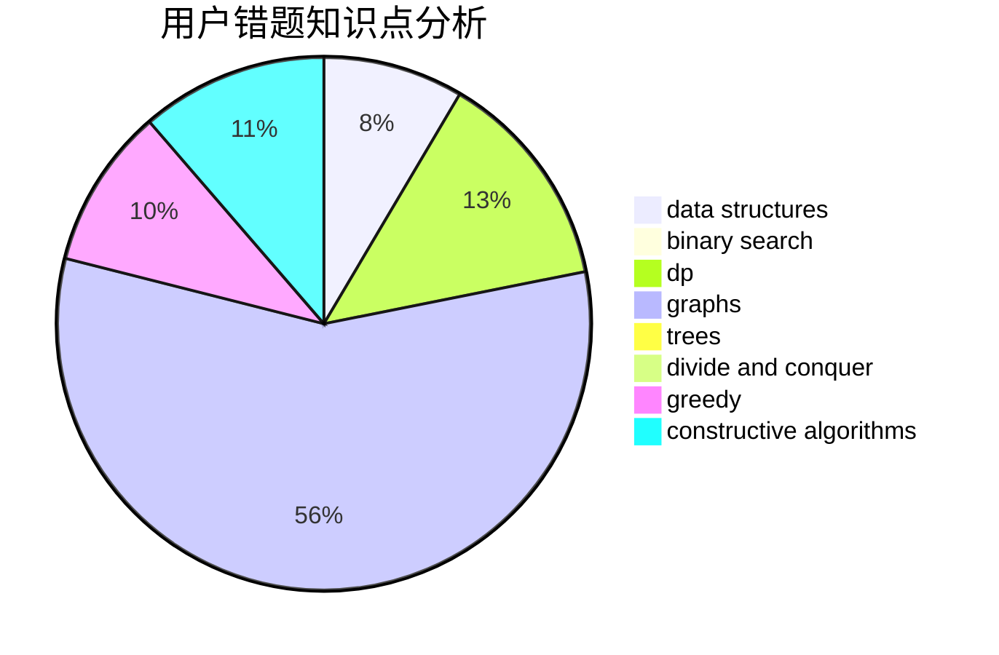

# Dyswan
<!-- tabs:start -->
#### **用户提交结果分析**

#### **用户做题类型偏好分析**

#### **用户错题知识点分析**

<!-- tabs:end -->
# 推荐题目
[Spoilt Permutation](http://codeforces.com/problemset/problem/56/B)		implementation		  
[The Doctor Meets Vader (Medium)](http://codeforces.com/problemset/problem/1184/B2)		flows,
                        graph matchings,
                        graphs,
                        shortest paths,
                        sortings		  
[Megacity](http://codeforces.com/problemset/problem/424/B)		binary search,
                        greedy,
                        implementation,
                        sortings		  
[Vulnerable Kerbals](https://codeforces.com/contest/800/problem/C)		constructive algorithms,
                        dp,
                        graphs,
                        math,
                        number theory		  
[Voltage Keepsake](https://codeforces.com/contest/800/problem/A)		binary search,
                        math		  
[Analysis of Pathes in Functional Graph](http://codeforces.com/problemset/problem/702/E)		data structures,
                        graphs		  
[Star Trek](http://codeforces.com/problemset/problem/1402/C)		*special problem,
                        combinatorics,
                        dfs and similar,
                        dp,
                        games,
                        graphs,
                        matrices,
                        trees		  
[k-th divisor](http://codeforces.com/problemset/problem/762/A)		math,
                        number theory		  
[Subarray Sorting](http://codeforces.com/problemset/problem/1187/D)		data structures,
                        sortings		  
[Construct the String](http://codeforces.com/problemset/problem/1335/B)		constructive algorithms		  
<!-- tabs:start -->
#### **data structures**
[Analysis of Pathes in Functional Graph](http://codeforces.com/problemset/problem/702/E)		data structures,
                        graphs		  
[Subarray Sorting](http://codeforces.com/problemset/problem/1187/D)		data structures,
                        sortings		  
[Boring Card Game](http://codeforces.com/problemset/problem/1427/F)		data structures,
                        greedy,
                        trees		  
[Rooks and Rectangles](http://codeforces.com/problemset/problem/524/E)		data structures,
                        sortings		  
[Chat Order](http://codeforces.com/problemset/problem/637/B)		*special problem,
                        binary search,
                        constructive algorithms,
                        data structures,
                        sortings		  
[You Are Given a Tree](http://codeforces.com/problemset/problem/1039/D)		data structures,
                        dp,
                        trees		  
[Complete the MST](https://codeforces.com/contest/1509/problem/F)		data structures,
                        dfs and similar,
                        dsu,
                        graphs,
                        greedy,
                        math		  
[Travelling Salesman Problem](https://codeforces.com/contest/1504/problem/E)		binary search,
                        data structures,
                        dp,
                        greedy,
                        shortest paths,
                        sortings,
                        two pointers		  
[Decreasing Debts](http://codeforces.com/problemset/problem/1266/D)		constructive algorithms,
                        data structures,
                        graphs,
                        greedy,
                        implementation,
                        math,
                        two pointers		  
[Maximum width](http://codeforces.com/problemset/problem/1492/C)		binary search,
                        data structures,
                        dp,
                        greedy,
                        two pointers		  
#### **binary search**
[Megacity](http://codeforces.com/problemset/problem/424/B)		binary search,
                        greedy,
                        implementation,
                        sortings		  
[Voltage Keepsake](https://codeforces.com/contest/800/problem/A)		binary search,
                        math		  
[Chat Order](http://codeforces.com/problemset/problem/637/B)		*special problem,
                        binary search,
                        constructive algorithms,
                        data structures,
                        sortings		  
[Vanya and Computer Game](http://codeforces.com/problemset/problem/492/D)		binary search,
                        implementation,
                        math,
                        sortings		  
[Travelling Salesman Problem](https://codeforces.com/contest/1504/problem/E)		binary search,
                        data structures,
                        dp,
                        greedy,
                        shortest paths,
                        sortings,
                        two pointers		  
[Maximum Subrectangle](http://codeforces.com/problemset/problem/1060/C)		binary search,
                        implementation,
                        two pointers		  
[Maximum width](http://codeforces.com/problemset/problem/1492/C)		binary search,
                        data structures,
                        dp,
                        greedy,
                        two pointers		  
[Pairs](http://codeforces.com/problemset/problem/1463/D)		binary search,
                        constructive algorithms,
                        greedy,
                        two pointers		  
[Old Floppy Drive](http://codeforces.com/problemset/problem/1490/G)		binary search,
                        data structures,
                        math		  
[Odd Mineral Resource](http://codeforces.com/problemset/problem/1479/D)		binary search,
                        bitmasks,
                        brute force,
                        data structures,
                        probabilities,
                        trees		  
#### **dp**
[Vulnerable Kerbals](https://codeforces.com/contest/800/problem/C)		constructive algorithms,
                        dp,
                        graphs,
                        math,
                        number theory		  
[Star Trek](http://codeforces.com/problemset/problem/1402/C)		*special problem,
                        combinatorics,
                        dfs and similar,
                        dp,
                        games,
                        graphs,
                        matrices,
                        trees		  
[Varying Kibibits](https://codeforces.com/contest/800/problem/D)		bitmasks,
                        dp		  
[Pashmak and Graph](http://codeforces.com/problemset/problem/459/E)		dp,
                        sortings		  
[World of Darkraft - 2](http://codeforces.com/problemset/problem/464/D)		dp,
                        probabilities		  
[You Are Given a Tree](http://codeforces.com/problemset/problem/1039/D)		data structures,
                        dp,
                        trees		  
[Travelling Salesman Problem](https://codeforces.com/contest/1504/problem/E)		binary search,
                        data structures,
                        dp,
                        greedy,
                        shortest paths,
                        sortings,
                        two pointers		  
[Make Equal](http://codeforces.com/problemset/problem/1188/D)		dp		  
[The Top Scorer](http://codeforces.com/problemset/problem/1096/E)		combinatorics,
                        dp,
                        math,
                        probabilities		  
[Maximum width](http://codeforces.com/problemset/problem/1492/C)		binary search,
                        data structures,
                        dp,
                        greedy,
                        two pointers		  
#### **graph**
[The Doctor Meets Vader (Medium)](http://codeforces.com/problemset/problem/1184/B2)		flows,
                        graph matchings,
                        graphs,
                        shortest paths,
                        sortings		  
[Vulnerable Kerbals](https://codeforces.com/contest/800/problem/C)		constructive algorithms,
                        dp,
                        graphs,
                        math,
                        number theory		  
[Analysis of Pathes in Functional Graph](http://codeforces.com/problemset/problem/702/E)		data structures,
                        graphs		  
[Star Trek](http://codeforces.com/problemset/problem/1402/C)		*special problem,
                        combinatorics,
                        dfs and similar,
                        dp,
                        games,
                        graphs,
                        matrices,
                        trees		  
[Complete the MST](https://codeforces.com/contest/1509/problem/F)		data structures,
                        dfs and similar,
                        dsu,
                        graphs,
                        greedy,
                        math		  
[Decreasing Debts](http://codeforces.com/problemset/problem/1266/D)		constructive algorithms,
                        data structures,
                        graphs,
                        greedy,
                        implementation,
                        math,
                        two pointers		  
[One Billion Shades of Grey](http://codeforces.com/problemset/problem/1427/G)		flows,
                        graphs		  
[Directed Roads](http://codeforces.com/problemset/problem/711/D)		combinatorics,
                        dfs and similar,
                        graphs,
                        math		  
[Minimum Ties](http://codeforces.com/problemset/problem/1487/C)		brute force,
                        constructive algorithms,
                        dfs and similar,
                        graphs,
                        greedy,
                        implementation,
                        math		  
[Chef Monocarp](http://codeforces.com/problemset/problem/1437/C)		dp,
                        flows,
                        graph matchings,
                        greedy,
                        math,
                        sortings		  
#### **trees**
[Star Trek](http://codeforces.com/problemset/problem/1402/C)		*special problem,
                        combinatorics,
                        dfs and similar,
                        dp,
                        games,
                        graphs,
                        matrices,
                        trees		  
[Boring Card Game](http://codeforces.com/problemset/problem/1427/F)		data structures,
                        greedy,
                        trees		  
[You Are Given a Tree](http://codeforces.com/problemset/problem/1039/D)		data structures,
                        dp,
                        trees		  
[Odd Mineral Resource](http://codeforces.com/problemset/problem/1479/D)		binary search,
                        bitmasks,
                        brute force,
                        data structures,
                        probabilities,
                        trees		  
[Yet Another Card Deck](http://codeforces.com/problemset/problem/1511/C)		brute force,
                        data structures,
                        implementation,
                        trees		  
[Diameter Cuts](http://codeforces.com/problemset/problem/1499/F)		combinatorics,
                        dfs and similar,
                        dp,
                        trees		  
[Fib-tree](http://codeforces.com/problemset/problem/1491/E)		brute force,
                        dfs and similar,
                        divide and conquer,
                        number theory,
                        trees		  
[13th Labour of Heracles](http://codeforces.com/problemset/problem/1466/D)		data structures,
                        greedy,
                        sortings,
                        trees		  
[BFS Trees](http://codeforces.com/problemset/problem/1495/D)		combinatorics,
                        dfs and similar,
                        graphs,
                        math,
                        shortest paths,
                        trees		  
[Sum of Prefix Sums](http://codeforces.com/problemset/problem/1303/G)		data structures,
                        divide and conquer,
                        geometry,
                        trees		  
#### **divide and conquer**
[Divide and Summarize](http://codeforces.com/problemset/problem/1461/D)		binary search,
                        brute force,
                        data structures,
                        divide and conquer,
                        implementation,
                        sortings		  
[Song of the Sirens](http://codeforces.com/problemset/problem/1466/G)		combinatorics,
                        divide and conquer,
                        hashing,
                        math,
                        string suffix structures,
                        strings		  
[Permutation Transformation](http://codeforces.com/problemset/problem/1490/D)		dfs and similar,
                        divide and conquer,
                        implementation		  
[Skyline Photo](https://codeforces.com/contest/1483/problem/C)		data structures,
                        divide and conquer,
                        dp		  
[Fib-tree](http://codeforces.com/problemset/problem/1491/E)		brute force,
                        dfs and similar,
                        divide and conquer,
                        number theory,
                        trees		  
[Sum of Prefix Sums](http://codeforces.com/problemset/problem/1303/G)		data structures,
                        divide and conquer,
                        geometry,
                        trees		  
[Dogeforces](http://codeforces.com/problemset/problem/1494/D)		constructive algorithms,
                        data structures,
                        dfs and similar,
                        divide and conquer,
                        dsu,
                        greedy,
                        sortings,
                        trees		  
[Logistical Questions](http://codeforces.com/problemset/problem/566/C)		dfs and similar,
                        divide and conquer,
                        trees		  
[Fruit Sequences](http://codeforces.com/problemset/problem/1428/F)		binary search,
                        data structures,
                        divide and conquer,
                        dp,
                        two pointers		  
[Dr. Evil Underscores](http://codeforces.com/problemset/problem/1285/D)		bitmasks,
                        brute force,
                        dfs and similar,
                        divide and conquer,
                        dp,
                        greedy,
                        strings,
                        trees		  
#### **greedy**
[Megacity](http://codeforces.com/problemset/problem/424/B)		binary search,
                        greedy,
                        implementation,
                        sortings		  
[Boring Card Game](http://codeforces.com/problemset/problem/1427/F)		data structures,
                        greedy,
                        trees		  
[Maria Breaks the Self-isolation](http://codeforces.com/problemset/problem/1358/B)		greedy,
                        sortings		  
[Complete the MST](https://codeforces.com/contest/1509/problem/F)		data structures,
                        dfs and similar,
                        dsu,
                        graphs,
                        greedy,
                        math		  
[The Fair Nut and Strings](http://codeforces.com/problemset/problem/1083/B)		greedy,
                        strings		  
[Travelling Salesman Problem](https://codeforces.com/contest/1504/problem/E)		binary search,
                        data structures,
                        dp,
                        greedy,
                        shortest paths,
                        sortings,
                        two pointers		  
[Candy Box (easy version)](http://codeforces.com/problemset/problem/1183/D)		greedy,
                        sortings		  
[Decreasing Debts](http://codeforces.com/problemset/problem/1266/D)		constructive algorithms,
                        data structures,
                        graphs,
                        greedy,
                        implementation,
                        math,
                        two pointers		  
[2048 Game](http://codeforces.com/problemset/problem/1221/A)		brute force,
                        greedy,
                        math		  
[Maximum width](http://codeforces.com/problemset/problem/1492/C)		binary search,
                        data structures,
                        dp,
                        greedy,
                        two pointers		  
#### **constructive algorithms**
[Vulnerable Kerbals](https://codeforces.com/contest/800/problem/C)		constructive algorithms,
                        dp,
                        graphs,
                        math,
                        number theory		  
[Construct the String](http://codeforces.com/problemset/problem/1335/B)		constructive algorithms		  
[Pavel and barbecue](http://codeforces.com/problemset/problem/756/A)		constructive algorithms,
                        dfs and similar		  
[Chat Order](http://codeforces.com/problemset/problem/637/B)		*special problem,
                        binary search,
                        constructive algorithms,
                        data structures,
                        sortings		  
[Decreasing Debts](http://codeforces.com/problemset/problem/1266/D)		constructive algorithms,
                        data structures,
                        graphs,
                        greedy,
                        implementation,
                        math,
                        two pointers		  
[Balanced Array](http://codeforces.com/problemset/problem/1343/B)		constructive algorithms,
                        math		  
[Anti-knapsack](http://codeforces.com/problemset/problem/1493/A)		constructive algorithms,
                        greedy		  
[Pairs](http://codeforces.com/problemset/problem/1463/D)		binary search,
                        constructive algorithms,
                        greedy,
                        two pointers		  
[XOR-gun](https://codeforces.com/contest/1456/problem/B)		bitmasks,
                        brute force,
                        constructive algorithms		  
[Genius's Gambit](http://codeforces.com/problemset/problem/1492/D)		bitmasks,
                        constructive algorithms,
                        greedy,
                        math		  
#### **sortings**
[The Doctor Meets Vader (Medium)](http://codeforces.com/problemset/problem/1184/B2)		flows,
                        graph matchings,
                        graphs,
                        shortest paths,
                        sortings		  
[Megacity](http://codeforces.com/problemset/problem/424/B)		binary search,
                        greedy,
                        implementation,
                        sortings		  
[Subarray Sorting](http://codeforces.com/problemset/problem/1187/D)		data structures,
                        sortings		  
[Rooks and Rectangles](http://codeforces.com/problemset/problem/524/E)		data structures,
                        sortings		  
[Chat Order](http://codeforces.com/problemset/problem/637/B)		*special problem,
                        binary search,
                        constructive algorithms,
                        data structures,
                        sortings		  
[Pashmak and Graph](http://codeforces.com/problemset/problem/459/E)		dp,
                        sortings		  
[Vanya and Computer Game](http://codeforces.com/problemset/problem/492/D)		binary search,
                        implementation,
                        math,
                        sortings		  
[Maria Breaks the Self-isolation](http://codeforces.com/problemset/problem/1358/B)		greedy,
                        sortings		  
[Travelling Salesman Problem](https://codeforces.com/contest/1504/problem/E)		binary search,
                        data structures,
                        dp,
                        greedy,
                        shortest paths,
                        sortings,
                        two pointers		  
[Candy Box (easy version)](http://codeforces.com/problemset/problem/1183/D)		greedy,
                        sortings		  
<!-- tabs:end -->
