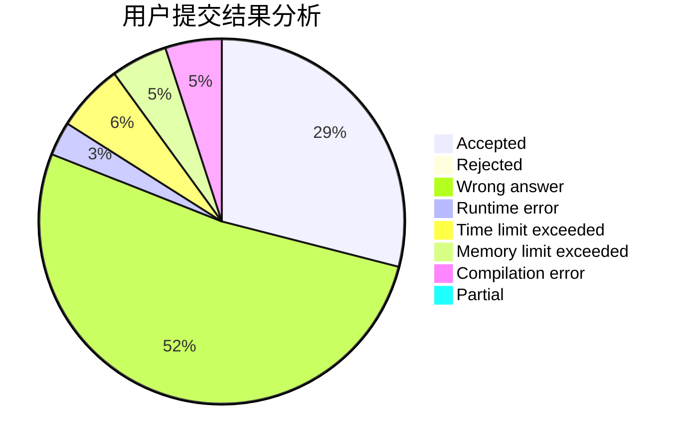
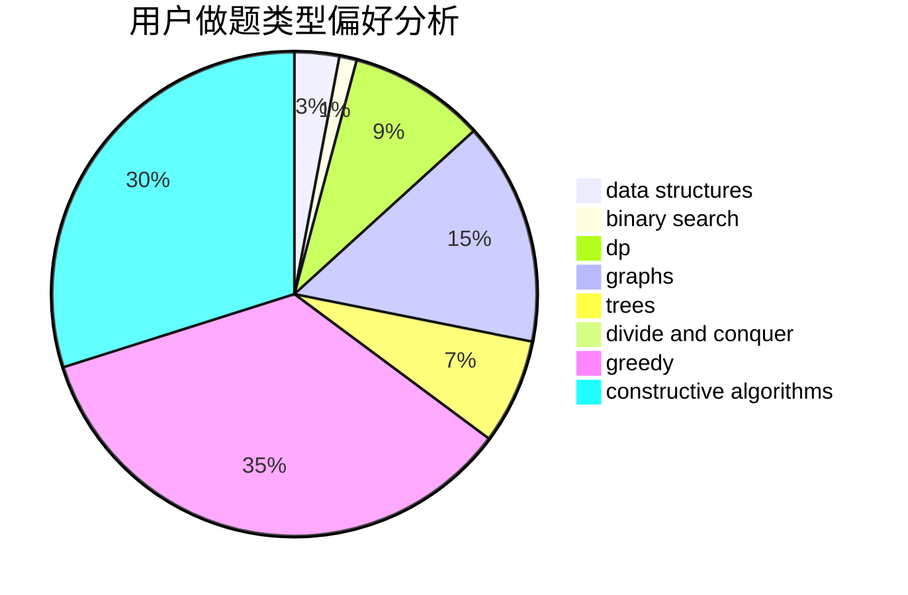
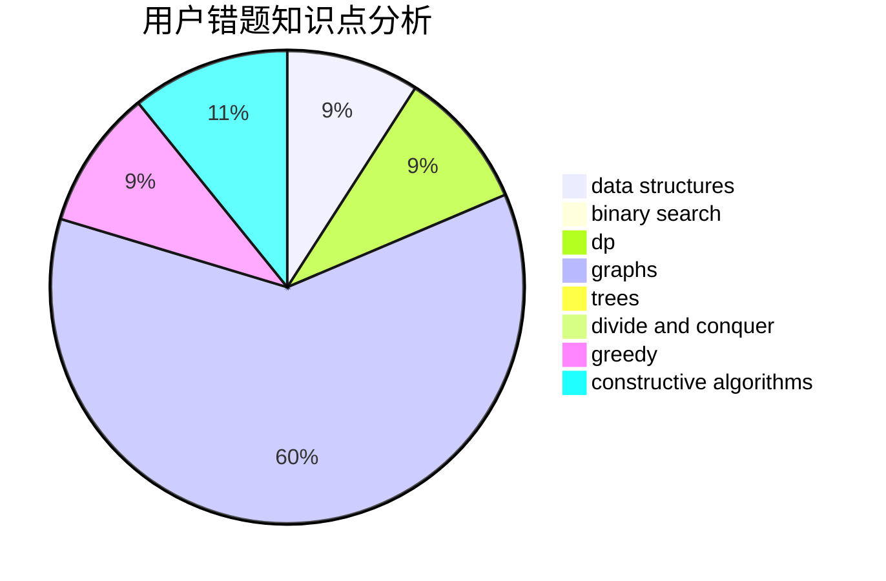

# Dyswan

<!-- tabs:start -->

#### **用户提交结果分析**

#### **用户做题类型偏好分析**

#### **用户错题知识点分析**

<!-- tabs:end -->
# 推荐题目
[1187E](https://codeforces.com/contest/1187/problem/E)		dfs and similar,
                        dp,
                        trees		  
[58E](https://codeforces.com/contest/58/problem/E)		dp		  
[160D](https://codeforces.com/contest/160/problem/D)		dfs and similar,
                        dsu,
                        graphs,
                        sortings		  
[1191A](https://codeforces.com/contest/1191/problem/A)		brute force		  
[815B](https://codeforces.com/contest/815/problem/B)		brute force,
                        combinatorics,
                        constructive algorithms,
                        math		  
[780E](https://codeforces.com/contest/780/problem/E)		constructive algorithms,
                        dfs and similar,
                        graphs		  
[447A](https://codeforces.com/contest/447/problem/A)		implementation		  
[5131](https://codeforces.com/contest/513/problem/1)		dsu,graphs,sortings,trees		  
[103B](https://codeforces.com/contest/103/problem/B)		dfs and similar,
                        dsu,
                        graphs		  
[1495E](https://codeforces.com/contest/1495/problem/E)		brute force,
                        data structures,
                        greedy,
                        implementation		  
