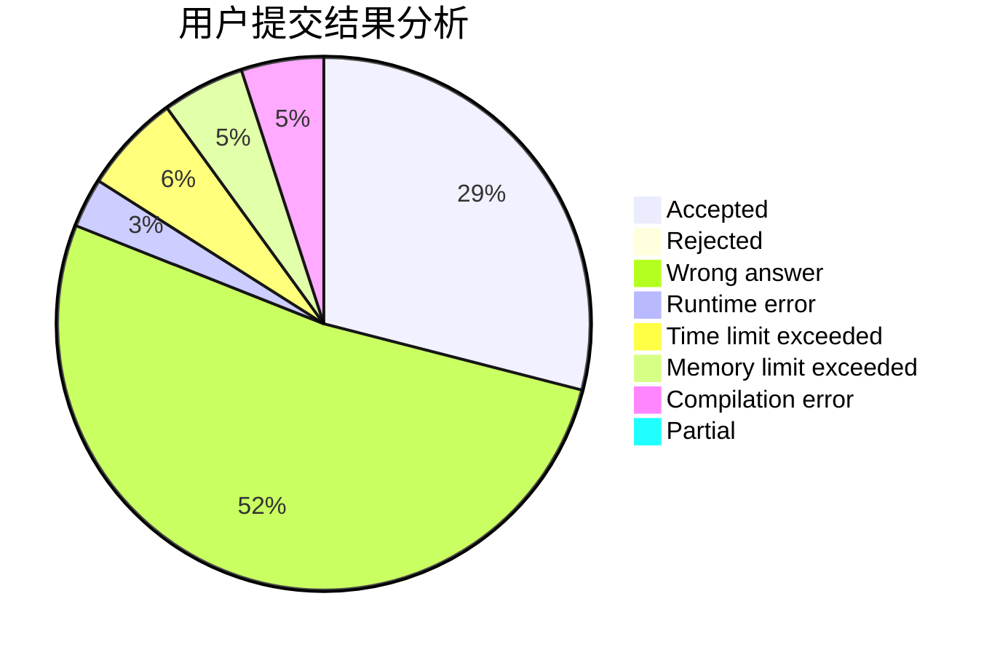
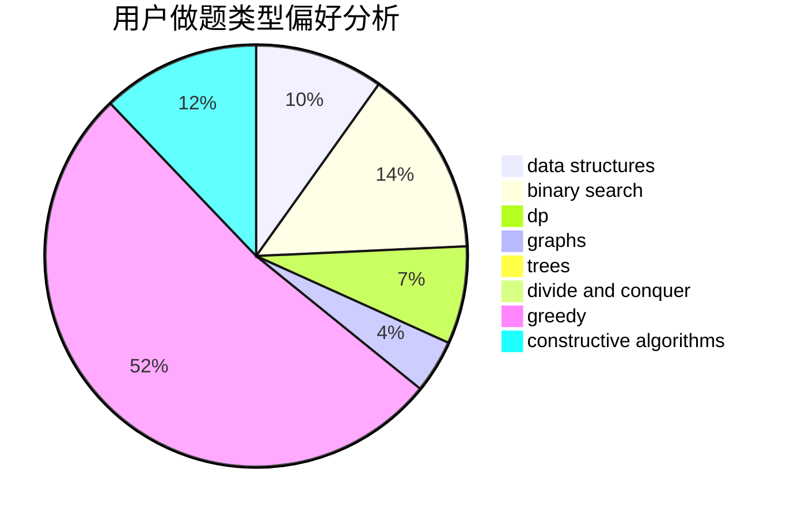
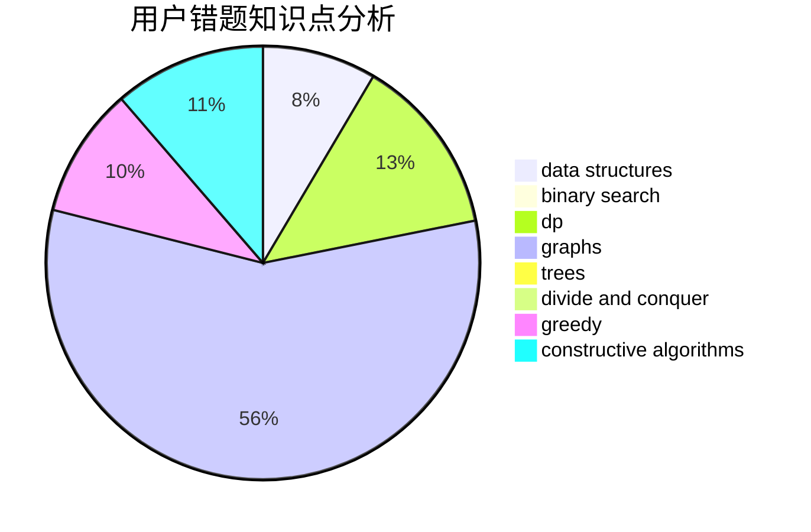

# Dyswan

<!-- tabs:start -->

#### **用户提交结果分析**

#### **用户做题类型偏好分析**

#### **用户错题知识点分析**

<!-- tabs:end -->
# 推荐题目
[1184B2](https://codeforces.com/contest/1184B/problem/2)		flows,
                        graph matchings,
                        graphs,
                        shortest paths,
                        sortings		  
[56B](https://codeforces.com/contest/56/problem/B)		implementation		  
[1509F](https://codeforces.com/contest/1509/problem/F)		dsu,graphs,sortings,trees		  
[1187D](https://codeforces.com/contest/1187/problem/D)		data structures,
                        sortings		  
[800A](https://codeforces.com/contest/800/problem/A)		dsu,graphs,sortings,trees		  
[762A](https://codeforces.com/contest/762/problem/A)		math,
                        number theory		  
[424B](https://codeforces.com/contest/424/problem/B)		binary search,
                        greedy,
                        implementation,
                        sortings		  
[492D](https://codeforces.com/contest/492/problem/D)		binary search,
                        implementation,
                        math,
                        sortings		  
[1039D](https://codeforces.com/contest/1039/problem/D)		data structures,
                        dp,
                        trees		  
[1488A](https://codeforces.com/contest/1488/problem/A)		*special problem,
                        math		  
