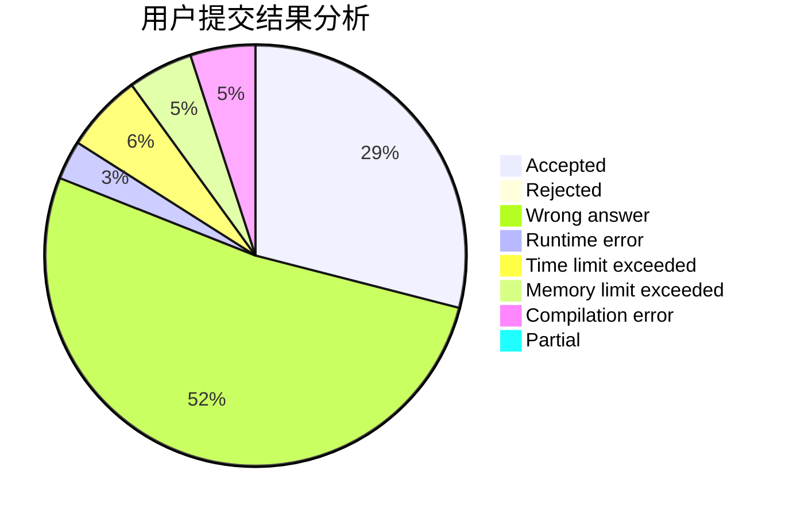
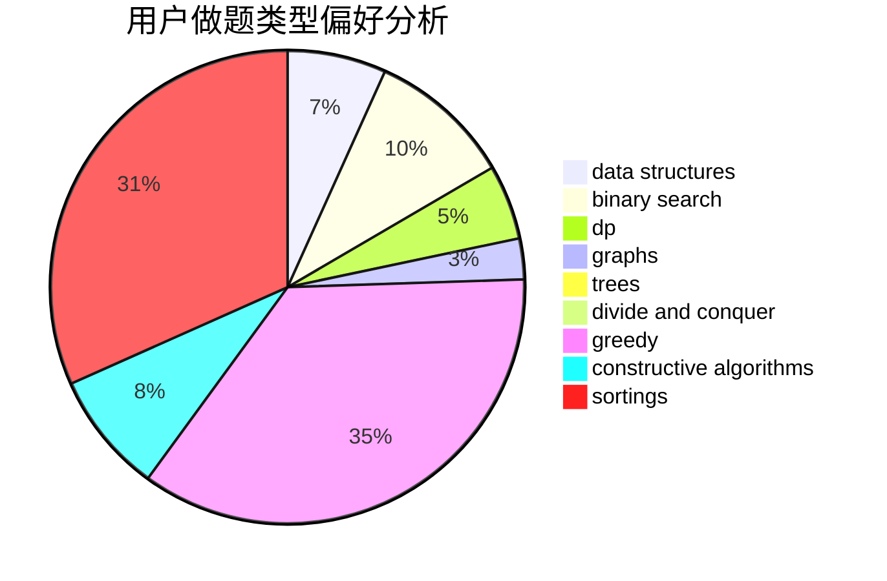
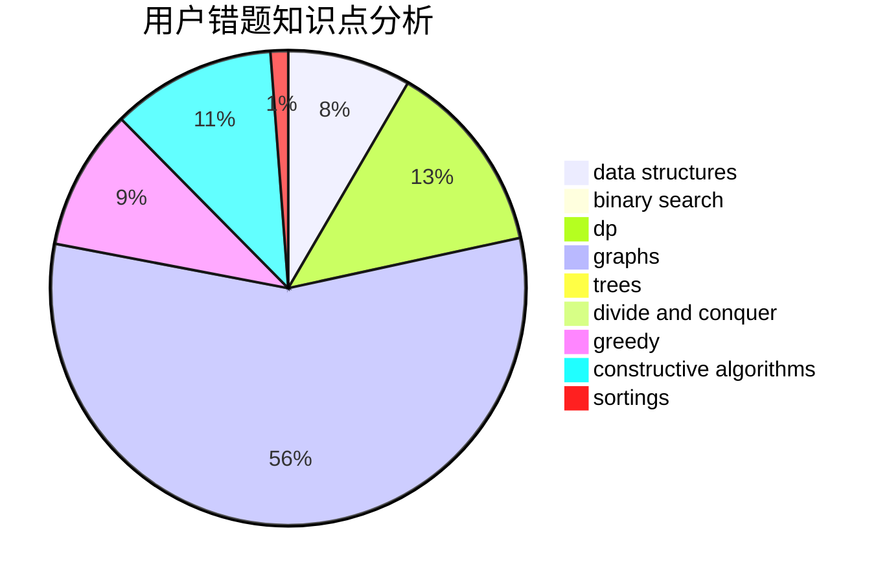

# Dyswan
<!-- tabs:start -->
#### **用户提交结果分析**

#### **用户做题类型偏好分析**

#### **用户错题知识点分析**

<!-- tabs:end -->
# 推荐题目
[56B](http://codeforces.com/problemset/problem/56/B)		implementation		  
[1184B2](http://codeforces.com/problemset/problem/1184/B2)		flows,
                        graph matchings,
                        graphs,
                        shortest paths,
                        sortings		  
[424B](http://codeforces.com/problemset/problem/424/B)		binary search,
                        greedy,
                        implementation,
                        sortings		  
[800C](https://codeforces.com/contest/800/problem/C)		constructive algorithms,
                        dp,
                        graphs,
                        math,
                        number theory		  
[800A](https://codeforces.com/contest/800/problem/A)		binary search,
                        math		  
[702E](http://codeforces.com/problemset/problem/702/E)		data structures,
                        graphs		  
[1402C](http://codeforces.com/problemset/problem/1402/C)		*special problem,
                        combinatorics,
                        dfs and similar,
                        dp,
                        games,
                        graphs,
                        matrices,
                        trees		  
[762A](http://codeforces.com/problemset/problem/762/A)		math,
                        number theory		  
[1187D](http://codeforces.com/problemset/problem/1187/D)		data structures,
                        sortings		  
[1335B](http://codeforces.com/problemset/problem/1335/B)		constructive algorithms		  
<!-- tabs:start -->
#### **data structures**
[702E](http://codeforces.com/problemset/problem/702/E)		data structures,
                        graphs		  
[1187D](http://codeforces.com/problemset/problem/1187/D)		data structures,
                        sortings		  
[1427F](http://codeforces.com/problemset/problem/1427/F)		data structures,
                        greedy,
                        trees		  
[524E](http://codeforces.com/problemset/problem/524/E)		data structures,
                        sortings		  
[637B](http://codeforces.com/problemset/problem/637/B)		*special problem,
                        binary search,
                        constructive algorithms,
                        data structures,
                        sortings		  
[1039D](http://codeforces.com/problemset/problem/1039/D)		data structures,
                        dp,
                        trees		  
[1509F](https://codeforces.com/contest/1509/problem/F)		data structures,
                        dfs and similar,
                        dsu,
                        graphs,
                        greedy,
                        math		  
[1504E](https://codeforces.com/contest/1504/problem/E)		binary search,
                        data structures,
                        dp,
                        greedy,
                        shortest paths,
                        sortings,
                        two pointers		  
[1266D](http://codeforces.com/problemset/problem/1266/D)		constructive algorithms,
                        data structures,
                        graphs,
                        greedy,
                        implementation,
                        math,
                        two pointers		  
[1492C](http://codeforces.com/problemset/problem/1492/C)		binary search,
                        data structures,
                        dp,
                        greedy,
                        two pointers		  
#### **binary search**
[424B](http://codeforces.com/problemset/problem/424/B)		binary search,
                        greedy,
                        implementation,
                        sortings		  
[800A](https://codeforces.com/contest/800/problem/A)		binary search,
                        math		  
[637B](http://codeforces.com/problemset/problem/637/B)		*special problem,
                        binary search,
                        constructive algorithms,
                        data structures,
                        sortings		  
[492D](http://codeforces.com/problemset/problem/492/D)		binary search,
                        implementation,
                        math,
                        sortings		  
[1504E](https://codeforces.com/contest/1504/problem/E)		binary search,
                        data structures,
                        dp,
                        greedy,
                        shortest paths,
                        sortings,
                        two pointers		  
[1060C](http://codeforces.com/problemset/problem/1060/C)		binary search,
                        implementation,
                        two pointers		  
[1492C](http://codeforces.com/problemset/problem/1492/C)		binary search,
                        data structures,
                        dp,
                        greedy,
                        two pointers		  
[1463D](http://codeforces.com/problemset/problem/1463/D)		binary search,
                        constructive algorithms,
                        greedy,
                        two pointers		  
[1490G](http://codeforces.com/problemset/problem/1490/G)		binary search,
                        data structures,
                        math		  
[1479D](http://codeforces.com/problemset/problem/1479/D)		binary search,
                        bitmasks,
                        brute force,
                        data structures,
                        probabilities,
                        trees		  
#### **dp**
[800C](https://codeforces.com/contest/800/problem/C)		constructive algorithms,
                        dp,
                        graphs,
                        math,
                        number theory		  
[1402C](http://codeforces.com/problemset/problem/1402/C)		*special problem,
                        combinatorics,
                        dfs and similar,
                        dp,
                        games,
                        graphs,
                        matrices,
                        trees		  
[800D](https://codeforces.com/contest/800/problem/D)		bitmasks,
                        dp		  
[459E](http://codeforces.com/problemset/problem/459/E)		dp,
                        sortings		  
[464D](http://codeforces.com/problemset/problem/464/D)		dp,
                        probabilities		  
[1039D](http://codeforces.com/problemset/problem/1039/D)		data structures,
                        dp,
                        trees		  
[1504E](https://codeforces.com/contest/1504/problem/E)		binary search,
                        data structures,
                        dp,
                        greedy,
                        shortest paths,
                        sortings,
                        two pointers		  
[1188D](http://codeforces.com/problemset/problem/1188/D)		dp		  
[1096E](http://codeforces.com/problemset/problem/1096/E)		combinatorics,
                        dp,
                        math,
                        probabilities		  
[1492C](http://codeforces.com/problemset/problem/1492/C)		binary search,
                        data structures,
                        dp,
                        greedy,
                        two pointers		  
#### **graph**
[1184B2](http://codeforces.com/problemset/problem/1184/B2)		flows,
                        graph matchings,
                        graphs,
                        shortest paths,
                        sortings		  
[800C](https://codeforces.com/contest/800/problem/C)		constructive algorithms,
                        dp,
                        graphs,
                        math,
                        number theory		  
[702E](http://codeforces.com/problemset/problem/702/E)		data structures,
                        graphs		  
[1402C](http://codeforces.com/problemset/problem/1402/C)		*special problem,
                        combinatorics,
                        dfs and similar,
                        dp,
                        games,
                        graphs,
                        matrices,
                        trees		  
[1509F](https://codeforces.com/contest/1509/problem/F)		data structures,
                        dfs and similar,
                        dsu,
                        graphs,
                        greedy,
                        math		  
[1266D](http://codeforces.com/problemset/problem/1266/D)		constructive algorithms,
                        data structures,
                        graphs,
                        greedy,
                        implementation,
                        math,
                        two pointers		  
[1427G](http://codeforces.com/problemset/problem/1427/G)		flows,
                        graphs		  
[711D](http://codeforces.com/problemset/problem/711/D)		combinatorics,
                        dfs and similar,
                        graphs,
                        math		  
[1487C](http://codeforces.com/problemset/problem/1487/C)		brute force,
                        constructive algorithms,
                        dfs and similar,
                        graphs,
                        greedy,
                        implementation,
                        math		  
[1437C](http://codeforces.com/problemset/problem/1437/C)		dp,
                        flows,
                        graph matchings,
                        greedy,
                        math,
                        sortings		  
#### **trees**
[1402C](http://codeforces.com/problemset/problem/1402/C)		*special problem,
                        combinatorics,
                        dfs and similar,
                        dp,
                        games,
                        graphs,
                        matrices,
                        trees		  
[1427F](http://codeforces.com/problemset/problem/1427/F)		data structures,
                        greedy,
                        trees		  
[1039D](http://codeforces.com/problemset/problem/1039/D)		data structures,
                        dp,
                        trees		  
[1479D](http://codeforces.com/problemset/problem/1479/D)		binary search,
                        bitmasks,
                        brute force,
                        data structures,
                        probabilities,
                        trees		  
[1511C](http://codeforces.com/problemset/problem/1511/C)		brute force,
                        data structures,
                        implementation,
                        trees		  
[1499F](http://codeforces.com/problemset/problem/1499/F)		combinatorics,
                        dfs and similar,
                        dp,
                        trees		  
[1491E](http://codeforces.com/problemset/problem/1491/E)		brute force,
                        dfs and similar,
                        divide and conquer,
                        number theory,
                        trees		  
[1466D](http://codeforces.com/problemset/problem/1466/D)		data structures,
                        greedy,
                        sortings,
                        trees		  
[1495D](http://codeforces.com/problemset/problem/1495/D)		combinatorics,
                        dfs and similar,
                        graphs,
                        math,
                        shortest paths,
                        trees		  
[1303G](http://codeforces.com/problemset/problem/1303/G)		data structures,
                        divide and conquer,
                        geometry,
                        trees		  
#### **divide and conquer**
[1461D](http://codeforces.com/problemset/problem/1461/D)		binary search,
                        brute force,
                        data structures,
                        divide and conquer,
                        implementation,
                        sortings		  
[1466G](http://codeforces.com/problemset/problem/1466/G)		combinatorics,
                        divide and conquer,
                        hashing,
                        math,
                        string suffix structures,
                        strings		  
[1490D](http://codeforces.com/problemset/problem/1490/D)		dfs and similar,
                        divide and conquer,
                        implementation		  
[1483C](https://codeforces.com/contest/1483/problem/C)		data structures,
                        divide and conquer,
                        dp		  
[1491E](http://codeforces.com/problemset/problem/1491/E)		brute force,
                        dfs and similar,
                        divide and conquer,
                        number theory,
                        trees		  
[1303G](http://codeforces.com/problemset/problem/1303/G)		data structures,
                        divide and conquer,
                        geometry,
                        trees		  
[1494D](http://codeforces.com/problemset/problem/1494/D)		constructive algorithms,
                        data structures,
                        dfs and similar,
                        divide and conquer,
                        dsu,
                        greedy,
                        sortings,
                        trees		  
[1482E](http://codeforces.com/problemset/problem/1482/E)		data structures,
                        divide and conquer,
                        dp		  
[566C](http://codeforces.com/problemset/problem/566/C)		dfs and similar,
                        divide and conquer,
                        trees		  
[1428F](http://codeforces.com/problemset/problem/1428/F)		binary search,
                        data structures,
                        divide and conquer,
                        dp,
                        two pointers		  
#### **greedy**
[424B](http://codeforces.com/problemset/problem/424/B)		binary search,
                        greedy,
                        implementation,
                        sortings		  
[1427F](http://codeforces.com/problemset/problem/1427/F)		data structures,
                        greedy,
                        trees		  
[1358B](http://codeforces.com/problemset/problem/1358/B)		greedy,
                        sortings		  
[1509F](https://codeforces.com/contest/1509/problem/F)		data structures,
                        dfs and similar,
                        dsu,
                        graphs,
                        greedy,
                        math		  
[1083B](http://codeforces.com/problemset/problem/1083/B)		greedy,
                        strings		  
[1504E](https://codeforces.com/contest/1504/problem/E)		binary search,
                        data structures,
                        dp,
                        greedy,
                        shortest paths,
                        sortings,
                        two pointers		  
[1183D](http://codeforces.com/problemset/problem/1183/D)		greedy,
                        sortings		  
[1266D](http://codeforces.com/problemset/problem/1266/D)		constructive algorithms,
                        data structures,
                        graphs,
                        greedy,
                        implementation,
                        math,
                        two pointers		  
[1221A](http://codeforces.com/problemset/problem/1221/A)		brute force,
                        greedy,
                        math		  
[1492C](http://codeforces.com/problemset/problem/1492/C)		binary search,
                        data structures,
                        dp,
                        greedy,
                        two pointers		  
#### **constructive algorithms**
[800C](https://codeforces.com/contest/800/problem/C)		constructive algorithms,
                        dp,
                        graphs,
                        math,
                        number theory		  
[1335B](http://codeforces.com/problemset/problem/1335/B)		constructive algorithms		  
[756A](http://codeforces.com/problemset/problem/756/A)		constructive algorithms,
                        dfs and similar		  
[637B](http://codeforces.com/problemset/problem/637/B)		*special problem,
                        binary search,
                        constructive algorithms,
                        data structures,
                        sortings		  
[1266D](http://codeforces.com/problemset/problem/1266/D)		constructive algorithms,
                        data structures,
                        graphs,
                        greedy,
                        implementation,
                        math,
                        two pointers		  
[1343B](http://codeforces.com/problemset/problem/1343/B)		constructive algorithms,
                        math		  
[1493A](http://codeforces.com/problemset/problem/1493/A)		constructive algorithms,
                        greedy		  
[1463D](http://codeforces.com/problemset/problem/1463/D)		binary search,
                        constructive algorithms,
                        greedy,
                        two pointers		  
[1456B](https://codeforces.com/contest/1456/problem/B)		bitmasks,
                        brute force,
                        constructive algorithms		  
[1492D](http://codeforces.com/problemset/problem/1492/D)		bitmasks,
                        constructive algorithms,
                        greedy,
                        math		  
#### **sortings**
[1184B2](http://codeforces.com/problemset/problem/1184/B2)		flows,
                        graph matchings,
                        graphs,
                        shortest paths,
                        sortings		  
[424B](http://codeforces.com/problemset/problem/424/B)		binary search,
                        greedy,
                        implementation,
                        sortings		  
[1187D](http://codeforces.com/problemset/problem/1187/D)		data structures,
                        sortings		  
[524E](http://codeforces.com/problemset/problem/524/E)		data structures,
                        sortings		  
[637B](http://codeforces.com/problemset/problem/637/B)		*special problem,
                        binary search,
                        constructive algorithms,
                        data structures,
                        sortings		  
[459E](http://codeforces.com/problemset/problem/459/E)		dp,
                        sortings		  
[492D](http://codeforces.com/problemset/problem/492/D)		binary search,
                        implementation,
                        math,
                        sortings		  
[1358B](http://codeforces.com/problemset/problem/1358/B)		greedy,
                        sortings		  
[1504E](https://codeforces.com/contest/1504/problem/E)		binary search,
                        data structures,
                        dp,
                        greedy,
                        shortest paths,
                        sortings,
                        two pointers		  
[1183D](http://codeforces.com/problemset/problem/1183/D)		greedy,
                        sortings		  
<!-- tabs:end -->
