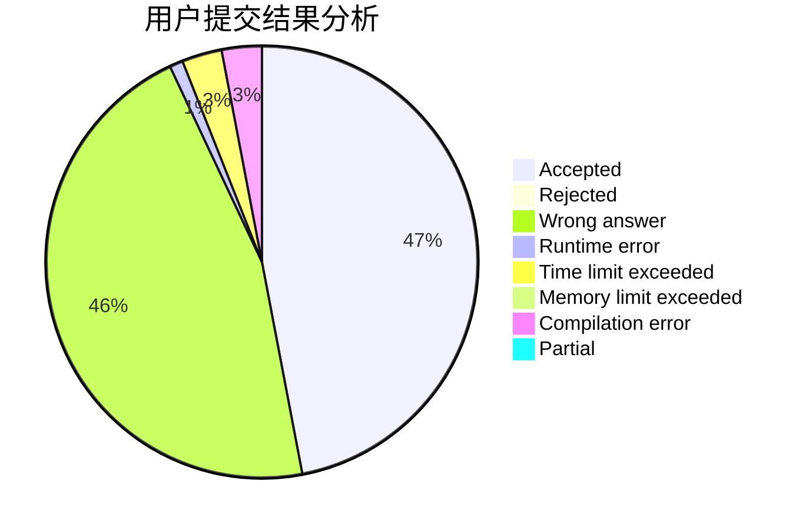
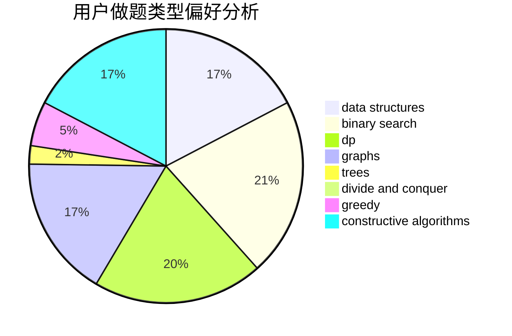
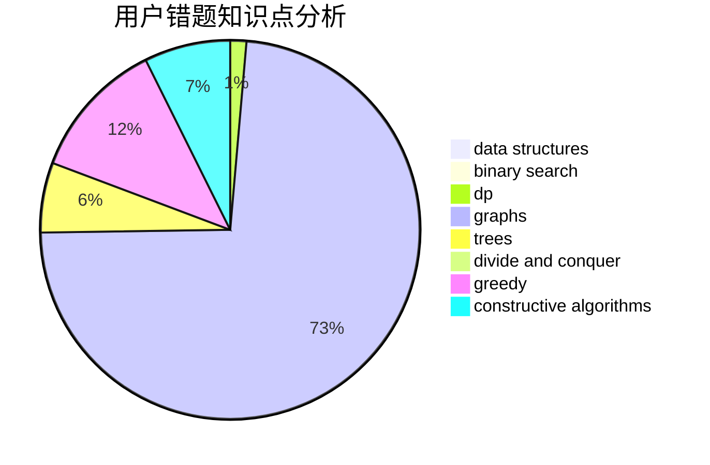

# 2018030102067

<!-- tabs:start -->

#### **用户提交结果分析**

#### **用户做题类型偏好分析**

#### **用户错题知识点分析**

<!-- tabs:end -->
# 推荐题目
[1243E](https://codeforces.com/contest/1243/problem/E)		dsu,graphs,sortings,trees		  
[12471](https://codeforces.com/contest/1247/problem/1)		dsu,graphs,sortings,trees		  
[1157G](https://codeforces.com/contest/1157/problem/G)		brute force,
                        constructive algorithms		  
[1245B](https://codeforces.com/contest/1245/problem/B)		constructive algorithms,
                        dp,
                        greedy		  
[1246C](https://codeforces.com/contest/1246/problem/C)		dsu,graphs,sortings,trees		  
[1245D](https://codeforces.com/contest/1245/problem/D)		dsu,
                        graphs,
                        greedy,
                        shortest paths,
                        trees		  
[1246F](https://codeforces.com/contest/1246/problem/F)		nan		  
[1245C](https://codeforces.com/contest/1245/problem/C)		dp		  
[1054G](https://codeforces.com/contest/1054/problem/G)		constructive algorithms,
                        greedy,
                        math		  
[1244G](https://codeforces.com/contest/1244/problem/G)		constructive algorithms,
                        greedy,
                        math		  
