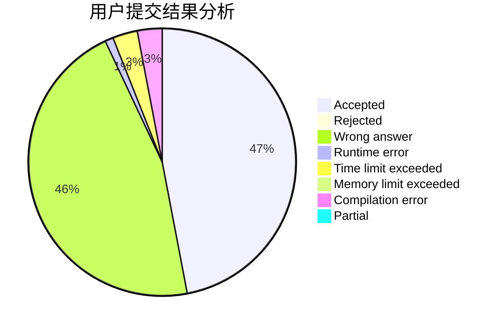
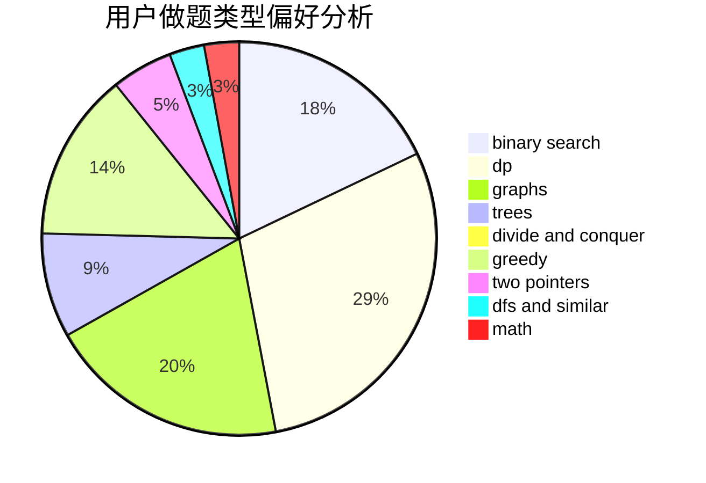

# 2018030102067

<!-- tabs:start -->

#### **用户提交结果分析**

#### **用户做题类型偏好分析**

<!-- tabs:end -->
# 推荐题目
[1243E](https://codeforces.com/contest/1243/problem/E)
[12471](https://codeforces.com/contest/1247/problem/1)
[1157G](https://codeforces.com/contest/1157/problem/G)
[1245B](https://codeforces.com/contest/1245/problem/B)
[1246C](https://codeforces.com/contest/1246/problem/C)
[1245D](https://codeforces.com/contest/1245/problem/D)
[1246F](https://codeforces.com/contest/1246/problem/F)
[1245C](https://codeforces.com/contest/1245/problem/C)
[1054G](https://codeforces.com/contest/1054/problem/G)
[1244G](https://codeforces.com/contest/1244/problem/G)
