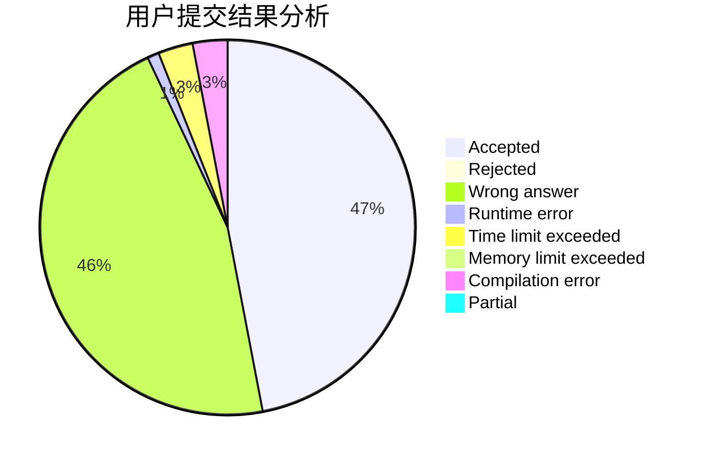
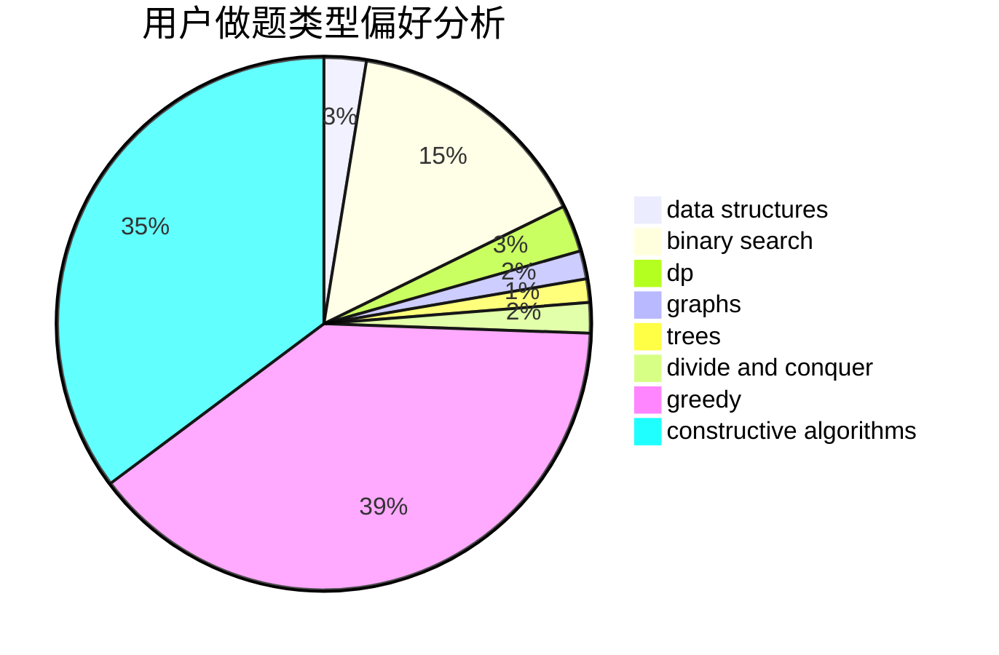
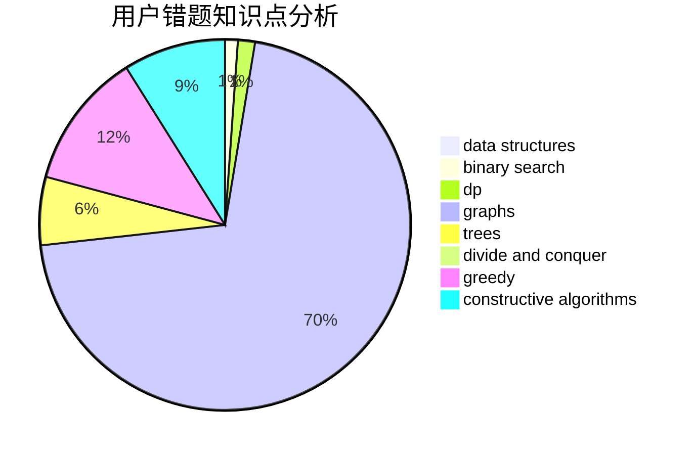

# 2018030102067
<!-- tabs:start -->
#### **用户提交结果分析**

#### **用户做题类型偏好分析**

#### **用户错题知识点分析**

<!-- tabs:end -->
# 推荐题目
[Save the Nature](https://codeforces.com/contest/1241/problem/C)		binary search,
                        greedy		  
[Football](http://codeforces.com/problemset/problem/1240/F)		graphs		  
[Ugly Pairs](http://codeforces.com/problemset/problem/1156/B)		dfs and similar,
                        greedy,
                        implementation,
                        sortings,
                        strings		  
[CME](https://codeforces.com/contest/1241/problem/A)		math		  
[Keyboard Purchase](http://codeforces.com/problemset/problem/1238/E)		bitmasks,
                        dp		  
[Candies Distribution](http://codeforces.com/problemset/problem/1054/C)		constructive algorithms,
                        implementation		  
[Ivan the Fool and the Probability Theory](http://codeforces.com/problemset/problem/1239/A)		combinatorics,
                        dp,
                        math		  
[Sequence Sorting](https://codeforces.com/contest/1241/problem/D)		dp,
                        greedy,
                        two pointers		  
[Paint the Tree](https://codeforces.com/contest/1241/problem/E)		brute force,
                        constructive algorithms,
                        dp,
                        graphs,
                        implementation,
                        trees		  
[Adilbek and the Watering System](http://codeforces.com/problemset/problem/1238/G)		data structures,
                        greedy,
                        sortings		  
<!-- tabs:start -->
#### **data structures**
[Save the Nature](http://codeforces.com/problemset/problem/1238/G)		data structures,
                        greedy,
                        sortings		  
[Football](https://codeforces.com/contest/1240/problem/D)		data structures,
                        divide and conquer,
                        dp,
                        hashing		  
[Ugly Pairs](http://codeforces.com/problemset/problem/1239/C)		data structures,
                        greedy,
                        implementation		  
[CME](http://codeforces.com/problemset/problem/1492/C)		binary search,
                        data structures,
                        dp,
                        greedy,
                        two pointers		  
[Keyboard Purchase](http://codeforces.com/problemset/problem/1490/G)		binary search,
                        data structures,
                        math		  
[Candies Distribution](http://codeforces.com/problemset/problem/1479/D)		binary search,
                        bitmasks,
                        brute force,
                        data structures,
                        probabilities,
                        trees		  
[Ivan the Fool and the Probability Theory](http://codeforces.com/problemset/problem/1497/A)		brute force,
                        data structures,
                        greedy,
                        sortings		  
[Sequence Sorting](http://codeforces.com/problemset/problem/1491/C)		brute force,
                        data structures,
                        dp,
                        greedy,
                        implementation		  
[Paint the Tree](http://codeforces.com/problemset/problem/1492/B)		data structures,
                        greedy,
                        math		  
[Adilbek and the Watering System](http://codeforces.com/problemset/problem/1436/E)		binary search,
                        data structures,
                        two pointers		  
#### **binary search**
[Save the Nature](https://codeforces.com/contest/1241/problem/C)		binary search,
                        greedy		  
[Football](https://codeforces.com/contest/1169/problem/C)		binary search,
                        greedy		  
[Ugly Pairs](https://codeforces.com/contest/1240/problem/A)		binary search,
                        greedy		  
[CME](http://codeforces.com/problemset/problem/1238/D)		binary search,
                        combinatorics,
                        dp,
                        strings		  
[Keyboard Purchase](https://codeforces.com/contest/1240/problem/E)		binary search,
                        math,
                        number theory		  
[Candies Distribution](http://codeforces.com/problemset/problem/1492/C)		binary search,
                        data structures,
                        dp,
                        greedy,
                        two pointers		  
[Ivan the Fool and the Probability Theory](http://codeforces.com/problemset/problem/1463/D)		binary search,
                        constructive algorithms,
                        greedy,
                        two pointers		  
[Sequence Sorting](http://codeforces.com/problemset/problem/1490/G)		binary search,
                        data structures,
                        math		  
[Paint the Tree](http://codeforces.com/problemset/problem/1479/D)		binary search,
                        bitmasks,
                        brute force,
                        data structures,
                        probabilities,
                        trees		  
[Adilbek and the Watering System](http://codeforces.com/problemset/problem/1436/E)		binary search,
                        data structures,
                        two pointers		  
#### **dp**
[Save the Nature](http://codeforces.com/problemset/problem/1238/E)		bitmasks,
                        dp		  
[Football](http://codeforces.com/problemset/problem/1239/A)		combinatorics,
                        dp,
                        math		  
[Ugly Pairs](https://codeforces.com/contest/1241/problem/D)		dp,
                        greedy,
                        two pointers		  
[CME](https://codeforces.com/contest/1241/problem/E)		brute force,
                        constructive algorithms,
                        dp,
                        graphs,
                        implementation,
                        trees		  
[Keyboard Purchase](http://codeforces.com/problemset/problem/1238/D)		binary search,
                        combinatorics,
                        dp,
                        strings		  
[Candies Distribution](https://codeforces.com/contest/1240/problem/D)		data structures,
                        divide and conquer,
                        dp,
                        hashing		  
[Ivan the Fool and the Probability Theory](https://codeforces.com/contest/1240/problem/C)		brute force,
                        constructive algorithms,
                        dp,
                        graphs,
                        implementation,
                        trees		  
[Sequence Sorting](http://codeforces.com/problemset/problem/123/E)		dfs and similar,
                        dp,
                        probabilities,
                        trees		  
[Paint the Tree](https://codeforces.com/contest/1240/problem/B)		dp,
                        greedy,
                        two pointers		  
[Adilbek and the Watering System](http://codeforces.com/problemset/problem/1239/E)		dp,
                        implementation		  
#### **graph**
[Save the Nature](http://codeforces.com/problemset/problem/1240/F)		graphs		  
[Football](https://codeforces.com/contest/1241/problem/E)		brute force,
                        constructive algorithms,
                        dp,
                        graphs,
                        implementation,
                        trees		  
[Ugly Pairs](https://codeforces.com/contest/1240/problem/C)		brute force,
                        constructive algorithms,
                        dp,
                        graphs,
                        implementation,
                        trees		  
[CME](http://codeforces.com/problemset/problem/1239/F)		graphs,
                        implementation		  
[Keyboard Purchase](http://codeforces.com/problemset/problem/1239/D)		2-sat,
                        dfs and similar,
                        graph matchings,
                        graphs		  
[Candies Distribution](http://codeforces.com/problemset/problem/1238/F)		dfs and similar,
                        dp,
                        graphs,
                        trees		  
[Ivan the Fool and the Probability Theory](http://codeforces.com/problemset/problem/1487/C)		brute force,
                        constructive algorithms,
                        dfs and similar,
                        graphs,
                        greedy,
                        implementation,
                        math		  
[Sequence Sorting](http://codeforces.com/problemset/problem/1437/C)		dp,
                        flows,
                        graph matchings,
                        greedy,
                        math,
                        sortings		  
[Paint the Tree](http://codeforces.com/problemset/problem/1470/D)		constructive algorithms,
                        dfs and similar,
                        graph matchings,
                        graphs,
                        greedy		  
[Adilbek and the Watering System](http://codeforces.com/problemset/problem/1476/C)		dp,
                        graphs,
                        greedy		  
#### **trees**
[Save the Nature](https://codeforces.com/contest/1241/problem/E)		brute force,
                        constructive algorithms,
                        dp,
                        graphs,
                        implementation,
                        trees		  
[Football](https://codeforces.com/contest/1240/problem/C)		brute force,
                        constructive algorithms,
                        dp,
                        graphs,
                        implementation,
                        trees		  
[Ugly Pairs](http://codeforces.com/problemset/problem/123/E)		dfs and similar,
                        dp,
                        probabilities,
                        trees		  
[CME](http://codeforces.com/problemset/problem/1238/F)		dfs and similar,
                        dp,
                        graphs,
                        trees		  
[Keyboard Purchase](http://codeforces.com/problemset/problem/1479/D)		binary search,
                        bitmasks,
                        brute force,
                        data structures,
                        probabilities,
                        trees		  
[Candies Distribution](http://codeforces.com/problemset/problem/1511/C)		brute force,
                        data structures,
                        implementation,
                        trees		  
[Ivan the Fool and the Probability Theory](http://codeforces.com/problemset/problem/1499/F)		combinatorics,
                        dfs and similar,
                        dp,
                        trees		  
[Sequence Sorting](http://codeforces.com/problemset/problem/1491/E)		brute force,
                        dfs and similar,
                        divide and conquer,
                        number theory,
                        trees		  
[Paint the Tree](http://codeforces.com/problemset/problem/1466/D)		data structures,
                        greedy,
                        sortings,
                        trees		  
[Adilbek and the Watering System](http://codeforces.com/problemset/problem/1495/D)		combinatorics,
                        dfs and similar,
                        graphs,
                        math,
                        shortest paths,
                        trees		  
#### **divide and conquer**
[Save the Nature](https://codeforces.com/contest/1240/problem/D)		data structures,
                        divide and conquer,
                        dp,
                        hashing		  
[Football](http://codeforces.com/problemset/problem/1461/D)		binary search,
                        brute force,
                        data structures,
                        divide and conquer,
                        implementation,
                        sortings		  
[Ugly Pairs](http://codeforces.com/problemset/problem/1466/G)		combinatorics,
                        divide and conquer,
                        hashing,
                        math,
                        string suffix structures,
                        strings		  
[CME](http://codeforces.com/problemset/problem/1490/D)		dfs and similar,
                        divide and conquer,
                        implementation		  
[Keyboard Purchase](https://codeforces.com/contest/1483/problem/C)		data structures,
                        divide and conquer,
                        dp		  
[Candies Distribution](http://codeforces.com/problemset/problem/1491/E)		brute force,
                        dfs and similar,
                        divide and conquer,
                        number theory,
                        trees		  
[Ivan the Fool and the Probability Theory](http://codeforces.com/problemset/problem/1303/G)		data structures,
                        divide and conquer,
                        geometry,
                        trees		  
[Sequence Sorting](http://codeforces.com/problemset/problem/1494/D)		constructive algorithms,
                        data structures,
                        dfs and similar,
                        divide and conquer,
                        dsu,
                        greedy,
                        sortings,
                        trees		  
[Paint the Tree](http://codeforces.com/problemset/problem/1482/E)		data structures,
                        divide and conquer,
                        dp		  
[Adilbek and the Watering System](http://codeforces.com/problemset/problem/566/C)		dfs and similar,
                        divide and conquer,
                        trees		  
#### **greedy**
[Save the Nature](https://codeforces.com/contest/1241/problem/C)		binary search,
                        greedy		  
[Football](http://codeforces.com/problemset/problem/1156/B)		dfs and similar,
                        greedy,
                        implementation,
                        sortings,
                        strings		  
[Ugly Pairs](https://codeforces.com/contest/1241/problem/D)		dp,
                        greedy,
                        two pointers		  
[CME](http://codeforces.com/problemset/problem/1238/G)		data structures,
                        greedy,
                        sortings		  
[Keyboard Purchase](https://codeforces.com/contest/1169/problem/C)		binary search,
                        greedy		  
[Candies Distribution](https://codeforces.com/contest/1240/problem/A)		binary search,
                        greedy		  
[Ivan the Fool and the Probability Theory](http://codeforces.com/problemset/problem/1239/C)		data structures,
                        greedy,
                        implementation		  
[Sequence Sorting](https://codeforces.com/contest/1240/problem/B)		dp,
                        greedy,
                        two pointers		  
[Paint the Tree](http://codeforces.com/problemset/problem/1492/C)		binary search,
                        data structures,
                        dp,
                        greedy,
                        two pointers		  
[Adilbek and the Watering System](https://codeforces.com/contest/1496/problem/C)		geometry,
                        greedy,
                        math,
                        sortings		  
#### **constructive algorithms**
[Save the Nature](http://codeforces.com/problemset/problem/1054/C)		constructive algorithms,
                        implementation		  
[Football](https://codeforces.com/contest/1241/problem/E)		brute force,
                        constructive algorithms,
                        dp,
                        graphs,
                        implementation,
                        trees		  
[Ugly Pairs](https://codeforces.com/contest/1240/problem/C)		brute force,
                        constructive algorithms,
                        dp,
                        graphs,
                        implementation,
                        trees		  
[CME](http://codeforces.com/problemset/problem/1493/A)		constructive algorithms,
                        greedy		  
[Keyboard Purchase](http://codeforces.com/problemset/problem/1463/D)		binary search,
                        constructive algorithms,
                        greedy,
                        two pointers		  
[Candies Distribution](https://codeforces.com/contest/1456/problem/B)		bitmasks,
                        brute force,
                        constructive algorithms		  
[Ivan the Fool and the Probability Theory](http://codeforces.com/problemset/problem/1492/D)		bitmasks,
                        constructive algorithms,
                        greedy,
                        math		  
[Sequence Sorting](https://codeforces.com/contest/1504/problem/D)		constructive algorithms,
                        games,
                        interactive		  
[Paint the Tree](https://codeforces.com/contest/1483/problem/A)		brute force,
                        constructive algorithms,
                        greedy,
                        implementation		  
[Adilbek and the Watering System](https://codeforces.com/contest/1457/problem/D)		bitmasks,
                        brute force,
                        constructive algorithms		  
#### **sortings**
[Save the Nature](http://codeforces.com/problemset/problem/1156/B)		dfs and similar,
                        greedy,
                        implementation,
                        sortings,
                        strings		  
[Football](http://codeforces.com/problemset/problem/1238/G)		data structures,
                        greedy,
                        sortings		  
[Ugly Pairs](https://codeforces.com/contest/1496/problem/C)		geometry,
                        greedy,
                        math,
                        sortings		  
[CME](http://codeforces.com/problemset/problem/1495/A)		geometry,
                        greedy,
                        math,
                        sortings		  
[Keyboard Purchase](http://codeforces.com/problemset/problem/1497/A)		brute force,
                        data structures,
                        greedy,
                        sortings		  
[Candies Distribution](http://codeforces.com/problemset/problem/1427/A)		math,
                        sortings		  
[Ivan the Fool and the Probability Theory](http://codeforces.com/problemset/problem/1461/D)		binary search,
                        brute force,
                        data structures,
                        divide and conquer,
                        implementation,
                        sortings		  
[Sequence Sorting](http://codeforces.com/problemset/problem/1437/C)		dp,
                        flows,
                        graph matchings,
                        greedy,
                        math,
                        sortings		  
[Paint the Tree](http://codeforces.com/problemset/problem/1473/A)		greedy,
                        implementation,
                        math,
                        sortings		  
[Adilbek and the Watering System](http://codeforces.com/problemset/problem/1486/B)		binary search,
                        geometry,
                        shortest paths,
                        sortings		  
<!-- tabs:end -->
