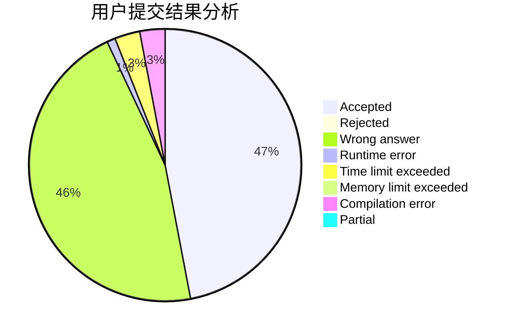
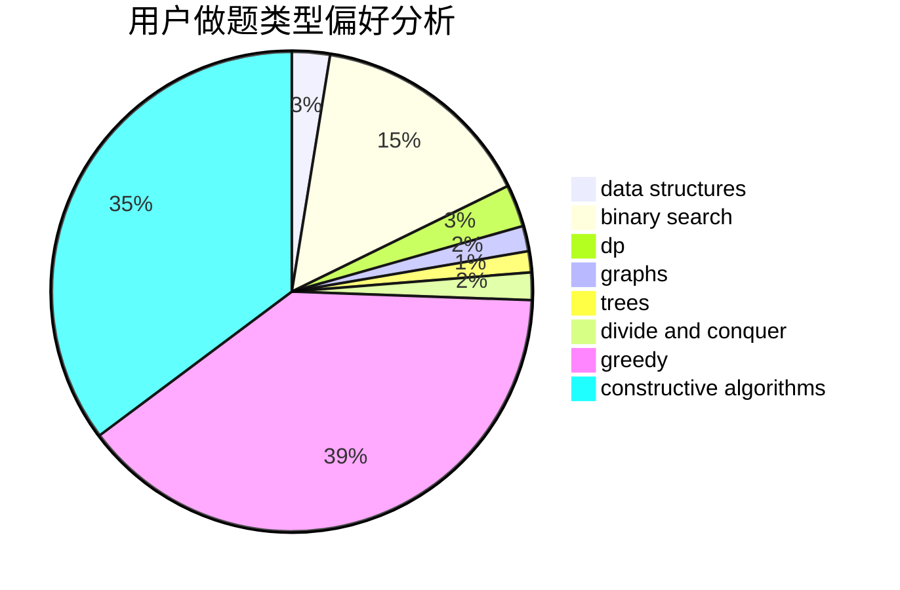
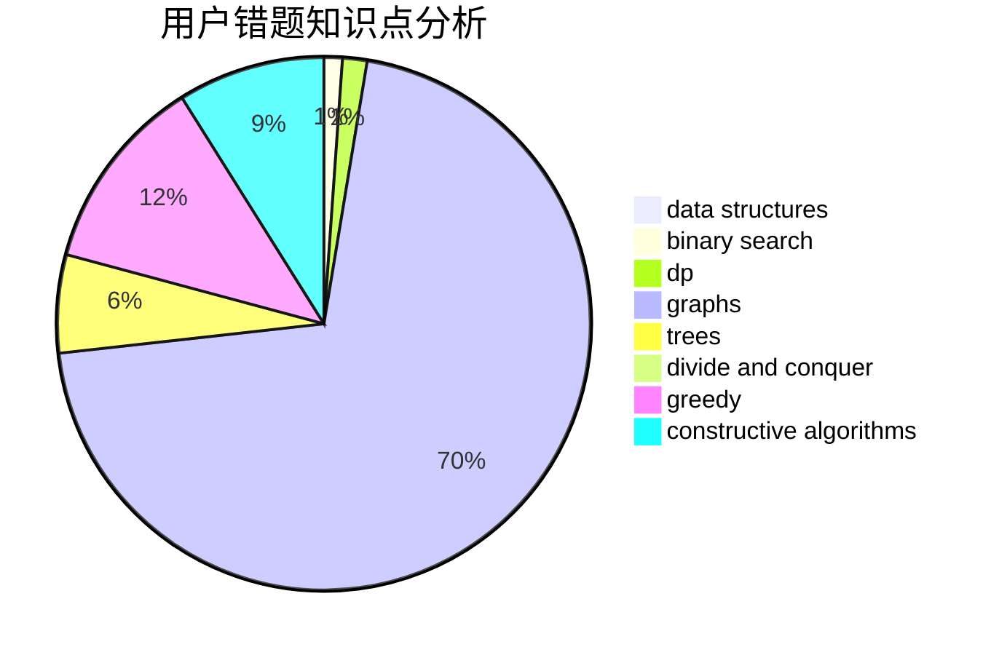

# 2018030102067

<!-- tabs:start -->

#### **用户提交结果分析**

#### **用户做题类型偏好分析**

#### **用户错题知识点分析**

<!-- tabs:end -->
# 推荐题目
[1238E](https://codeforces.com/contest/1238/problem/E)		bitmasks,
                        dp		  
[1241C](https://codeforces.com/contest/1241/problem/C)		dsu,graphs,sortings,trees		  
[1156B](https://codeforces.com/contest/1156/problem/B)		dfs and similar,
                        greedy,
                        implementation,
                        sortings,
                        strings		  
[123D](https://codeforces.com/contest/123/problem/D)		string suffix structures		  
[1240F](https://codeforces.com/contest/1240/problem/F)		graphs		  
[1240A](https://codeforces.com/contest/1240/problem/A)		dsu,graphs,sortings,trees		  
[1241B](https://codeforces.com/contest/1241/problem/B)		dsu,graphs,sortings,trees		  
[123E](https://codeforces.com/contest/123/problem/E)		dfs and similar,
                        dp,
                        probabilities,
                        trees		  
[1054C](https://codeforces.com/contest/1054/problem/C)		constructive algorithms,
                        implementation		  
[1239E](https://codeforces.com/contest/1239/problem/E)		dp,
                        implementation		  
