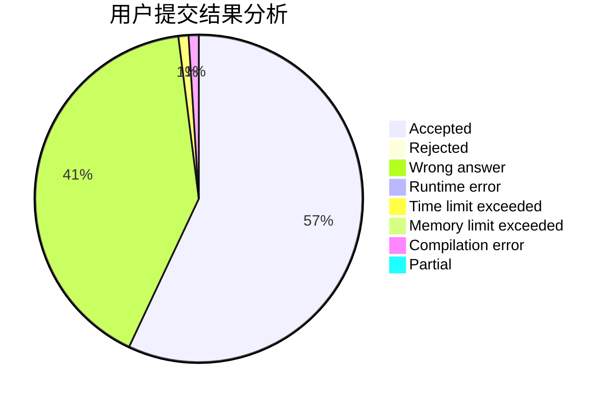
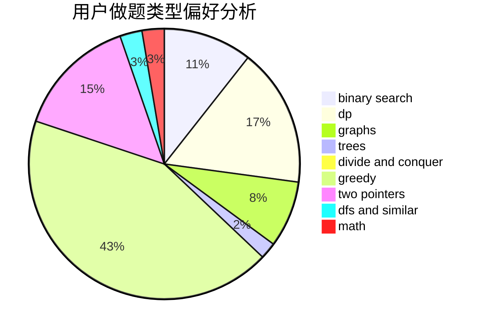

# Dzhao

<!-- tabs:start -->

#### **用户提交结果分析**

#### **用户做题类型偏好分析**

<!-- tabs:end -->
# 推荐题目
[448B](https://codeforces.com/contest/448/problem/B)
[429A](https://codeforces.com/contest/429/problem/A)
[765C](https://codeforces.com/contest/765/problem/C)
[717E](https://codeforces.com/contest/717/problem/E)
[101D](https://codeforces.com/contest/101/problem/D)
[639D](https://codeforces.com/contest/639/problem/D)
[650C](https://codeforces.com/contest/650/problem/C)
[317D](https://codeforces.com/contest/317/problem/D)
[1080B](https://codeforces.com/contest/1080/problem/B)
[798A](https://codeforces.com/contest/798/problem/A)
