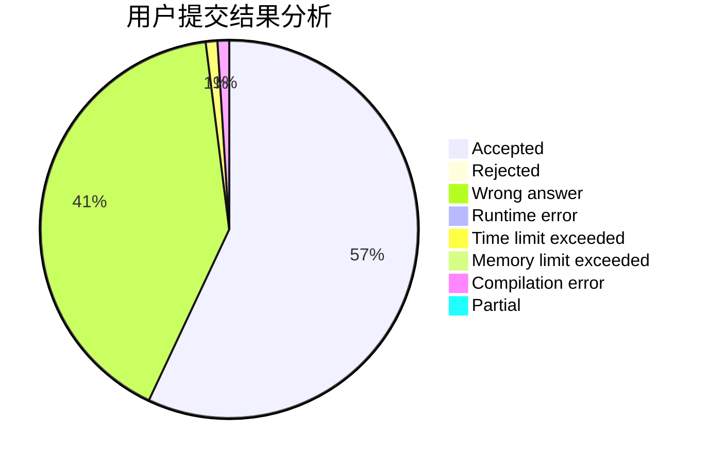
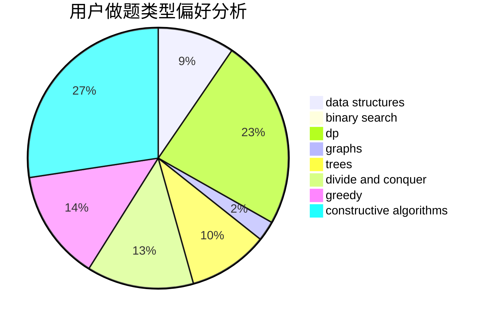
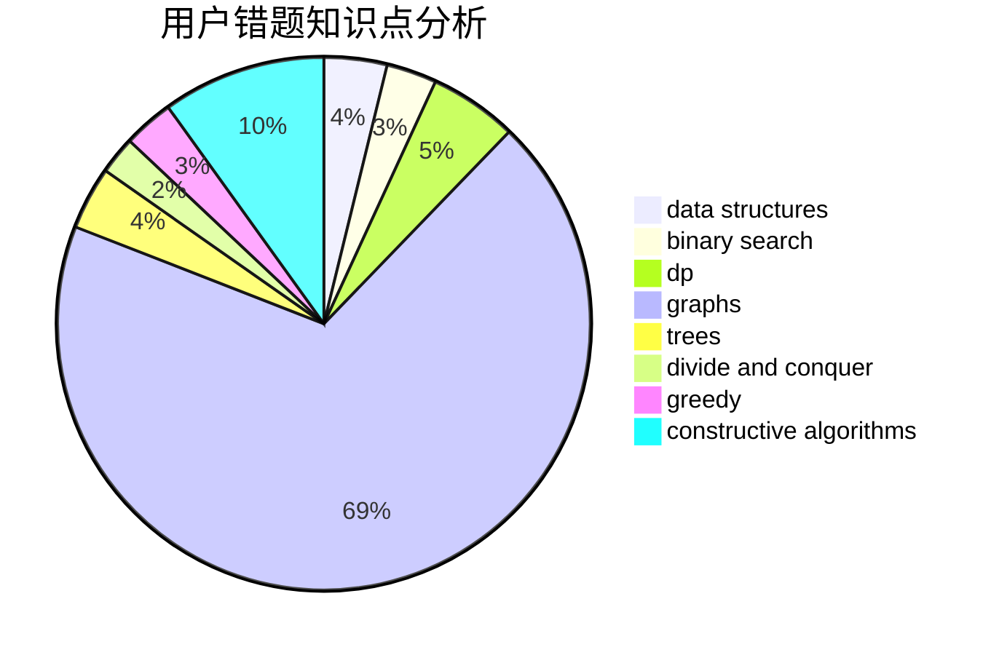

# Dzhao

<!-- tabs:start -->

#### **用户提交结果分析**

#### **用户做题类型偏好分析**

#### **用户错题知识点分析**

<!-- tabs:end -->
# 推荐题目
[424E](https://codeforces.com/contest/424/problem/E)		dfs and similar,
                        dp,
                        probabilities		  
[39J](https://codeforces.com/contest/39/problem/J)		hashing,
                        implementation,
                        strings		  
[746A](https://codeforces.com/contest/746/problem/A)		implementation,
                        math		  
[6C](https://codeforces.com/contest/6/problem/C)		greedy,
                        two pointers		  
[1019D](https://codeforces.com/contest/1019/problem/D)		binary search,
                        geometry,
                        sortings		  
[618E](https://codeforces.com/contest/618/problem/E)		data structures,
                        geometry		  
[622C](https://codeforces.com/contest/622/problem/C)		data structures,
                        implementation		  
[29E](https://codeforces.com/contest/29/problem/E)		graphs,
                        shortest paths		  
[107C](https://codeforces.com/contest/107/problem/C)		bitmasks,
                        dp		  
[779E](https://codeforces.com/contest/779/problem/E)		dsu,graphs,sortings,trees		  
