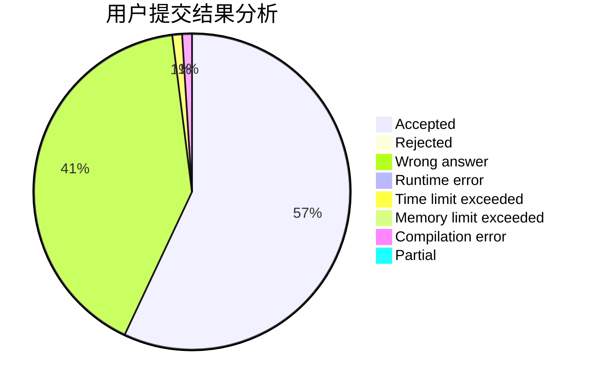
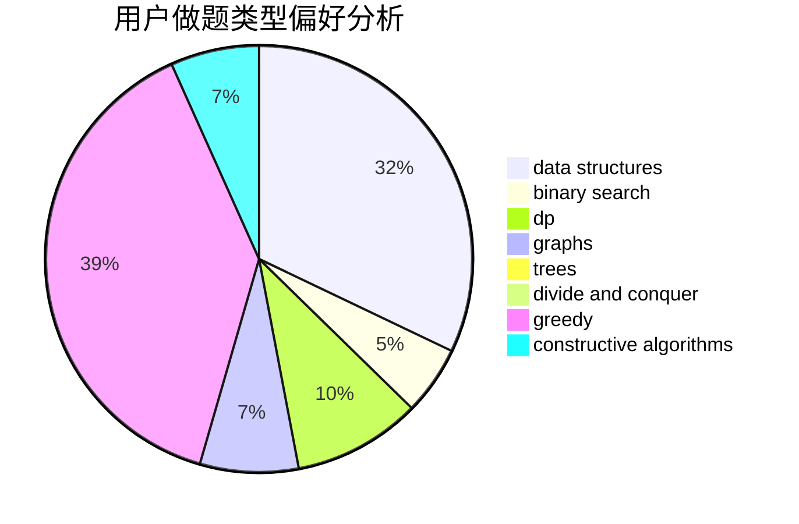
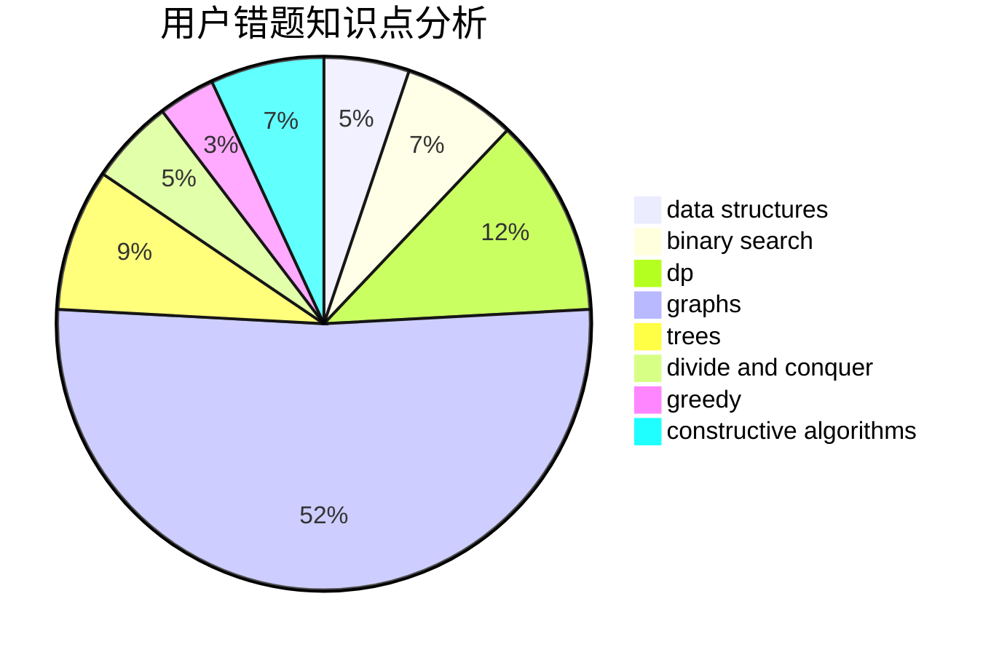

# Dzhao

<!-- tabs:start -->

#### **用户提交结果分析**

#### **用户做题类型偏好分析**

#### **用户错题知识点分析**

<!-- tabs:end -->
# 推荐题目
[448B](https://codeforces.com/contest/448/problem/B)		implementation,
                        strings		  
[429A](https://codeforces.com/contest/429/problem/A)		dfs and similar,
                        trees		  
[765C](https://codeforces.com/contest/765/problem/C)		math		  
[717E](https://codeforces.com/contest/717/problem/E)		dfs and similar		  
[101D](https://codeforces.com/contest/101/problem/D)		dp,
                        greedy,
                        probabilities,
                        sortings,
                        trees		  
[639D](https://codeforces.com/contest/639/problem/D)		data structures,
                        greedy,
                        sortings,
                        two pointers		  
[650C](https://codeforces.com/contest/650/problem/C)		dfs and similar,
                        dp,
                        dsu,
                        graphs,
                        greedy		  
[317D](https://codeforces.com/contest/317/problem/D)		dp,
                        games		  
[1080B](https://codeforces.com/contest/1080/problem/B)		math		  
[798A](https://codeforces.com/contest/798/problem/A)		brute force,
                        constructive algorithms,
                        strings		  
