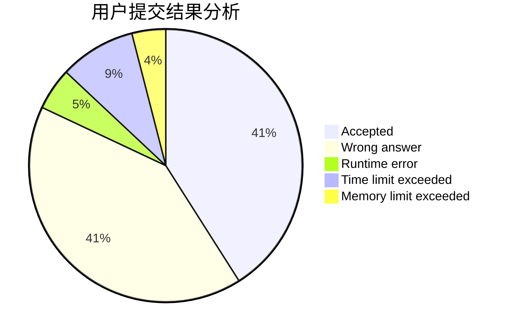
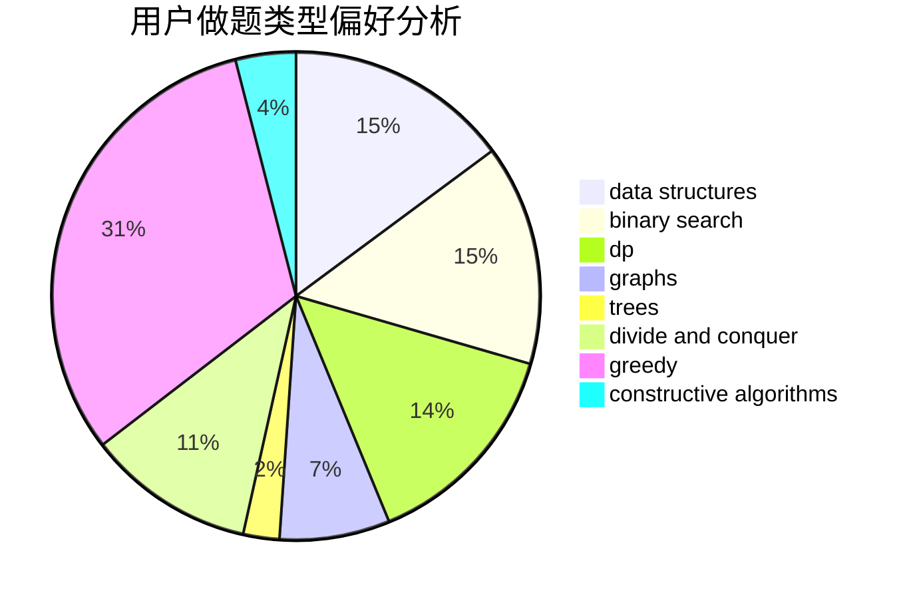
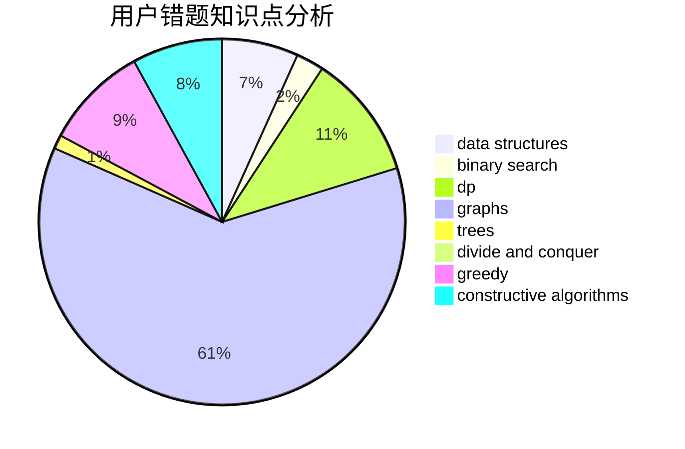

# ELT_AW
<!-- tabs:start -->
#### **用户提交结果分析**

#### **用户做题类型偏好分析**

#### **用户错题知识点分析**

<!-- tabs:end -->
# 推荐题目
[Maximize the Remaining String](http://codeforces.com/problemset/problem/1506/G)		brute force,
                        data structures,
                        dp,
                        greedy,
                        strings		  
[New Colony](http://codeforces.com/problemset/problem/1481/B)		brute force,
                        greedy,
                        implementation		  
[Ball in Berland](http://codeforces.com/problemset/problem/1475/C)		combinatorics,
                        graphs,
                        math		  
[Matrix Sorting](http://codeforces.com/problemset/problem/1500/C)		bitmasks,
                        brute force,
                        constructive algorithms,
                        greedy,
                        two pointers		  
[Glass Half Spilled](https://codeforces.com/contest/1459/problem/D)		dp		  
[TorCoder](http://codeforces.com/problemset/problem/240/F)		data structures		  
[Little Artem and Dance](https://codeforces.com/contest/669/problem/D)		brute force,
                        constructive algorithms,
                        implementation		  
[Pairs of Numbers](http://codeforces.com/problemset/problem/134/B)		brute force,
                        dfs and similar,
                        math,
                        number theory		  
[Binary String Constructing](http://codeforces.com/problemset/problem/1003/B)		constructive algorithms		  
[Text Document Analysis](http://codeforces.com/problemset/problem/723/B)		expression parsing,
                        implementation,
                        strings		  
<!-- tabs:start -->
#### **data structures**
[Maximize the Remaining String](http://codeforces.com/problemset/problem/1506/G)		brute force,
                        data structures,
                        dp,
                        greedy,
                        strings		  
[TorCoder](http://codeforces.com/problemset/problem/240/F)		data structures		  
[Heidi and Library (medium)](http://codeforces.com/problemset/problem/802/B)		data structures,
                        greedy		  
[Game with string](http://codeforces.com/problemset/problem/1104/B)		data structures,
                        implementation,
                        math		  
[Prison Transfer](http://codeforces.com/problemset/problem/427/B)		data structures,
                        implementation		  
[Frog Jumps](http://codeforces.com/problemset/problem/1324/C)		binary search,
                        data structures,
                        dfs and similar,
                        greedy,
                        implementation		  
[Animals and Puzzle](http://codeforces.com/problemset/problem/713/D)		binary search,
                        data structures		  
[Let Them Slide](http://codeforces.com/problemset/problem/1208/E)		data structures,
                        implementation		  
[Nearest Leaf](http://codeforces.com/problemset/problem/1110/F)		data structures,
                        trees		  
[LCC](http://codeforces.com/problemset/problem/1286/D)		data structures,
                        math,
                        matrices,
                        probabilities		  
#### **binary search**
[Dwarves, Hats and Extrasensory Abilities](https://codeforces.com/contest/1064/problem/E)		binary search,
                        constructive algorithms,
                        geometry,
                        interactive		  
[Frog Jumps](http://codeforces.com/problemset/problem/1324/C)		binary search,
                        data structures,
                        dfs and similar,
                        greedy,
                        implementation		  
[Animals and Puzzle](http://codeforces.com/problemset/problem/713/D)		binary search,
                        data structures		  
[Voltage Keepsake](https://codeforces.com/contest/801/problem/C)		binary search,
                        math		  
[Match Points](http://codeforces.com/problemset/problem/1156/C)		binary search,
                        greedy,
                        sortings,
                        ternary search,
                        two pointers		  
[Maximum width](http://codeforces.com/problemset/problem/1492/C)		binary search,
                        data structures,
                        dp,
                        greedy,
                        two pointers		  
[Pairs](http://codeforces.com/problemset/problem/1463/D)		binary search,
                        constructive algorithms,
                        greedy,
                        two pointers		  
[Old Floppy Drive](http://codeforces.com/problemset/problem/1490/G)		binary search,
                        data structures,
                        math		  
[Odd Mineral Resource](http://codeforces.com/problemset/problem/1479/D)		binary search,
                        bitmasks,
                        brute force,
                        data structures,
                        probabilities,
                        trees		  
[Complicated Computations](http://codeforces.com/problemset/problem/1436/E)		binary search,
                        data structures,
                        two pointers		  
#### **dp**
[Maximize the Remaining String](http://codeforces.com/problemset/problem/1506/G)		brute force,
                        data structures,
                        dp,
                        greedy,
                        strings		  
[Glass Half Spilled](https://codeforces.com/contest/1459/problem/D)		dp		  
[Monster Invaders](http://codeforces.com/problemset/problem/1396/C)		dp,
                        greedy,
                        implementation		  
[Clear the String](http://codeforces.com/problemset/problem/1132/F)		dp		  
[Nauuo and Pictures (hard version)](http://codeforces.com/problemset/problem/1172/C2)		dp,
                        probabilities		  
[Array GCD](http://codeforces.com/problemset/problem/623/B)		dp,
                        greedy,
                        number theory		  
[Dima and Salad](http://codeforces.com/problemset/problem/366/C)		dp		  
[Strange Function](http://codeforces.com/problemset/problem/1310/E)		dp		  
[LRU](http://codeforces.com/problemset/problem/698/C)		bitmasks,
                        dp,
                        math,
                        probabilities		  
[Village (Minimum)](http://codeforces.com/problemset/problem/1387/B1)		*special problem,
                        dp,
                        greedy,
                        trees		  
#### **graph**
[Ball in Berland](http://codeforces.com/problemset/problem/1475/C)		combinatorics,
                        graphs,
                        math		  
[Jzzhu and Cities](http://codeforces.com/problemset/problem/449/B)		graphs,
                        greedy,
                        shortest paths		  
[Chemical table](https://codeforces.com/contest/1013/problem/D)		constructive algorithms,
                        dfs and similar,
                        dsu,
                        graphs,
                        matrices		  
[String Transformation 1](https://codeforces.com/contest/1384/problem/C)		dsu,
                        graphs,
                        greedy,
                        sortings,
                        strings,
                        trees,
                        two pointers		  
[Ancient Language](http://codeforces.com/problemset/problem/1424/M)		graphs,
                        sortings		  
[Maximum Distance](http://codeforces.com/problemset/problem/1081/D)		dsu,
                        graphs,
                        shortest paths,
                        sortings		  
[Optimizer](http://codeforces.com/problemset/problem/1156/G)		graphs,
                        greedy,
                        hashing,
                        implementation		  
[Time to Run](http://codeforces.com/problemset/problem/1301/D)		constructive algorithms,
                        graphs,
                        implementation		  
[Minimum Ties](http://codeforces.com/problemset/problem/1487/C)		brute force,
                        constructive algorithms,
                        dfs and similar,
                        graphs,
                        greedy,
                        implementation,
                        math		  
[Chef Monocarp](http://codeforces.com/problemset/problem/1437/C)		dp,
                        flows,
                        graph matchings,
                        greedy,
                        math,
                        sortings		  
#### **trees**
[Matching Names](http://codeforces.com/problemset/problem/566/A)		dfs and similar,
                        strings,
                        trees		  
[String Transformation 1](https://codeforces.com/contest/1384/problem/C)		dsu,
                        graphs,
                        greedy,
                        sortings,
                        strings,
                        trees,
                        two pointers		  
[Nearest Leaf](http://codeforces.com/problemset/problem/1110/F)		data structures,
                        trees		  
[Village (Minimum)](http://codeforces.com/problemset/problem/1387/B1)		*special problem,
                        dp,
                        greedy,
                        trees		  
[Odd Mineral Resource](http://codeforces.com/problemset/problem/1479/D)		binary search,
                        bitmasks,
                        brute force,
                        data structures,
                        probabilities,
                        trees		  
[Yet Another Card Deck](http://codeforces.com/problemset/problem/1511/C)		brute force,
                        data structures,
                        implementation,
                        trees		  
[Diameter Cuts](http://codeforces.com/problemset/problem/1499/F)		combinatorics,
                        dfs and similar,
                        dp,
                        trees		  
[Fib-tree](http://codeforces.com/problemset/problem/1491/E)		brute force,
                        dfs and similar,
                        divide and conquer,
                        number theory,
                        trees		  
[13th Labour of Heracles](http://codeforces.com/problemset/problem/1466/D)		data structures,
                        greedy,
                        sortings,
                        trees		  
[BFS Trees](http://codeforces.com/problemset/problem/1495/D)		combinatorics,
                        dfs and similar,
                        graphs,
                        math,
                        shortest paths,
                        trees		  
#### **divide and conquer**
[Finding lines](http://codeforces.com/problemset/problem/788/D)		constructive algorithms,
                        divide and conquer,
                        interactive		  
[Divide and Summarize](http://codeforces.com/problemset/problem/1461/D)		binary search,
                        brute force,
                        data structures,
                        divide and conquer,
                        implementation,
                        sortings		  
[Song of the Sirens](http://codeforces.com/problemset/problem/1466/G)		combinatorics,
                        divide and conquer,
                        hashing,
                        math,
                        string suffix structures,
                        strings		  
[Permutation Transformation](http://codeforces.com/problemset/problem/1490/D)		dfs and similar,
                        divide and conquer,
                        implementation		  
[Skyline Photo](https://codeforces.com/contest/1483/problem/C)		data structures,
                        divide and conquer,
                        dp		  
[Fib-tree](http://codeforces.com/problemset/problem/1491/E)		brute force,
                        dfs and similar,
                        divide and conquer,
                        number theory,
                        trees		  
[Sum of Prefix Sums](http://codeforces.com/problemset/problem/1303/G)		data structures,
                        divide and conquer,
                        geometry,
                        trees		  
[Dogeforces](http://codeforces.com/problemset/problem/1494/D)		constructive algorithms,
                        data structures,
                        dfs and similar,
                        divide and conquer,
                        dsu,
                        greedy,
                        sortings,
                        trees		  
[Logistical Questions](http://codeforces.com/problemset/problem/566/C)		dfs and similar,
                        divide and conquer,
                        trees		  
[Fruit Sequences](http://codeforces.com/problemset/problem/1428/F)		binary search,
                        data structures,
                        divide and conquer,
                        dp,
                        two pointers		  
#### **greedy**
[Maximize the Remaining String](http://codeforces.com/problemset/problem/1506/G)		brute force,
                        data structures,
                        dp,
                        greedy,
                        strings		  
[New Colony](http://codeforces.com/problemset/problem/1481/B)		brute force,
                        greedy,
                        implementation		  
[Matrix Sorting](http://codeforces.com/problemset/problem/1500/C)		bitmasks,
                        brute force,
                        constructive algorithms,
                        greedy,
                        two pointers		  
[Monster Invaders](http://codeforces.com/problemset/problem/1396/C)		dp,
                        greedy,
                        implementation		  
[Heidi and Library (medium)](http://codeforces.com/problemset/problem/802/B)		data structures,
                        greedy		  
[Name](http://codeforces.com/problemset/problem/180/D)		greedy,
                        strings		  
[Jzzhu and Cities](http://codeforces.com/problemset/problem/449/B)		graphs,
                        greedy,
                        shortest paths		  
[Array GCD](http://codeforces.com/problemset/problem/623/B)		dp,
                        greedy,
                        number theory		  
[Frog Jumps](http://codeforces.com/problemset/problem/1324/C)		binary search,
                        data structures,
                        dfs and similar,
                        greedy,
                        implementation		  
[Bracket Subsequence](http://codeforces.com/problemset/problem/1023/C)		greedy		  
#### **constructive algorithms**
[Matrix Sorting](http://codeforces.com/problemset/problem/1500/C)		bitmasks,
                        brute force,
                        constructive algorithms,
                        greedy,
                        two pointers		  
[Little Artem and Dance](https://codeforces.com/contest/669/problem/D)		brute force,
                        constructive algorithms,
                        implementation		  
[Binary String Constructing](http://codeforces.com/problemset/problem/1003/B)		constructive algorithms		  
[Dwarves, Hats and Extrasensory Abilities](https://codeforces.com/contest/1064/problem/E)		binary search,
                        constructive algorithms,
                        geometry,
                        interactive		  
[Cactus Revenge](http://codeforces.com/problemset/problem/1267/C)		constructive algorithms		  
[Chemical table](https://codeforces.com/contest/1013/problem/D)		constructive algorithms,
                        dfs and similar,
                        dsu,
                        graphs,
                        matrices		  
[Drazil and Tiles](http://codeforces.com/problemset/problem/515/D)		constructive algorithms,
                        greedy		  
[Finding lines](http://codeforces.com/problemset/problem/788/D)		constructive algorithms,
                        divide and conquer,
                        interactive		  
[Neighbor Grid](http://codeforces.com/problemset/problem/1375/B)		constructive algorithms,
                        greedy		  
[Time to Run](http://codeforces.com/problemset/problem/1301/D)		constructive algorithms,
                        graphs,
                        implementation		  
#### **sortings**
[String Transformation 1](https://codeforces.com/contest/1384/problem/C)		dsu,
                        graphs,
                        greedy,
                        sortings,
                        strings,
                        trees,
                        two pointers		  
[Match Points](http://codeforces.com/problemset/problem/1156/C)		binary search,
                        greedy,
                        sortings,
                        ternary search,
                        two pointers		  
[Fancy Number](http://codeforces.com/problemset/problem/118/C)		brute force,
                        greedy,
                        sortings,
                        strings		  
[Ancient Language](http://codeforces.com/problemset/problem/1424/M)		graphs,
                        sortings		  
[Maximum Distance](http://codeforces.com/problemset/problem/1081/D)		dsu,
                        graphs,
                        shortest paths,
                        sortings		  
[Cartoons](http://codeforces.com/problemset/problem/1297/B)		*special problem,
                        implementation,
                        sortings		  
[Diamond Miner](https://codeforces.com/contest/1496/problem/C)		geometry,
                        greedy,
                        math,
                        sortings		  
[Meximization](http://codeforces.com/problemset/problem/1497/A)		brute force,
                        data structures,
                        greedy,
                        sortings		  
[Avoiding Zero](http://codeforces.com/problemset/problem/1427/A)		math,
                        sortings		  
[Divide and Summarize](http://codeforces.com/problemset/problem/1461/D)		binary search,
                        brute force,
                        data structures,
                        divide and conquer,
                        implementation,
                        sortings		  
<!-- tabs:end -->
