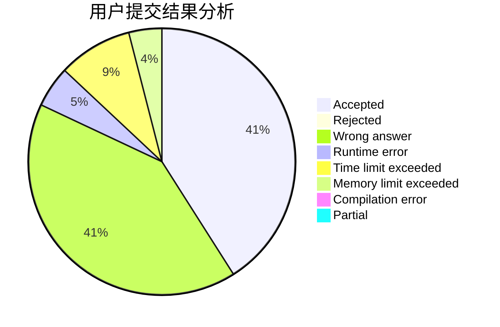
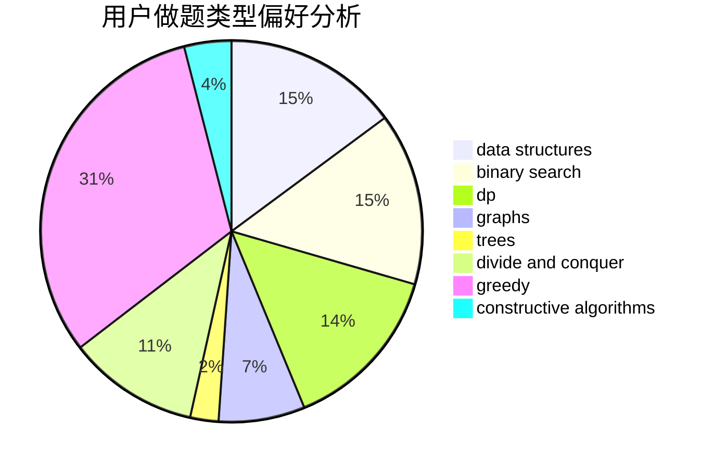
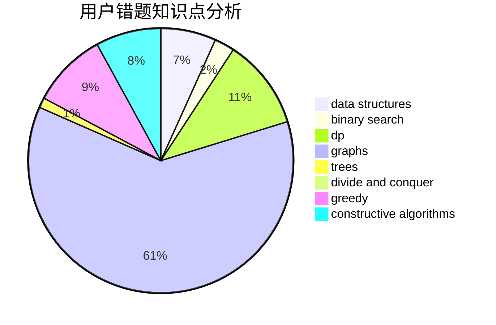

# ELT_AW

<!-- tabs:start -->

#### **用户提交结果分析**

#### **用户做题类型偏好分析**

#### **用户错题知识点分析**

<!-- tabs:end -->
# 推荐题目
[1003B](https://codeforces.com/contest/1003/problem/B)		constructive algorithms		  
[802B](https://codeforces.com/contest/802/problem/B)		data structures,
                        greedy		  
[134B](https://codeforces.com/contest/134/problem/B)		brute force,
                        dfs and similar,
                        math,
                        number theory		  
[669D](https://codeforces.com/contest/669/problem/D)		dsu,graphs,sortings,trees		  
[733A](https://codeforces.com/contest/733/problem/A)		implementation		  
[180D](https://codeforces.com/contest/180/problem/D)		greedy,
                        strings		  
[240F](https://codeforces.com/contest/240/problem/F)		data structures		  
[366C](https://codeforces.com/contest/366/problem/C)		dp		  
[1301D](https://codeforces.com/contest/1301/problem/D)		constructive algorithms,
                        graphs,
                        implementation		  
[449B](https://codeforces.com/contest/449/problem/B)		graphs,
                        greedy,
                        shortest paths		  
