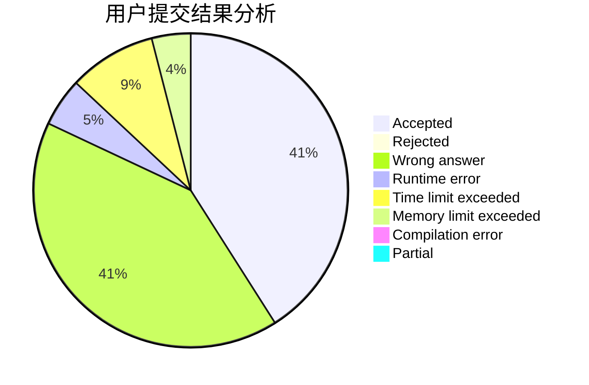
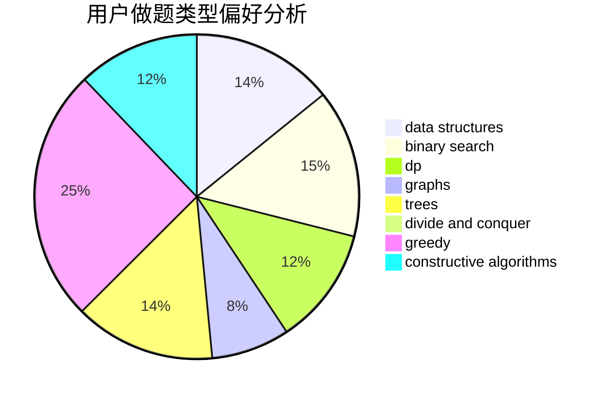
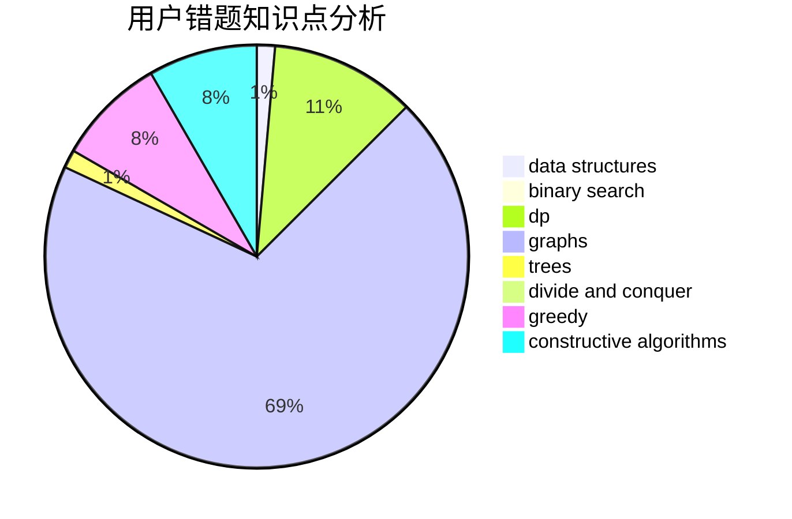

# ELT_AW

<!-- tabs:start -->

#### **用户提交结果分析**

#### **用户做题类型偏好分析**

#### **用户错题知识点分析**

<!-- tabs:end -->
# 推荐题目
[1003E](https://codeforces.com/contest/1003/problem/E)		constructive algorithms,
                        graphs		  
[817A](https://codeforces.com/contest/817/problem/A)		implementation,
                        math,
                        number theory		  
[13573](https://codeforces.com/contest/1357/problem/3)		dsu,graphs,sortings,trees		  
[691D](https://codeforces.com/contest/691/problem/D)		dfs and similar,
                        dsu,
                        math		  
[750F](https://codeforces.com/contest/750/problem/F)		constructive algorithms,
                        implementation,
                        interactive,
                        trees		  
[208A](https://codeforces.com/contest/208/problem/A)		strings		  
[261D](https://codeforces.com/contest/261/problem/D)		dp		  
[394C](https://codeforces.com/contest/394/problem/C)		constructive algorithms,
                        greedy		  
[1311A](https://codeforces.com/contest/1311/problem/A)		greedy,
                        implementation,
                        math		  
[468E](https://codeforces.com/contest/468/problem/E)		dp,
                        graph matchings,
                        math,
                        meet-in-the-middle		  
