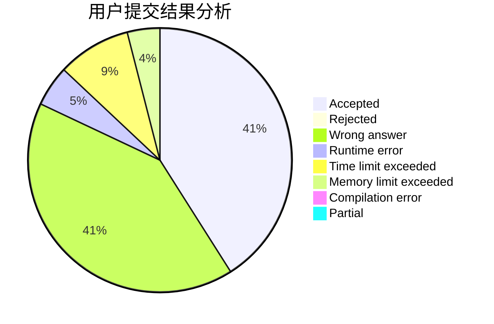
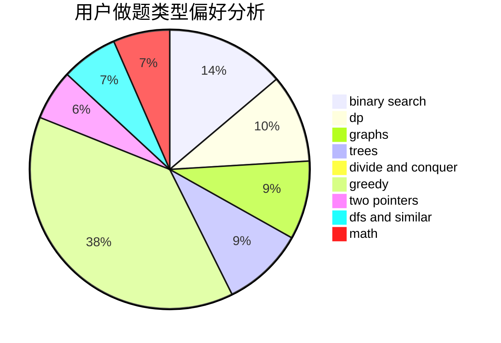

# ELT_AW

<!-- tabs:start -->

#### **用户提交结果分析**

#### **用户做题类型偏好分析**

<!-- tabs:end -->
# 推荐题目
[1003E](https://codeforces.com/contest/1003/problem/E)
[817A](https://codeforces.com/contest/817/problem/A)
[13573](https://codeforces.com/contest/1357/problem/3)
[691D](https://codeforces.com/contest/691/problem/D)
[750F](https://codeforces.com/contest/750/problem/F)
[208A](https://codeforces.com/contest/208/problem/A)
[261D](https://codeforces.com/contest/261/problem/D)
[394C](https://codeforces.com/contest/394/problem/C)
[1311A](https://codeforces.com/contest/1311/problem/A)
[468E](https://codeforces.com/contest/468/problem/E)
