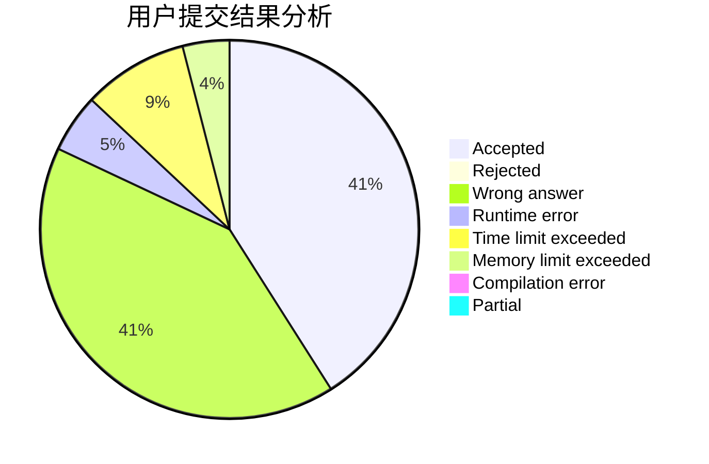
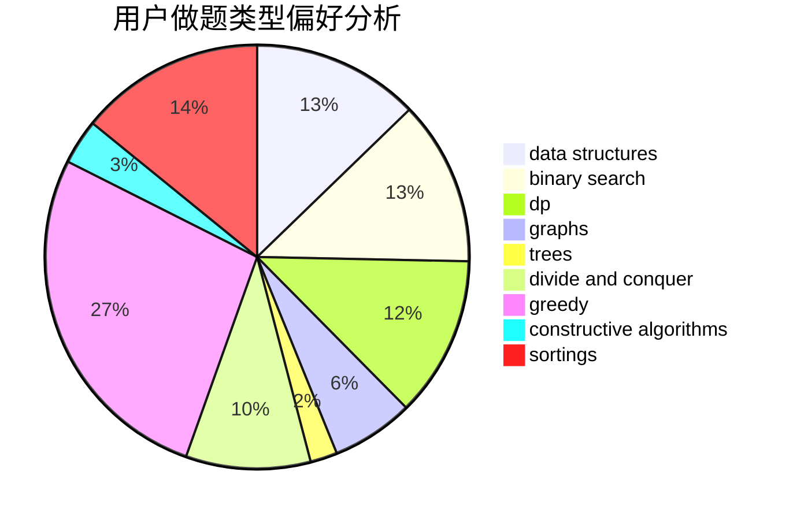
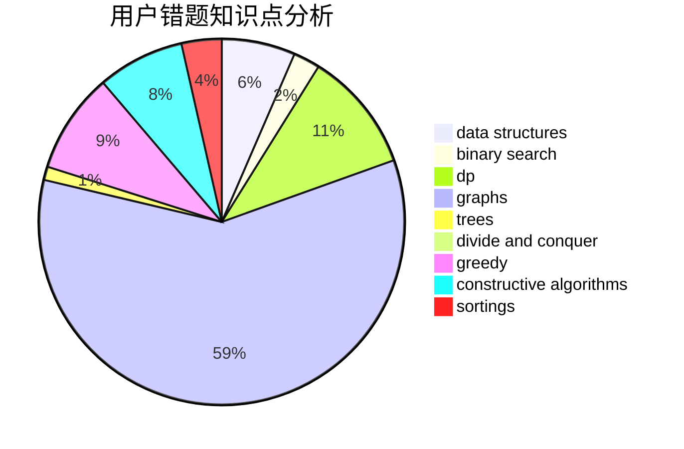

# ELT_AW
<!-- tabs:start -->
#### **用户提交结果分析**

#### **用户做题类型偏好分析**

#### **用户错题知识点分析**

<!-- tabs:end -->
# 推荐题目
[1506G](http://codeforces.com/problemset/problem/1506/G)		brute force,
                        data structures,
                        dp,
                        greedy,
                        strings		  
[1481B](http://codeforces.com/problemset/problem/1481/B)		brute force,
                        greedy,
                        implementation		  
[1475C](http://codeforces.com/problemset/problem/1475/C)		combinatorics,
                        graphs,
                        math		  
[1500C](http://codeforces.com/problemset/problem/1500/C)		bitmasks,
                        brute force,
                        constructive algorithms,
                        greedy,
                        two pointers		  
[1459D](https://codeforces.com/contest/1459/problem/D)		dp		  
[240F](http://codeforces.com/problemset/problem/240/F)		data structures		  
[669D](https://codeforces.com/contest/669/problem/D)		brute force,
                        constructive algorithms,
                        implementation		  
[134B](http://codeforces.com/problemset/problem/134/B)		brute force,
                        dfs and similar,
                        math,
                        number theory		  
[1003B](http://codeforces.com/problemset/problem/1003/B)		constructive algorithms		  
[723B](http://codeforces.com/problemset/problem/723/B)		expression parsing,
                        implementation,
                        strings		  
<!-- tabs:start -->
#### **data structures**
[1506G](http://codeforces.com/problemset/problem/1506/G)		brute force,
                        data structures,
                        dp,
                        greedy,
                        strings		  
[240F](http://codeforces.com/problemset/problem/240/F)		data structures		  
[802B](http://codeforces.com/problemset/problem/802/B)		data structures,
                        greedy		  
[1104B](http://codeforces.com/problemset/problem/1104/B)		data structures,
                        implementation,
                        math		  
[427B](http://codeforces.com/problemset/problem/427/B)		data structures,
                        implementation		  
[1324C](http://codeforces.com/problemset/problem/1324/C)		binary search,
                        data structures,
                        dfs and similar,
                        greedy,
                        implementation		  
[713D](http://codeforces.com/problemset/problem/713/D)		binary search,
                        data structures		  
[1208E](http://codeforces.com/problemset/problem/1208/E)		data structures,
                        implementation		  
[1110F](http://codeforces.com/problemset/problem/1110/F)		data structures,
                        trees		  
[1286D](http://codeforces.com/problemset/problem/1286/D)		data structures,
                        math,
                        matrices,
                        probabilities		  
#### **binary search**
[1064E](https://codeforces.com/contest/1064/problem/E)		binary search,
                        constructive algorithms,
                        geometry,
                        interactive		  
[1324C](http://codeforces.com/problemset/problem/1324/C)		binary search,
                        data structures,
                        dfs and similar,
                        greedy,
                        implementation		  
[713D](http://codeforces.com/problemset/problem/713/D)		binary search,
                        data structures		  
[801C](https://codeforces.com/contest/801/problem/C)		binary search,
                        math		  
[1156C](http://codeforces.com/problemset/problem/1156/C)		binary search,
                        greedy,
                        sortings,
                        ternary search,
                        two pointers		  
[1492C](http://codeforces.com/problemset/problem/1492/C)		binary search,
                        data structures,
                        dp,
                        greedy,
                        two pointers		  
[1463D](http://codeforces.com/problemset/problem/1463/D)		binary search,
                        constructive algorithms,
                        greedy,
                        two pointers		  
[1490G](http://codeforces.com/problemset/problem/1490/G)		binary search,
                        data structures,
                        math		  
[1479D](http://codeforces.com/problemset/problem/1479/D)		binary search,
                        bitmasks,
                        brute force,
                        data structures,
                        probabilities,
                        trees		  
[1436E](http://codeforces.com/problemset/problem/1436/E)		binary search,
                        data structures,
                        two pointers		  
#### **dp**
[1506G](http://codeforces.com/problemset/problem/1506/G)		brute force,
                        data structures,
                        dp,
                        greedy,
                        strings		  
[1459D](https://codeforces.com/contest/1459/problem/D)		dp		  
[1396C](http://codeforces.com/problemset/problem/1396/C)		dp,
                        greedy,
                        implementation		  
[1132F](http://codeforces.com/problemset/problem/1132/F)		dp		  
[1172C2](http://codeforces.com/problemset/problem/1172/C2)		dp,
                        probabilities		  
[623B](http://codeforces.com/problemset/problem/623/B)		dp,
                        greedy,
                        number theory		  
[366C](http://codeforces.com/problemset/problem/366/C)		dp		  
[1310E](http://codeforces.com/problemset/problem/1310/E)		dp		  
[698C](http://codeforces.com/problemset/problem/698/C)		bitmasks,
                        dp,
                        math,
                        probabilities		  
[1387B1](http://codeforces.com/problemset/problem/1387/B1)		*special problem,
                        dp,
                        greedy,
                        trees		  
#### **graph**
[1475C](http://codeforces.com/problemset/problem/1475/C)		combinatorics,
                        graphs,
                        math		  
[449B](http://codeforces.com/problemset/problem/449/B)		graphs,
                        greedy,
                        shortest paths		  
[1013D](https://codeforces.com/contest/1013/problem/D)		constructive algorithms,
                        dfs and similar,
                        dsu,
                        graphs,
                        matrices		  
[1384C](https://codeforces.com/contest/1384/problem/C)		dsu,
                        graphs,
                        greedy,
                        sortings,
                        strings,
                        trees,
                        two pointers		  
[1424M](http://codeforces.com/problemset/problem/1424/M)		graphs,
                        sortings		  
[1081D](http://codeforces.com/problemset/problem/1081/D)		dsu,
                        graphs,
                        shortest paths,
                        sortings		  
[1156G](http://codeforces.com/problemset/problem/1156/G)		graphs,
                        greedy,
                        hashing,
                        implementation		  
[1301D](http://codeforces.com/problemset/problem/1301/D)		constructive algorithms,
                        graphs,
                        implementation		  
[1487C](http://codeforces.com/problemset/problem/1487/C)		brute force,
                        constructive algorithms,
                        dfs and similar,
                        graphs,
                        greedy,
                        implementation,
                        math		  
[1437C](http://codeforces.com/problemset/problem/1437/C)		dp,
                        flows,
                        graph matchings,
                        greedy,
                        math,
                        sortings		  
#### **trees**
[566A](http://codeforces.com/problemset/problem/566/A)		dfs and similar,
                        strings,
                        trees		  
[1384C](https://codeforces.com/contest/1384/problem/C)		dsu,
                        graphs,
                        greedy,
                        sortings,
                        strings,
                        trees,
                        two pointers		  
[1110F](http://codeforces.com/problemset/problem/1110/F)		data structures,
                        trees		  
[1387B1](http://codeforces.com/problemset/problem/1387/B1)		*special problem,
                        dp,
                        greedy,
                        trees		  
[1479D](http://codeforces.com/problemset/problem/1479/D)		binary search,
                        bitmasks,
                        brute force,
                        data structures,
                        probabilities,
                        trees		  
[1511C](http://codeforces.com/problemset/problem/1511/C)		brute force,
                        data structures,
                        implementation,
                        trees		  
[1499F](http://codeforces.com/problemset/problem/1499/F)		combinatorics,
                        dfs and similar,
                        dp,
                        trees		  
[1491E](http://codeforces.com/problemset/problem/1491/E)		brute force,
                        dfs and similar,
                        divide and conquer,
                        number theory,
                        trees		  
[1466D](http://codeforces.com/problemset/problem/1466/D)		data structures,
                        greedy,
                        sortings,
                        trees		  
[1495D](http://codeforces.com/problemset/problem/1495/D)		combinatorics,
                        dfs and similar,
                        graphs,
                        math,
                        shortest paths,
                        trees		  
#### **divide and conquer**
[788D](http://codeforces.com/problemset/problem/788/D)		constructive algorithms,
                        divide and conquer,
                        interactive		  
[1461D](http://codeforces.com/problemset/problem/1461/D)		binary search,
                        brute force,
                        data structures,
                        divide and conquer,
                        implementation,
                        sortings		  
[1466G](http://codeforces.com/problemset/problem/1466/G)		combinatorics,
                        divide and conquer,
                        hashing,
                        math,
                        string suffix structures,
                        strings		  
[1490D](http://codeforces.com/problemset/problem/1490/D)		dfs and similar,
                        divide and conquer,
                        implementation		  
[1483C](https://codeforces.com/contest/1483/problem/C)		data structures,
                        divide and conquer,
                        dp		  
[1491E](http://codeforces.com/problemset/problem/1491/E)		brute force,
                        dfs and similar,
                        divide and conquer,
                        number theory,
                        trees		  
[1303G](http://codeforces.com/problemset/problem/1303/G)		data structures,
                        divide and conquer,
                        geometry,
                        trees		  
[1494D](http://codeforces.com/problemset/problem/1494/D)		constructive algorithms,
                        data structures,
                        dfs and similar,
                        divide and conquer,
                        dsu,
                        greedy,
                        sortings,
                        trees		  
[1482E](http://codeforces.com/problemset/problem/1482/E)		data structures,
                        divide and conquer,
                        dp		  
[566C](http://codeforces.com/problemset/problem/566/C)		dfs and similar,
                        divide and conquer,
                        trees		  
#### **greedy**
[1506G](http://codeforces.com/problemset/problem/1506/G)		brute force,
                        data structures,
                        dp,
                        greedy,
                        strings		  
[1481B](http://codeforces.com/problemset/problem/1481/B)		brute force,
                        greedy,
                        implementation		  
[1500C](http://codeforces.com/problemset/problem/1500/C)		bitmasks,
                        brute force,
                        constructive algorithms,
                        greedy,
                        two pointers		  
[1396C](http://codeforces.com/problemset/problem/1396/C)		dp,
                        greedy,
                        implementation		  
[802B](http://codeforces.com/problemset/problem/802/B)		data structures,
                        greedy		  
[180D](http://codeforces.com/problemset/problem/180/D)		greedy,
                        strings		  
[449B](http://codeforces.com/problemset/problem/449/B)		graphs,
                        greedy,
                        shortest paths		  
[623B](http://codeforces.com/problemset/problem/623/B)		dp,
                        greedy,
                        number theory		  
[1324C](http://codeforces.com/problemset/problem/1324/C)		binary search,
                        data structures,
                        dfs and similar,
                        greedy,
                        implementation		  
[1023C](http://codeforces.com/problemset/problem/1023/C)		greedy		  
#### **constructive algorithms**
[1500C](http://codeforces.com/problemset/problem/1500/C)		bitmasks,
                        brute force,
                        constructive algorithms,
                        greedy,
                        two pointers		  
[669D](https://codeforces.com/contest/669/problem/D)		brute force,
                        constructive algorithms,
                        implementation		  
[1003B](http://codeforces.com/problemset/problem/1003/B)		constructive algorithms		  
[1064E](https://codeforces.com/contest/1064/problem/E)		binary search,
                        constructive algorithms,
                        geometry,
                        interactive		  
[1267C](http://codeforces.com/problemset/problem/1267/C)		constructive algorithms		  
[1013D](https://codeforces.com/contest/1013/problem/D)		constructive algorithms,
                        dfs and similar,
                        dsu,
                        graphs,
                        matrices		  
[515D](http://codeforces.com/problemset/problem/515/D)		constructive algorithms,
                        greedy		  
[788D](http://codeforces.com/problemset/problem/788/D)		constructive algorithms,
                        divide and conquer,
                        interactive		  
[1375B](http://codeforces.com/problemset/problem/1375/B)		constructive algorithms,
                        greedy		  
[1301D](http://codeforces.com/problemset/problem/1301/D)		constructive algorithms,
                        graphs,
                        implementation		  
#### **sortings**
[1384C](https://codeforces.com/contest/1384/problem/C)		dsu,
                        graphs,
                        greedy,
                        sortings,
                        strings,
                        trees,
                        two pointers		  
[1156C](http://codeforces.com/problemset/problem/1156/C)		binary search,
                        greedy,
                        sortings,
                        ternary search,
                        two pointers		  
[118C](http://codeforces.com/problemset/problem/118/C)		brute force,
                        greedy,
                        sortings,
                        strings		  
[1424M](http://codeforces.com/problemset/problem/1424/M)		graphs,
                        sortings		  
[1081D](http://codeforces.com/problemset/problem/1081/D)		dsu,
                        graphs,
                        shortest paths,
                        sortings		  
[1297B](http://codeforces.com/problemset/problem/1297/B)		*special problem,
                        implementation,
                        sortings		  
[1496C](https://codeforces.com/contest/1496/problem/C)		geometry,
                        greedy,
                        math,
                        sortings		  
[1495A](http://codeforces.com/problemset/problem/1495/A)		geometry,
                        greedy,
                        math,
                        sortings		  
[1497A](http://codeforces.com/problemset/problem/1497/A)		brute force,
                        data structures,
                        greedy,
                        sortings		  
[1427A](http://codeforces.com/problemset/problem/1427/A)		math,
                        sortings		  
<!-- tabs:end -->
