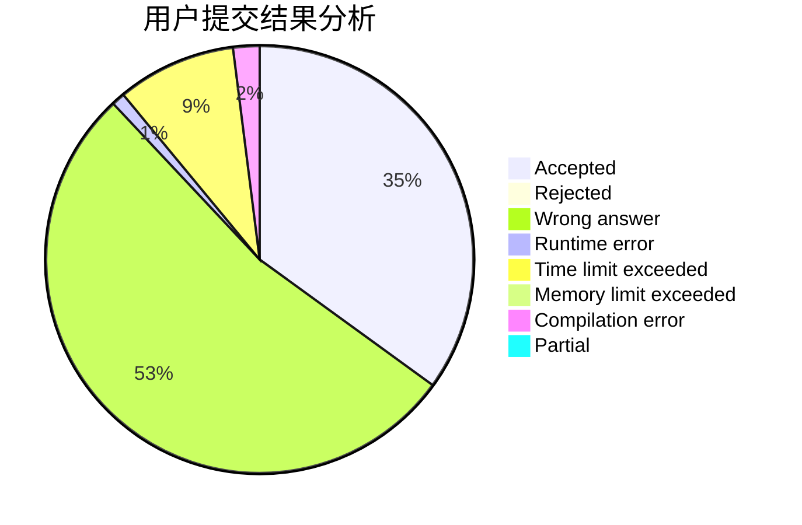
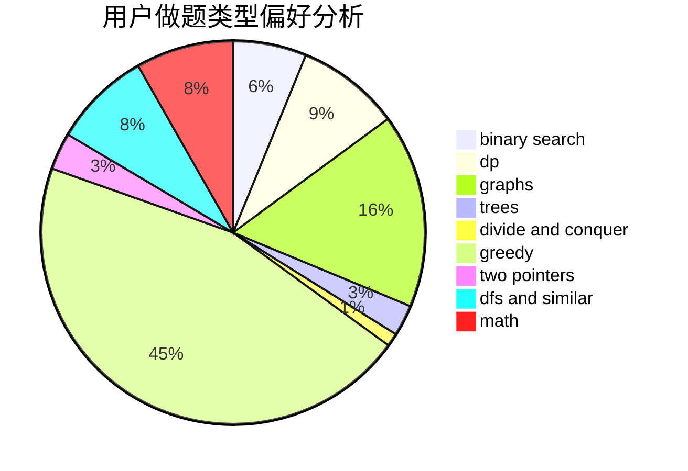

# EOT

<!-- tabs:start -->

#### **用户提交结果分析**

#### **用户做题类型偏好分析**

<!-- tabs:end -->
# 推荐题目
[12621](https://codeforces.com/contest/1262/problem/1)
[519D](https://codeforces.com/contest/519/problem/D)
[1399F](https://codeforces.com/contest/1399/problem/F)
[630A](https://codeforces.com/contest/630/problem/A)
[260D](https://codeforces.com/contest/260/problem/D)
[818D](https://codeforces.com/contest/818/problem/D)
[431E](https://codeforces.com/contest/431/problem/E)
[337C](https://codeforces.com/contest/337/problem/C)
[528A](https://codeforces.com/contest/528/problem/A)
[696B](https://codeforces.com/contest/696/problem/B)
