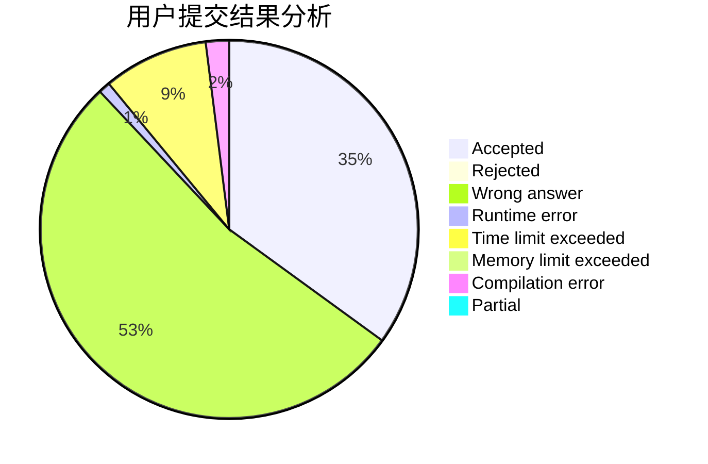
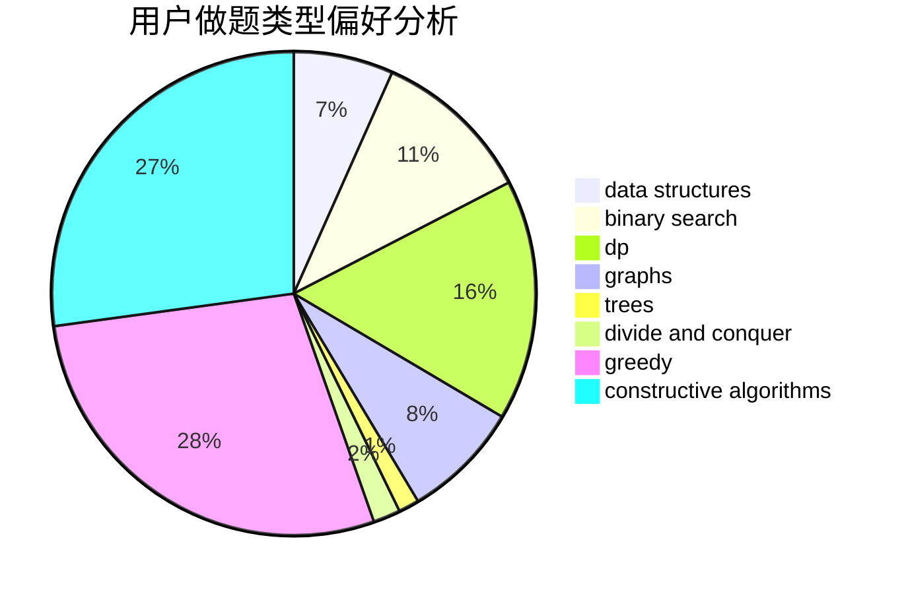
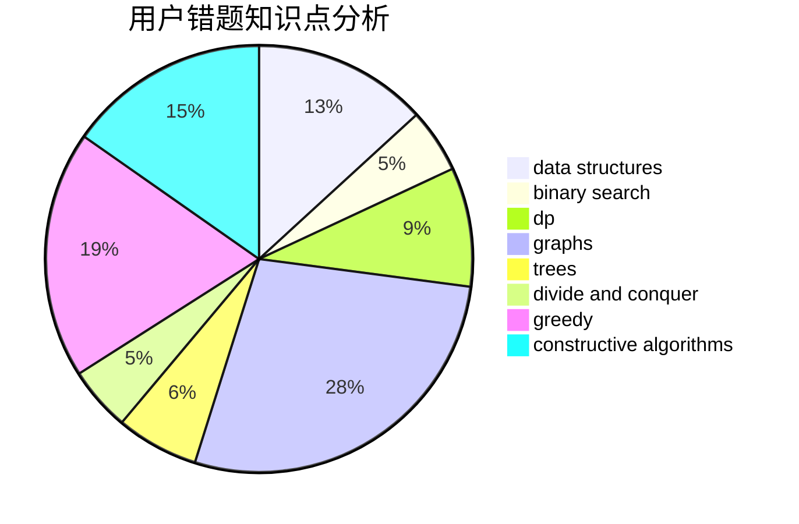

# EOT

<!-- tabs:start -->

#### **用户提交结果分析**

#### **用户做题类型偏好分析**

#### **用户错题知识点分析**

<!-- tabs:end -->
# 推荐题目
[1254D](https://codeforces.com/contest/1254/problem/D)		data structures,
                        probabilities,
                        trees		  
[498D](https://codeforces.com/contest/498/problem/D)		data structures,
                        dp,
                        number theory		  
[1391B](https://codeforces.com/contest/1391/problem/B)		brute force,
                        greedy,
                        implementation		  
[611A](https://codeforces.com/contest/611/problem/A)		implementation		  
[23B](https://codeforces.com/contest/23/problem/B)		constructive algorithms,
                        graphs,
                        math		  
[802N](https://codeforces.com/contest/802/problem/N)		binary search,
                        flows,
                        graphs		  
[403E](https://codeforces.com/contest/403/problem/E)		data structures,
                        implementation,
                        trees		  
[313C](https://codeforces.com/contest/313/problem/C)		constructive algorithms,
                        greedy,
                        implementation,
                        sortings		  
[508A](https://codeforces.com/contest/508/problem/A)		brute force		  
[670D1](https://codeforces.com/contest/670D/problem/1)		binary search,
                        brute force,
                        implementation		  
