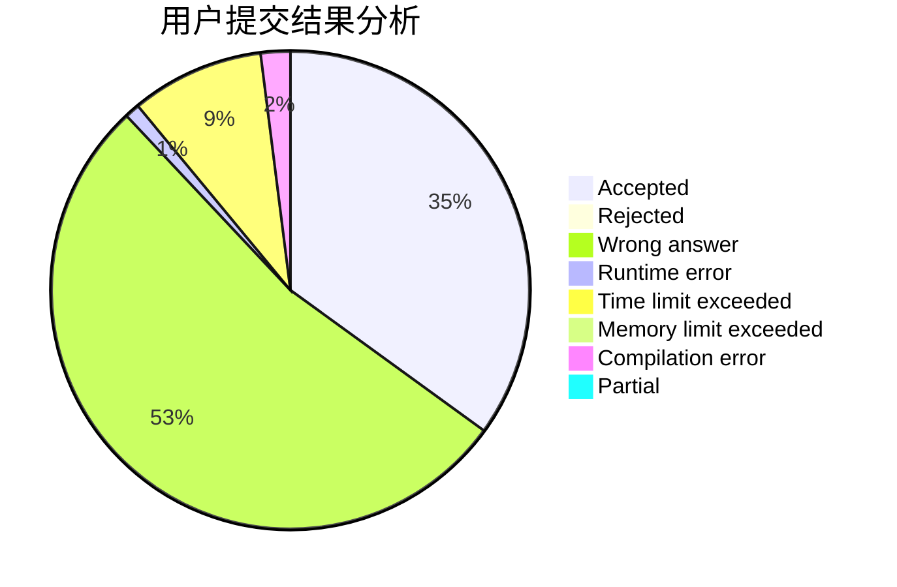
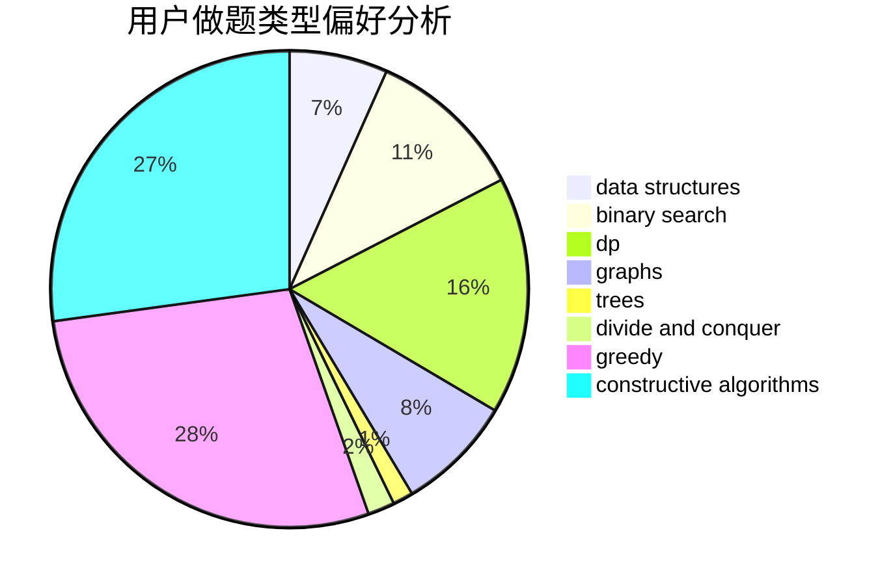
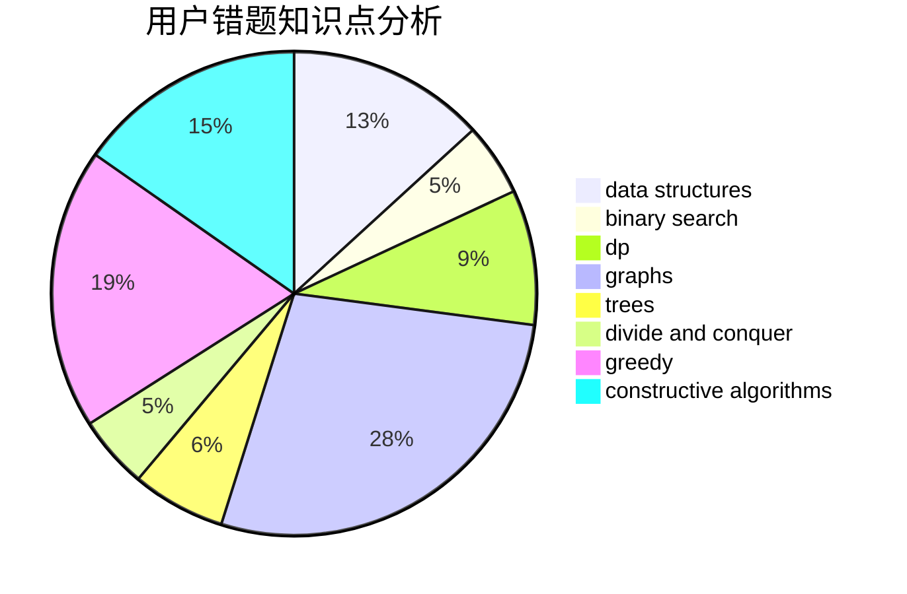

# EOT
<!-- tabs:start -->
#### **用户提交结果分析**

#### **用户做题类型偏好分析**

#### **用户错题知识点分析**

<!-- tabs:end -->
# 推荐题目
[Two Rooted Trees](http://codeforces.com/problemset/problem/403/E)		data structures,
                        implementation,
                        trees		  
[Maximal GCD](http://codeforces.com/problemset/problem/803/C)		constructive algorithms,
                        greedy,
                        math		  
[April Fools' Problem (hard)](http://codeforces.com/problemset/problem/802/O)		binary search,
                        data structures,
                        flows		  
[New Year and Days](http://codeforces.com/problemset/problem/611/A)		implementation		  
[April Fools' Problem (medium)](http://codeforces.com/problemset/problem/802/N)		binary search,
                        flows,
                        graphs		  
[Pasha and Pixels](http://codeforces.com/problemset/problem/508/A)		brute force		  
[Magazine Ad](http://codeforces.com/problemset/problem/803/D)		binary search,
                        greedy		  
[Tree Queries](http://codeforces.com/problemset/problem/1254/D)		data structures,
                        probabilities,
                        trees		  
[Traffic Jams in the Land](http://codeforces.com/problemset/problem/498/D)		data structures,
                        dp,
                        number theory		  
[Colorful Stones](http://codeforces.com/problemset/problem/264/D)		dp,
                        two pointers		  
<!-- tabs:start -->
#### **data structures**
[Two Rooted Trees](http://codeforces.com/problemset/problem/403/E)		data structures,
                        implementation,
                        trees		  
[Maximal GCD](http://codeforces.com/problemset/problem/802/O)		binary search,
                        data structures,
                        flows		  
[April Fools' Problem (hard)](http://codeforces.com/problemset/problem/1254/D)		data structures,
                        probabilities,
                        trees		  
[New Year and Days](http://codeforces.com/problemset/problem/498/D)		data structures,
                        dp,
                        number theory		  
[April Fools' Problem (medium)](https://codeforces.com/contest/504/problem/A)		constructive algorithms,
                        data structures,
                        greedy,
                        sortings,
                        trees		  
[Pasha and Pixels](http://codeforces.com/problemset/problem/1284/B)		binary search,
                        combinatorics,
                        data structures,
                        dp,
                        implementation,
                        sortings		  
[Magazine Ad](http://codeforces.com/problemset/problem/1499/G)		data structures,
                        graphs,
                        interactive		  
[Tree Queries](http://codeforces.com/problemset/problem/1329/D)		constructive algorithms,
                        data structures		  
[Traffic Jams in the Land](http://codeforces.com/problemset/problem/538/H)		2-sat,
                        data structures,
                        dfs and similar,
                        greedy		  
[Colorful Stones](http://codeforces.com/problemset/problem/1386/C)		*special problem,
                        bitmasks,
                        data structures,
                        divide and conquer,
                        dsu		  
#### **binary search**
[Two Rooted Trees](http://codeforces.com/problemset/problem/802/O)		binary search,
                        data structures,
                        flows		  
[Maximal GCD](http://codeforces.com/problemset/problem/802/N)		binary search,
                        flows,
                        graphs		  
[April Fools' Problem (hard)](http://codeforces.com/problemset/problem/803/D)		binary search,
                        greedy		  
[New Year and Days](http://codeforces.com/problemset/problem/670/D1)		binary search,
                        brute force,
                        implementation		  
[April Fools' Problem (medium)](http://codeforces.com/problemset/problem/1284/B)		binary search,
                        combinatorics,
                        data structures,
                        dp,
                        implementation,
                        sortings		  
[Pasha and Pixels](http://codeforces.com/problemset/problem/444/D)		binary search,
                        hashing,
                        strings,
                        two pointers		  
[Magazine Ad](http://codeforces.com/problemset/problem/1042/A)		binary search,
                        implementation		  
[Tree Queries](http://codeforces.com/problemset/problem/309/A)		binary search,
                        math,
                        two pointers		  
[Traffic Jams in the Land](http://codeforces.com/problemset/problem/1492/C)		binary search,
                        data structures,
                        dp,
                        greedy,
                        two pointers		  
[Colorful Stones](http://codeforces.com/problemset/problem/1463/D)		binary search,
                        constructive algorithms,
                        greedy,
                        two pointers		  
#### **dp**
[Two Rooted Trees](http://codeforces.com/problemset/problem/498/D)		data structures,
                        dp,
                        number theory		  
[Maximal GCD](http://codeforces.com/problemset/problem/264/D)		dp,
                        two pointers		  
[April Fools' Problem (hard)](http://codeforces.com/problemset/problem/351/B)		combinatorics,
                        dp,
                        probabilities		  
[New Year and Days](http://codeforces.com/problemset/problem/1284/B)		binary search,
                        combinatorics,
                        data structures,
                        dp,
                        implementation,
                        sortings		  
[April Fools' Problem (medium)](http://codeforces.com/problemset/problem/229/E)		combinatorics,
                        dp,
                        math,
                        probabilities		  
[Pasha and Pixels](http://codeforces.com/problemset/problem/802/L)		dfs and similar,
                        dp,
                        math,
                        trees		  
[Magazine Ad](http://codeforces.com/problemset/problem/1381/D)		dfs and similar,
                        dp,
                        greedy,
                        trees,
                        two pointers		  
[Tree Queries](http://codeforces.com/problemset/problem/1066/F)		dp		  
[Traffic Jams in the Land](http://codeforces.com/problemset/problem/802/K)		dp,
                        trees		  
[Colorful Stones](http://codeforces.com/problemset/problem/1439/D)		combinatorics,
                        dp,
                        fft		  
#### **graph**
[Two Rooted Trees](http://codeforces.com/problemset/problem/802/N)		binary search,
                        flows,
                        graphs		  
[Maximal GCD](http://codeforces.com/problemset/problem/23/B)		constructive algorithms,
                        graphs,
                        math		  
[April Fools' Problem (hard)](http://codeforces.com/problemset/problem/131/D)		dfs and similar,
                        graphs		  
[New Year and Days](https://codeforces.com/contest/1281/problem/E)		dfs and similar,
                        graphs,
                        greedy,
                        trees		  
[April Fools' Problem (medium)](http://codeforces.com/problemset/problem/1089/D)		graphs		  
[Pasha and Pixels](http://codeforces.com/problemset/problem/1499/G)		data structures,
                        graphs,
                        interactive		  
[Magazine Ad](https://codeforces.com/contest/1104/problem/E)		constructive algorithms,
                        dfs and similar,
                        graphs,
                        math		  
[Tree Queries](http://codeforces.com/problemset/problem/802/J)		dfs and similar,
                        graphs,
                        trees		  
[Traffic Jams in the Land](http://codeforces.com/problemset/problem/1037/E)		graphs		  
[Colorful Stones](http://codeforces.com/problemset/problem/1139/C)		dfs and similar,
                        dsu,
                        graphs,
                        math,
                        trees		  
#### **trees**
[Two Rooted Trees](http://codeforces.com/problemset/problem/403/E)		data structures,
                        implementation,
                        trees		  
[Maximal GCD](http://codeforces.com/problemset/problem/1254/D)		data structures,
                        probabilities,
                        trees		  
[April Fools' Problem (hard)](https://codeforces.com/contest/504/problem/A)		constructive algorithms,
                        data structures,
                        greedy,
                        sortings,
                        trees		  
[New Year and Days](https://codeforces.com/contest/1281/problem/E)		dfs and similar,
                        graphs,
                        greedy,
                        trees		  
[April Fools' Problem (medium)](http://codeforces.com/problemset/problem/802/L)		dfs and similar,
                        dp,
                        math,
                        trees		  
[Pasha and Pixels](http://codeforces.com/problemset/problem/1381/D)		dfs and similar,
                        dp,
                        greedy,
                        trees,
                        two pointers		  
[Magazine Ad](http://codeforces.com/problemset/problem/802/J)		dfs and similar,
                        graphs,
                        trees		  
[Tree Queries](http://codeforces.com/problemset/problem/1139/C)		dfs and similar,
                        dsu,
                        graphs,
                        math,
                        trees		  
[Traffic Jams in the Land](http://codeforces.com/problemset/problem/802/K)		dp,
                        trees		  
[Colorful Stones](http://codeforces.com/problemset/problem/1511/C)		brute force,
                        data structures,
                        implementation,
                        trees		  
#### **divide and conquer**
[Two Rooted Trees](http://codeforces.com/problemset/problem/512/E)		constructive algorithms,
                        divide and conquer		  
[Maximal GCD](http://codeforces.com/problemset/problem/1386/C)		*special problem,
                        bitmasks,
                        data structures,
                        divide and conquer,
                        dsu		  
[April Fools' Problem (hard)](http://codeforces.com/problemset/problem/1461/D)		binary search,
                        brute force,
                        data structures,
                        divide and conquer,
                        implementation,
                        sortings		  
[New Year and Days](http://codeforces.com/problemset/problem/1466/G)		combinatorics,
                        divide and conquer,
                        hashing,
                        math,
                        string suffix structures,
                        strings		  
[April Fools' Problem (medium)](http://codeforces.com/problemset/problem/1490/D)		dfs and similar,
                        divide and conquer,
                        implementation		  
[Pasha and Pixels](https://codeforces.com/contest/1483/problem/C)		data structures,
                        divide and conquer,
                        dp		  
[Magazine Ad](http://codeforces.com/problemset/problem/1491/E)		brute force,
                        dfs and similar,
                        divide and conquer,
                        number theory,
                        trees		  
[Tree Queries](http://codeforces.com/problemset/problem/1303/G)		data structures,
                        divide and conquer,
                        geometry,
                        trees		  
[Traffic Jams in the Land](http://codeforces.com/problemset/problem/1494/D)		constructive algorithms,
                        data structures,
                        dfs and similar,
                        divide and conquer,
                        dsu,
                        greedy,
                        sortings,
                        trees		  
[Colorful Stones](http://codeforces.com/problemset/problem/1482/E)		data structures,
                        divide and conquer,
                        dp		  
#### **greedy**
[Two Rooted Trees](http://codeforces.com/problemset/problem/803/C)		constructive algorithms,
                        greedy,
                        math		  
[Maximal GCD](http://codeforces.com/problemset/problem/803/D)		binary search,
                        greedy		  
[April Fools' Problem (hard)](http://codeforces.com/problemset/problem/1061/A)		greedy,
                        implementation,
                        math		  
[New Year and Days](https://codeforces.com/contest/477/problem/B)		constructive algorithms,
                        greedy,
                        math		  
[April Fools' Problem (medium)](http://codeforces.com/problemset/problem/1294/C)		greedy,
                        math,
                        number theory		  
[Pasha and Pixels](http://codeforces.com/problemset/problem/313/C)		constructive algorithms,
                        greedy,
                        implementation,
                        sortings		  
[Magazine Ad](http://codeforces.com/problemset/problem/1391/B)		brute force,
                        greedy,
                        implementation		  
[Tree Queries](http://codeforces.com/problemset/problem/1088/C)		constructive algorithms,
                        greedy,
                        math		  
[Traffic Jams in the Land](https://codeforces.com/contest/504/problem/A)		constructive algorithms,
                        data structures,
                        greedy,
                        sortings,
                        trees		  
[Colorful Stones](https://codeforces.com/contest/1281/problem/E)		dfs and similar,
                        graphs,
                        greedy,
                        trees		  
#### **constructive algorithms**
[Two Rooted Trees](http://codeforces.com/problemset/problem/803/C)		constructive algorithms,
                        greedy,
                        math		  
[Maximal GCD](http://codeforces.com/problemset/problem/23/B)		constructive algorithms,
                        graphs,
                        math		  
[April Fools' Problem (hard)](https://codeforces.com/contest/477/problem/B)		constructive algorithms,
                        greedy,
                        math		  
[New Year and Days](http://codeforces.com/problemset/problem/313/C)		constructive algorithms,
                        greedy,
                        implementation,
                        sortings		  
[April Fools' Problem (medium)](http://codeforces.com/problemset/problem/1088/C)		constructive algorithms,
                        greedy,
                        math		  
[Pasha and Pixels](https://codeforces.com/contest/504/problem/A)		constructive algorithms,
                        data structures,
                        greedy,
                        sortings,
                        trees		  
[Magazine Ad](http://codeforces.com/problemset/problem/512/E)		constructive algorithms,
                        divide and conquer		  
[Tree Queries](http://codeforces.com/problemset/problem/803/B)		constructive algorithms		  
[Traffic Jams in the Land](http://codeforces.com/problemset/problem/1282/D)		constructive algorithms,
                        interactive,
                        strings		  
[Colorful Stones](http://codeforces.com/problemset/problem/282/C)		constructive algorithms,
                        implementation,
                        math		  
#### **sortings**
[Two Rooted Trees](http://codeforces.com/problemset/problem/313/C)		constructive algorithms,
                        greedy,
                        implementation,
                        sortings		  
[Maximal GCD](https://codeforces.com/contest/504/problem/A)		constructive algorithms,
                        data structures,
                        greedy,
                        sortings,
                        trees		  
[April Fools' Problem (hard)](http://codeforces.com/problemset/problem/1284/B)		binary search,
                        combinatorics,
                        data structures,
                        dp,
                        implementation,
                        sortings		  
[New Year and Days](http://codeforces.com/problemset/problem/1294/B)		implementation,
                        sortings		  
[April Fools' Problem (medium)](http://codeforces.com/problemset/problem/1473/A)		greedy,
                        implementation,
                        math,
                        sortings		  
[Pasha and Pixels](http://codeforces.com/problemset/problem/1176/D)		dfs and similar,
                        graphs,
                        greedy,
                        number theory,
                        sortings		  
[Magazine Ad](https://codeforces.com/contest/1496/problem/C)		geometry,
                        greedy,
                        math,
                        sortings		  
[Tree Queries](http://codeforces.com/problemset/problem/1495/A)		geometry,
                        greedy,
                        math,
                        sortings		  
[Traffic Jams in the Land](http://codeforces.com/problemset/problem/1497/A)		brute force,
                        data structures,
                        greedy,
                        sortings		  
[Colorful Stones](http://codeforces.com/problemset/problem/1427/A)		math,
                        sortings		  
<!-- tabs:end -->
