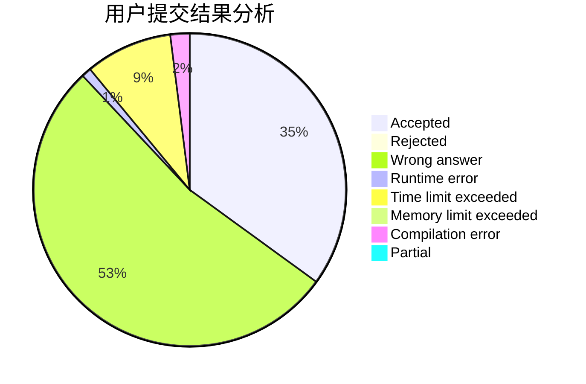
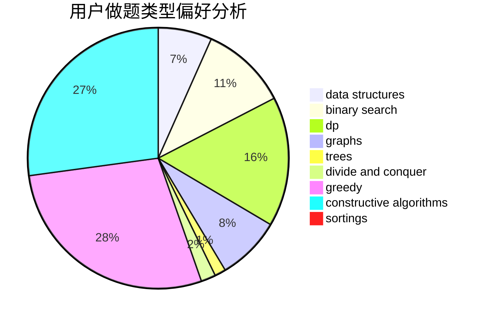
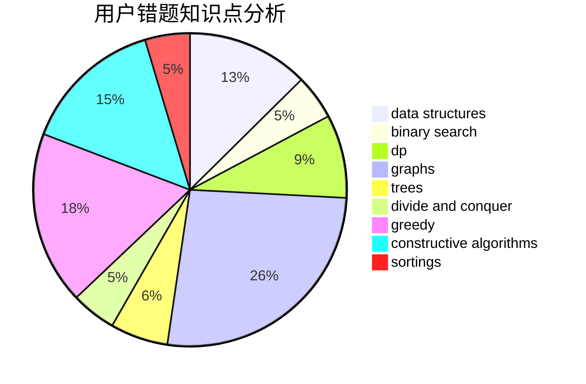

# EOT
<!-- tabs:start -->
#### **用户提交结果分析**

#### **用户做题类型偏好分析**

#### **用户错题知识点分析**

<!-- tabs:end -->
# 推荐题目
[403E](http://codeforces.com/problemset/problem/403/E)		data structures,
                        implementation,
                        trees		  
[803C](http://codeforces.com/problemset/problem/803/C)		constructive algorithms,
                        greedy,
                        math		  
[802O](http://codeforces.com/problemset/problem/802/O)		binary search,
                        data structures,
                        flows		  
[611A](http://codeforces.com/problemset/problem/611/A)		implementation		  
[802N](http://codeforces.com/problemset/problem/802/N)		binary search,
                        flows,
                        graphs		  
[508A](http://codeforces.com/problemset/problem/508/A)		brute force		  
[803D](http://codeforces.com/problemset/problem/803/D)		binary search,
                        greedy		  
[1254D](http://codeforces.com/problemset/problem/1254/D)		data structures,
                        probabilities,
                        trees		  
[498D](http://codeforces.com/problemset/problem/498/D)		data structures,
                        dp,
                        number theory		  
[264D](http://codeforces.com/problemset/problem/264/D)		dp,
                        two pointers		  
<!-- tabs:start -->
#### **data structures**
[403E](http://codeforces.com/problemset/problem/403/E)		data structures,
                        implementation,
                        trees		  
[802O](http://codeforces.com/problemset/problem/802/O)		binary search,
                        data structures,
                        flows		  
[1254D](http://codeforces.com/problemset/problem/1254/D)		data structures,
                        probabilities,
                        trees		  
[498D](http://codeforces.com/problemset/problem/498/D)		data structures,
                        dp,
                        number theory		  
[504A](https://codeforces.com/contest/504/problem/A)		constructive algorithms,
                        data structures,
                        greedy,
                        sortings,
                        trees		  
[1284B](http://codeforces.com/problemset/problem/1284/B)		binary search,
                        combinatorics,
                        data structures,
                        dp,
                        implementation,
                        sortings		  
[1499G](http://codeforces.com/problemset/problem/1499/G)		data structures,
                        graphs,
                        interactive		  
[1329D](http://codeforces.com/problemset/problem/1329/D)		constructive algorithms,
                        data structures		  
[538H](http://codeforces.com/problemset/problem/538/H)		2-sat,
                        data structures,
                        dfs and similar,
                        greedy		  
[1386C](http://codeforces.com/problemset/problem/1386/C)		*special problem,
                        bitmasks,
                        data structures,
                        divide and conquer,
                        dsu		  
#### **binary search**
[802O](http://codeforces.com/problemset/problem/802/O)		binary search,
                        data structures,
                        flows		  
[802N](http://codeforces.com/problemset/problem/802/N)		binary search,
                        flows,
                        graphs		  
[803D](http://codeforces.com/problemset/problem/803/D)		binary search,
                        greedy		  
[670D1](http://codeforces.com/problemset/problem/670/D1)		binary search,
                        brute force,
                        implementation		  
[1284B](http://codeforces.com/problemset/problem/1284/B)		binary search,
                        combinatorics,
                        data structures,
                        dp,
                        implementation,
                        sortings		  
[444D](http://codeforces.com/problemset/problem/444/D)		binary search,
                        hashing,
                        strings,
                        two pointers		  
[1042A](http://codeforces.com/problemset/problem/1042/A)		binary search,
                        implementation		  
[309A](http://codeforces.com/problemset/problem/309/A)		binary search,
                        math,
                        two pointers		  
[1492C](http://codeforces.com/problemset/problem/1492/C)		binary search,
                        data structures,
                        dp,
                        greedy,
                        two pointers		  
[1463D](http://codeforces.com/problemset/problem/1463/D)		binary search,
                        constructive algorithms,
                        greedy,
                        two pointers		  
#### **dp**
[498D](http://codeforces.com/problemset/problem/498/D)		data structures,
                        dp,
                        number theory		  
[264D](http://codeforces.com/problemset/problem/264/D)		dp,
                        two pointers		  
[351B](http://codeforces.com/problemset/problem/351/B)		combinatorics,
                        dp,
                        probabilities		  
[1284B](http://codeforces.com/problemset/problem/1284/B)		binary search,
                        combinatorics,
                        data structures,
                        dp,
                        implementation,
                        sortings		  
[229E](http://codeforces.com/problemset/problem/229/E)		combinatorics,
                        dp,
                        math,
                        probabilities		  
[802L](http://codeforces.com/problemset/problem/802/L)		dfs and similar,
                        dp,
                        math,
                        trees		  
[1381D](http://codeforces.com/problemset/problem/1381/D)		dfs and similar,
                        dp,
                        greedy,
                        trees,
                        two pointers		  
[1066F](http://codeforces.com/problemset/problem/1066/F)		dp		  
[802K](http://codeforces.com/problemset/problem/802/K)		dp,
                        trees		  
[1439D](http://codeforces.com/problemset/problem/1439/D)		combinatorics,
                        dp,
                        fft		  
#### **graph**
[802N](http://codeforces.com/problemset/problem/802/N)		binary search,
                        flows,
                        graphs		  
[23B](http://codeforces.com/problemset/problem/23/B)		constructive algorithms,
                        graphs,
                        math		  
[131D](http://codeforces.com/problemset/problem/131/D)		dfs and similar,
                        graphs		  
[1281E](https://codeforces.com/contest/1281/problem/E)		dfs and similar,
                        graphs,
                        greedy,
                        trees		  
[1089D](http://codeforces.com/problemset/problem/1089/D)		graphs		  
[1499G](http://codeforces.com/problemset/problem/1499/G)		data structures,
                        graphs,
                        interactive		  
[1104E](https://codeforces.com/contest/1104/problem/E)		constructive algorithms,
                        dfs and similar,
                        graphs,
                        math		  
[802J](http://codeforces.com/problemset/problem/802/J)		dfs and similar,
                        graphs,
                        trees		  
[1037E](http://codeforces.com/problemset/problem/1037/E)		graphs		  
[1139C](http://codeforces.com/problemset/problem/1139/C)		dfs and similar,
                        dsu,
                        graphs,
                        math,
                        trees		  
#### **trees**
[403E](http://codeforces.com/problemset/problem/403/E)		data structures,
                        implementation,
                        trees		  
[1254D](http://codeforces.com/problemset/problem/1254/D)		data structures,
                        probabilities,
                        trees		  
[504A](https://codeforces.com/contest/504/problem/A)		constructive algorithms,
                        data structures,
                        greedy,
                        sortings,
                        trees		  
[1281E](https://codeforces.com/contest/1281/problem/E)		dfs and similar,
                        graphs,
                        greedy,
                        trees		  
[802L](http://codeforces.com/problemset/problem/802/L)		dfs and similar,
                        dp,
                        math,
                        trees		  
[1381D](http://codeforces.com/problemset/problem/1381/D)		dfs and similar,
                        dp,
                        greedy,
                        trees,
                        two pointers		  
[802J](http://codeforces.com/problemset/problem/802/J)		dfs and similar,
                        graphs,
                        trees		  
[1139C](http://codeforces.com/problemset/problem/1139/C)		dfs and similar,
                        dsu,
                        graphs,
                        math,
                        trees		  
[802K](http://codeforces.com/problemset/problem/802/K)		dp,
                        trees		  
[1511C](http://codeforces.com/problemset/problem/1511/C)		brute force,
                        data structures,
                        implementation,
                        trees		  
#### **divide and conquer**
[512E](http://codeforces.com/problemset/problem/512/E)		constructive algorithms,
                        divide and conquer		  
[1386C](http://codeforces.com/problemset/problem/1386/C)		*special problem,
                        bitmasks,
                        data structures,
                        divide and conquer,
                        dsu		  
[1461D](http://codeforces.com/problemset/problem/1461/D)		binary search,
                        brute force,
                        data structures,
                        divide and conquer,
                        implementation,
                        sortings		  
[1466G](http://codeforces.com/problemset/problem/1466/G)		combinatorics,
                        divide and conquer,
                        hashing,
                        math,
                        string suffix structures,
                        strings		  
[1490D](http://codeforces.com/problemset/problem/1490/D)		dfs and similar,
                        divide and conquer,
                        implementation		  
[1483C](https://codeforces.com/contest/1483/problem/C)		data structures,
                        divide and conquer,
                        dp		  
[1491E](http://codeforces.com/problemset/problem/1491/E)		brute force,
                        dfs and similar,
                        divide and conquer,
                        number theory,
                        trees		  
[1303G](http://codeforces.com/problemset/problem/1303/G)		data structures,
                        divide and conquer,
                        geometry,
                        trees		  
[1494D](http://codeforces.com/problemset/problem/1494/D)		constructive algorithms,
                        data structures,
                        dfs and similar,
                        divide and conquer,
                        dsu,
                        greedy,
                        sortings,
                        trees		  
[1482E](http://codeforces.com/problemset/problem/1482/E)		data structures,
                        divide and conquer,
                        dp		  
#### **greedy**
[803C](http://codeforces.com/problemset/problem/803/C)		constructive algorithms,
                        greedy,
                        math		  
[803D](http://codeforces.com/problemset/problem/803/D)		binary search,
                        greedy		  
[1061A](http://codeforces.com/problemset/problem/1061/A)		greedy,
                        implementation,
                        math		  
[477B](https://codeforces.com/contest/477/problem/B)		constructive algorithms,
                        greedy,
                        math		  
[1294C](http://codeforces.com/problemset/problem/1294/C)		greedy,
                        math,
                        number theory		  
[313C](http://codeforces.com/problemset/problem/313/C)		constructive algorithms,
                        greedy,
                        implementation,
                        sortings		  
[1391B](http://codeforces.com/problemset/problem/1391/B)		brute force,
                        greedy,
                        implementation		  
[1088C](http://codeforces.com/problemset/problem/1088/C)		constructive algorithms,
                        greedy,
                        math		  
[504A](https://codeforces.com/contest/504/problem/A)		constructive algorithms,
                        data structures,
                        greedy,
                        sortings,
                        trees		  
[1281E](https://codeforces.com/contest/1281/problem/E)		dfs and similar,
                        graphs,
                        greedy,
                        trees		  
#### **constructive algorithms**
[803C](http://codeforces.com/problemset/problem/803/C)		constructive algorithms,
                        greedy,
                        math		  
[23B](http://codeforces.com/problemset/problem/23/B)		constructive algorithms,
                        graphs,
                        math		  
[477B](https://codeforces.com/contest/477/problem/B)		constructive algorithms,
                        greedy,
                        math		  
[313C](http://codeforces.com/problemset/problem/313/C)		constructive algorithms,
                        greedy,
                        implementation,
                        sortings		  
[1088C](http://codeforces.com/problemset/problem/1088/C)		constructive algorithms,
                        greedy,
                        math		  
[504A](https://codeforces.com/contest/504/problem/A)		constructive algorithms,
                        data structures,
                        greedy,
                        sortings,
                        trees		  
[512E](http://codeforces.com/problemset/problem/512/E)		constructive algorithms,
                        divide and conquer		  
[803B](http://codeforces.com/problemset/problem/803/B)		constructive algorithms		  
[1282D](http://codeforces.com/problemset/problem/1282/D)		constructive algorithms,
                        interactive,
                        strings		  
[282C](http://codeforces.com/problemset/problem/282/C)		constructive algorithms,
                        implementation,
                        math		  
#### **sortings**
[313C](http://codeforces.com/problemset/problem/313/C)		constructive algorithms,
                        greedy,
                        implementation,
                        sortings		  
[504A](https://codeforces.com/contest/504/problem/A)		constructive algorithms,
                        data structures,
                        greedy,
                        sortings,
                        trees		  
[1284B](http://codeforces.com/problemset/problem/1284/B)		binary search,
                        combinatorics,
                        data structures,
                        dp,
                        implementation,
                        sortings		  
[1294B](http://codeforces.com/problemset/problem/1294/B)		implementation,
                        sortings		  
[1473A](http://codeforces.com/problemset/problem/1473/A)		greedy,
                        implementation,
                        math,
                        sortings		  
[1176D](http://codeforces.com/problemset/problem/1176/D)		dfs and similar,
                        graphs,
                        greedy,
                        number theory,
                        sortings		  
[1496C](https://codeforces.com/contest/1496/problem/C)		geometry,
                        greedy,
                        math,
                        sortings		  
[1495A](http://codeforces.com/problemset/problem/1495/A)		geometry,
                        greedy,
                        math,
                        sortings		  
[1497A](http://codeforces.com/problemset/problem/1497/A)		brute force,
                        data structures,
                        greedy,
                        sortings		  
[1427A](http://codeforces.com/problemset/problem/1427/A)		math,
                        sortings		  
<!-- tabs:end -->
