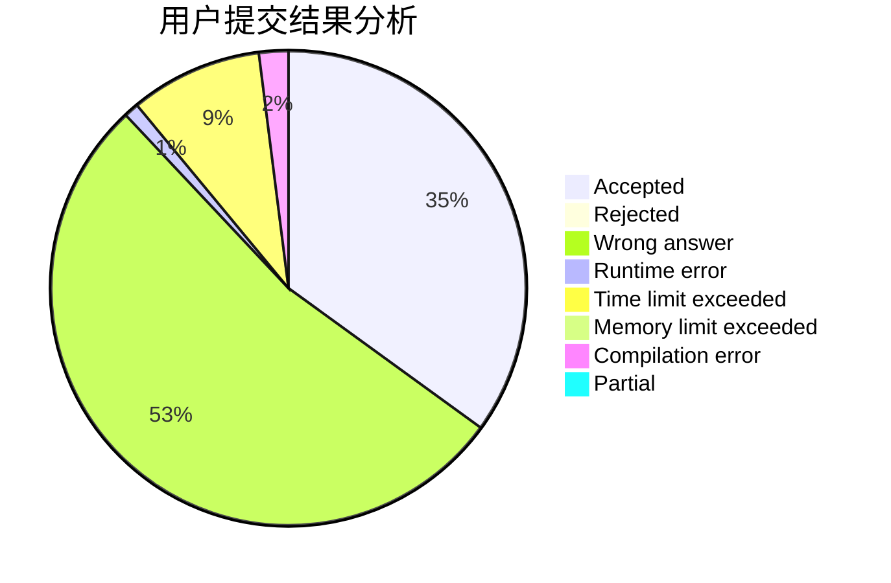
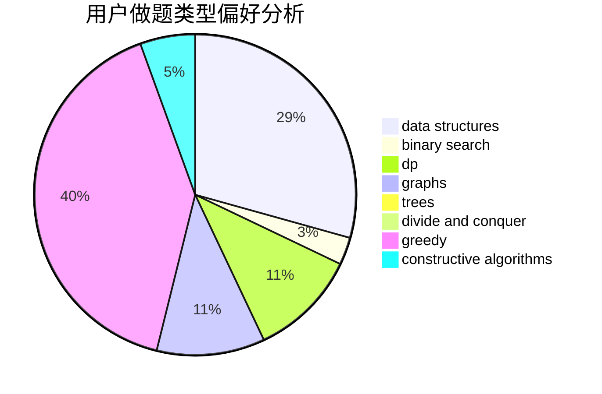
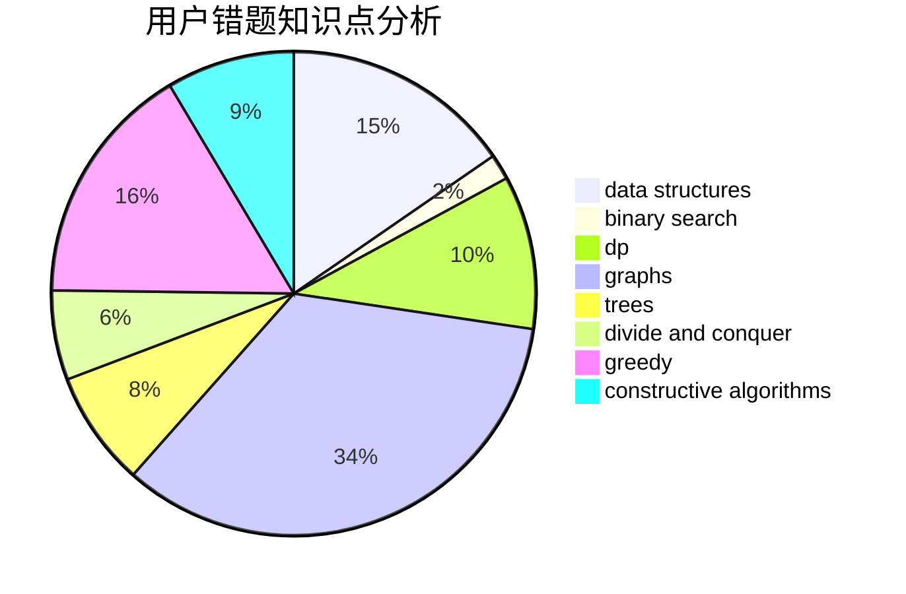

# EOT

<!-- tabs:start -->

#### **用户提交结果分析**

#### **用户做题类型偏好分析**

#### **用户错题知识点分析**

<!-- tabs:end -->
# 推荐题目
[12621](https://codeforces.com/contest/1262/problem/1)		dsu,graphs,sortings,trees		  
[519D](https://codeforces.com/contest/519/problem/D)		data structures,
                        dp,
                        two pointers		  
[1399F](https://codeforces.com/contest/1399/problem/F)		data structures,
                        dp,
                        graphs,
                        sortings		  
[630A](https://codeforces.com/contest/630/problem/A)		number theory		  
[260D](https://codeforces.com/contest/260/problem/D)		constructive algorithms,
                        dsu,
                        graphs,
                        greedy,
                        trees		  
[818D](https://codeforces.com/contest/818/problem/D)		data structures,
                        implementation		  
[431E](https://codeforces.com/contest/431/problem/E)		binary search,
                        data structures,
                        ternary search		  
[337C](https://codeforces.com/contest/337/problem/C)		binary search,
                        greedy,
                        math,
                        matrices,
                        number theory		  
[528A](https://codeforces.com/contest/528/problem/A)		dsu,graphs,sortings,trees		  
[696B](https://codeforces.com/contest/696/problem/B)		dfs and similar,
                        math,
                        probabilities,
                        trees		  
