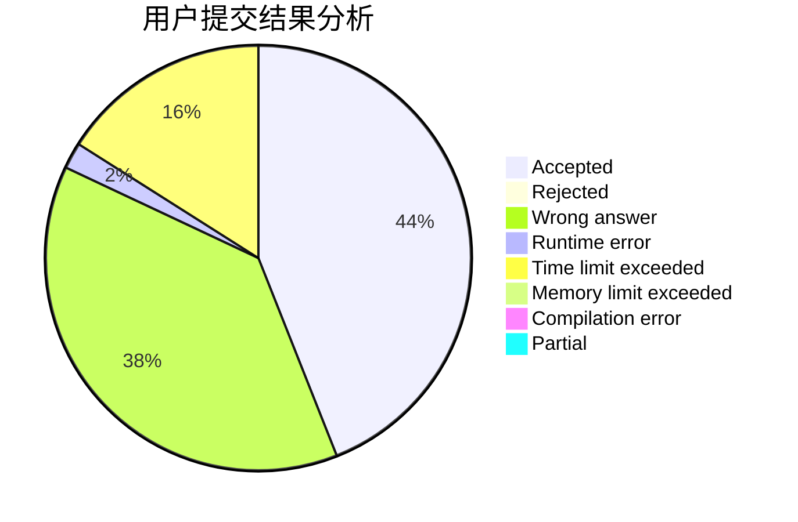
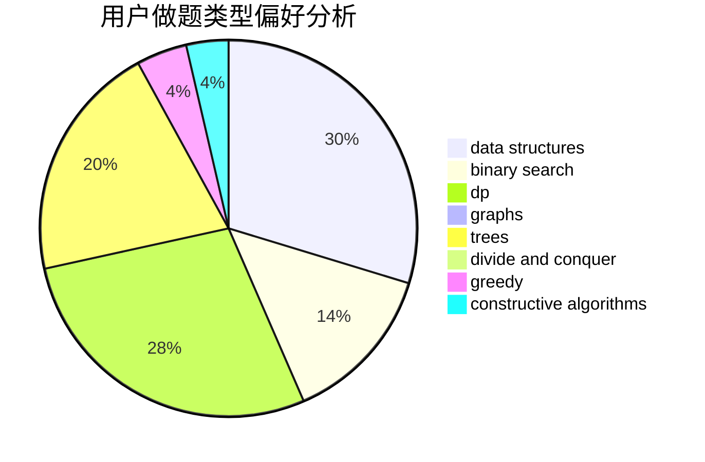
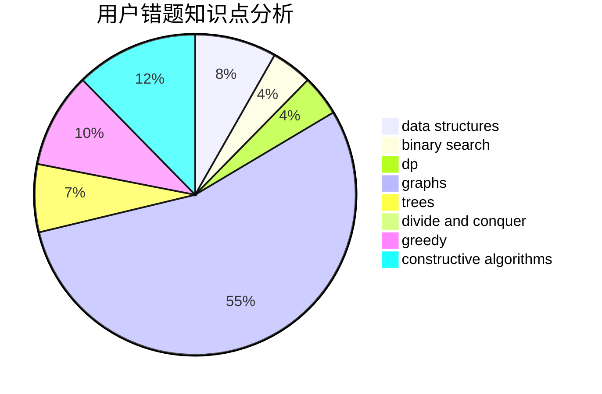

# ET2819
<!-- tabs:start -->
#### **用户提交结果分析**

#### **用户做题类型偏好分析**

#### **用户错题知识点分析**

<!-- tabs:end -->
# 推荐题目
[Traveling Graph](http://codeforces.com/problemset/problem/21/D)		bitmasks,
                        graph matchings,
                        graphs		  
[Anton and Fairy Tale](http://codeforces.com/problemset/problem/785/C)		binary search,
                        math		  
[Missile Silos](http://codeforces.com/problemset/problem/144/D)		data structures,
                        dfs and similar,
                        graphs,
                        shortest paths		  
[Bubble Cup hypothesis](https://codeforces.com/contest/1424/problem/I)		bitmasks,
                        constructive algorithms,
                        dp,
                        math		  
[Mars rover](http://codeforces.com/problemset/problem/1010/D)		dfs and similar,
                        graphs,
                        implementation,
                        trees		  
[Roma and Poker](http://codeforces.com/problemset/problem/803/E)		dp,
                        graphs		  
[Frames](http://codeforces.com/problemset/problem/152/D)		brute force		  
[AB-string](http://codeforces.com/problemset/problem/1238/D)		binary search,
                        combinatorics,
                        dp,
                        strings		  
[Points in Segments](http://codeforces.com/problemset/problem/1015/A)		implementation		  
[Elevator](http://codeforces.com/problemset/problem/117/A)		implementation,
                        math		  
<!-- tabs:start -->
#### **data structures**
[Missile Silos](http://codeforces.com/problemset/problem/144/D)		data structures,
                        dfs and similar,
                        graphs,
                        shortest paths		  
[Team Rocket Rises Again](http://codeforces.com/problemset/problem/757/F)		data structures,
                        graphs,
                        shortest paths		  
[Xenia and Bit Operations](http://codeforces.com/problemset/problem/339/D)		data structures,
                        trees		  
[Mind Control](http://codeforces.com/problemset/problem/1290/A)		brute force,
                        data structures,
                        implementation		  
[Shurikens](https://codeforces.com/contest/1434/problem/B)		data structures,
                        greedy,
                        implementation		  
[Maximum width](http://codeforces.com/problemset/problem/1492/C)		binary search,
                        data structures,
                        dp,
                        greedy,
                        two pointers		  
[Old Floppy Drive](http://codeforces.com/problemset/problem/1490/G)		binary search,
                        data structures,
                        math		  
[Odd Mineral Resource](http://codeforces.com/problemset/problem/1479/D)		binary search,
                        bitmasks,
                        brute force,
                        data structures,
                        probabilities,
                        trees		  
[Meximization](http://codeforces.com/problemset/problem/1497/A)		brute force,
                        data structures,
                        greedy,
                        sortings		  
[Pekora and Trampoline](http://codeforces.com/problemset/problem/1491/C)		brute force,
                        data structures,
                        dp,
                        greedy,
                        implementation		  
#### **binary search**
[Anton and Fairy Tale](http://codeforces.com/problemset/problem/785/C)		binary search,
                        math		  
[AB-string](http://codeforces.com/problemset/problem/1238/D)		binary search,
                        combinatorics,
                        dp,
                        strings		  
[Asterism (Hard Version)](http://codeforces.com/problemset/problem/1371/E2)		binary search,
                        combinatorics,
                        dp,
                        math,
                        number theory,
                        sortings		  
[Expected Damage](http://codeforces.com/problemset/problem/1418/E)		binary search,
                        combinatorics,
                        probabilities		  
[Maximum width](http://codeforces.com/problemset/problem/1492/C)		binary search,
                        data structures,
                        dp,
                        greedy,
                        two pointers		  
[Pairs](http://codeforces.com/problemset/problem/1463/D)		binary search,
                        constructive algorithms,
                        greedy,
                        two pointers		  
[Old Floppy Drive](http://codeforces.com/problemset/problem/1490/G)		binary search,
                        data structures,
                        math		  
[Odd Mineral Resource](http://codeforces.com/problemset/problem/1479/D)		binary search,
                        bitmasks,
                        brute force,
                        data structures,
                        probabilities,
                        trees		  
[Complicated Computations](http://codeforces.com/problemset/problem/1436/E)		binary search,
                        data structures,
                        two pointers		  
[Divide and Summarize](http://codeforces.com/problemset/problem/1461/D)		binary search,
                        brute force,
                        data structures,
                        divide and conquer,
                        implementation,
                        sortings		  
#### **dp**
[Bubble Cup hypothesis](https://codeforces.com/contest/1424/problem/I)		bitmasks,
                        constructive algorithms,
                        dp,
                        math		  
[Roma and Poker](http://codeforces.com/problemset/problem/803/E)		dp,
                        graphs		  
[AB-string](http://codeforces.com/problemset/problem/1238/D)		binary search,
                        combinatorics,
                        dp,
                        strings		  
[Asterism (Hard Version)](http://codeforces.com/problemset/problem/1371/E2)		binary search,
                        combinatorics,
                        dp,
                        math,
                        number theory,
                        sortings		  
[Maximum width](http://codeforces.com/problemset/problem/1492/C)		binary search,
                        data structures,
                        dp,
                        greedy,
                        two pointers		  
[Bouncing Ball](https://codeforces.com/contest/1457/problem/C)		brute force,
                        dp,
                        implementation		  
[Pekora and Trampoline](http://codeforces.com/problemset/problem/1491/C)		brute force,
                        data structures,
                        dp,
                        greedy,
                        implementation		  
[Chef Monocarp](http://codeforces.com/problemset/problem/1437/C)		dp,
                        flows,
                        graph matchings,
                        greedy,
                        math,
                        sortings		  
[Binary Removals](http://codeforces.com/problemset/problem/1499/B)		brute force,
                        dp,
                        greedy,
                        implementation		  
[Zookeeper and The Infinite Zoo](http://codeforces.com/problemset/problem/1491/D)		bitmasks,
                        constructive algorithms,
                        dp,
                        greedy,
                        math		  
#### **graph**
[Traveling Graph](http://codeforces.com/problemset/problem/21/D)		bitmasks,
                        graph matchings,
                        graphs		  
[Missile Silos](http://codeforces.com/problemset/problem/144/D)		data structures,
                        dfs and similar,
                        graphs,
                        shortest paths		  
[Mars rover](http://codeforces.com/problemset/problem/1010/D)		dfs and similar,
                        graphs,
                        implementation,
                        trees		  
[Roma and Poker](http://codeforces.com/problemset/problem/803/E)		dp,
                        graphs		  
[Dijkstra?](http://codeforces.com/problemset/problem/20/C)		graphs,
                        shortest paths		  
[Team Rocket Rises Again](http://codeforces.com/problemset/problem/757/F)		data structures,
                        graphs,
                        shortest paths		  
[Allowed Letters](http://codeforces.com/problemset/problem/1009/G)		bitmasks,
                        flows,
                        graph matchings,
                        graphs,
                        greedy		  
[Ski Accidents](http://codeforces.com/problemset/problem/1368/E)		constructive algorithms,
                        graphs,
                        greedy		  
[Minimum Ties](http://codeforces.com/problemset/problem/1487/C)		brute force,
                        constructive algorithms,
                        dfs and similar,
                        graphs,
                        greedy,
                        implementation,
                        math		  
[Chef Monocarp](http://codeforces.com/problemset/problem/1437/C)		dp,
                        flows,
                        graph matchings,
                        greedy,
                        math,
                        sortings		  
#### **trees**
[Mars rover](http://codeforces.com/problemset/problem/1010/D)		dfs and similar,
                        graphs,
                        implementation,
                        trees		  
[Xenia and Bit Operations](http://codeforces.com/problemset/problem/339/D)		data structures,
                        trees		  
[Odd Mineral Resource](http://codeforces.com/problemset/problem/1479/D)		binary search,
                        bitmasks,
                        brute force,
                        data structures,
                        probabilities,
                        trees		  
[Yet Another Card Deck](http://codeforces.com/problemset/problem/1511/C)		brute force,
                        data structures,
                        implementation,
                        trees		  
[Diameter Cuts](http://codeforces.com/problemset/problem/1499/F)		combinatorics,
                        dfs and similar,
                        dp,
                        trees		  
[Fib-tree](http://codeforces.com/problemset/problem/1491/E)		brute force,
                        dfs and similar,
                        divide and conquer,
                        number theory,
                        trees		  
[13th Labour of Heracles](http://codeforces.com/problemset/problem/1466/D)		data structures,
                        greedy,
                        sortings,
                        trees		  
[BFS Trees](http://codeforces.com/problemset/problem/1495/D)		combinatorics,
                        dfs and similar,
                        graphs,
                        math,
                        shortest paths,
                        trees		  
[Sum of Prefix Sums](http://codeforces.com/problemset/problem/1303/G)		data structures,
                        divide and conquer,
                        geometry,
                        trees		  
[Number of Simple Paths](http://codeforces.com/problemset/problem/1454/E)		combinatorics,
                        dfs and similar,
                        graphs,
                        trees		  
#### **divide and conquer**
[Divide and Summarize](http://codeforces.com/problemset/problem/1461/D)		binary search,
                        brute force,
                        data structures,
                        divide and conquer,
                        implementation,
                        sortings		  
[Song of the Sirens](http://codeforces.com/problemset/problem/1466/G)		combinatorics,
                        divide and conquer,
                        hashing,
                        math,
                        string suffix structures,
                        strings		  
[Permutation Transformation](http://codeforces.com/problemset/problem/1490/D)		dfs and similar,
                        divide and conquer,
                        implementation		  
[Skyline Photo](https://codeforces.com/contest/1483/problem/C)		data structures,
                        divide and conquer,
                        dp		  
[Fib-tree](http://codeforces.com/problemset/problem/1491/E)		brute force,
                        dfs and similar,
                        divide and conquer,
                        number theory,
                        trees		  
[Sum of Prefix Sums](http://codeforces.com/problemset/problem/1303/G)		data structures,
                        divide and conquer,
                        geometry,
                        trees		  
[Dogeforces](http://codeforces.com/problemset/problem/1494/D)		constructive algorithms,
                        data structures,
                        dfs and similar,
                        divide and conquer,
                        dsu,
                        greedy,
                        sortings,
                        trees		  
[Skyline Photo](http://codeforces.com/problemset/problem/1482/E)		data structures,
                        divide and conquer,
                        dp		  
[Logistical Questions](http://codeforces.com/problemset/problem/566/C)		dfs and similar,
                        divide and conquer,
                        trees		  
[Fruit Sequences](http://codeforces.com/problemset/problem/1428/F)		binary search,
                        data structures,
                        divide and conquer,
                        dp,
                        two pointers		  
#### **greedy**
[A Prank](http://codeforces.com/problemset/problem/1062/A)		greedy,
                        implementation		  
[Allowed Letters](http://codeforces.com/problemset/problem/1009/G)		bitmasks,
                        flows,
                        graph matchings,
                        graphs,
                        greedy		  
[Too Many Segments (easy version)](http://codeforces.com/problemset/problem/1249/D1)		greedy		  
[Ski Accidents](http://codeforces.com/problemset/problem/1368/E)		constructive algorithms,
                        graphs,
                        greedy		  
[TMT Document](http://codeforces.com/problemset/problem/1509/B)		greedy		  
[Shurikens](https://codeforces.com/contest/1434/problem/B)		data structures,
                        greedy,
                        implementation		  
[Repainting Street](https://codeforces.com/contest/1457/problem/B)		brute force,
                        brute force,
                        greedy		  
[Maximum width](http://codeforces.com/problemset/problem/1492/C)		binary search,
                        data structures,
                        dp,
                        greedy,
                        two pointers		  
[Diamond Miner](https://codeforces.com/contest/1496/problem/C)		geometry,
                        greedy,
                        math,
                        sortings		  
[Anti-knapsack](http://codeforces.com/problemset/problem/1493/A)		constructive algorithms,
                        greedy		  
#### **constructive algorithms**
[Bubble Cup hypothesis](https://codeforces.com/contest/1424/problem/I)		bitmasks,
                        constructive algorithms,
                        dp,
                        math		  
[Special Permutation](https://codeforces.com/contest/1347/problem/E)		constructive algorithms,
                        probabilities		  
[Ski Accidents](http://codeforces.com/problemset/problem/1368/E)		constructive algorithms,
                        graphs,
                        greedy		  
[Add Candies](http://codeforces.com/problemset/problem/1447/A)		constructive algorithms,
                        math		  
[Anti-knapsack](http://codeforces.com/problemset/problem/1493/A)		constructive algorithms,
                        greedy		  
[Pairs](http://codeforces.com/problemset/problem/1463/D)		binary search,
                        constructive algorithms,
                        greedy,
                        two pointers		  
[XOR-gun](https://codeforces.com/contest/1456/problem/B)		bitmasks,
                        brute force,
                        constructive algorithms		  
[Genius's Gambit](http://codeforces.com/problemset/problem/1492/D)		bitmasks,
                        constructive algorithms,
                        greedy,
                        math		  
[3-Coloring](https://codeforces.com/contest/1504/problem/D)		constructive algorithms,
                        games,
                        interactive		  
[Basic Diplomacy](https://codeforces.com/contest/1483/problem/A)		brute force,
                        constructive algorithms,
                        greedy,
                        implementation		  
#### **sortings**
[Origami](http://codeforces.com/problemset/problem/1381/E)		geometry,
                        math,
                        sortings		  
[Asterism (Hard Version)](http://codeforces.com/problemset/problem/1371/E2)		binary search,
                        combinatorics,
                        dp,
                        math,
                        number theory,
                        sortings		  
[Diamond Miner](https://codeforces.com/contest/1496/problem/C)		geometry,
                        greedy,
                        math,
                        sortings		  
[Diamond Miner](http://codeforces.com/problemset/problem/1495/A)		geometry,
                        greedy,
                        math,
                        sortings		  
[Meximization](http://codeforces.com/problemset/problem/1497/A)		brute force,
                        data structures,
                        greedy,
                        sortings		  
[Avoiding Zero](http://codeforces.com/problemset/problem/1427/A)		math,
                        sortings		  
[Divide and Summarize](http://codeforces.com/problemset/problem/1461/D)		binary search,
                        brute force,
                        data structures,
                        divide and conquer,
                        implementation,
                        sortings		  
[Chef Monocarp](http://codeforces.com/problemset/problem/1437/C)		dp,
                        flows,
                        graph matchings,
                        greedy,
                        math,
                        sortings		  
[Replacing Elements](http://codeforces.com/problemset/problem/1473/A)		greedy,
                        implementation,
                        math,
                        sortings		  
[Eastern Exhibition](http://codeforces.com/problemset/problem/1486/B)		binary search,
                        geometry,
                        shortest paths,
                        sortings		  
<!-- tabs:end -->
