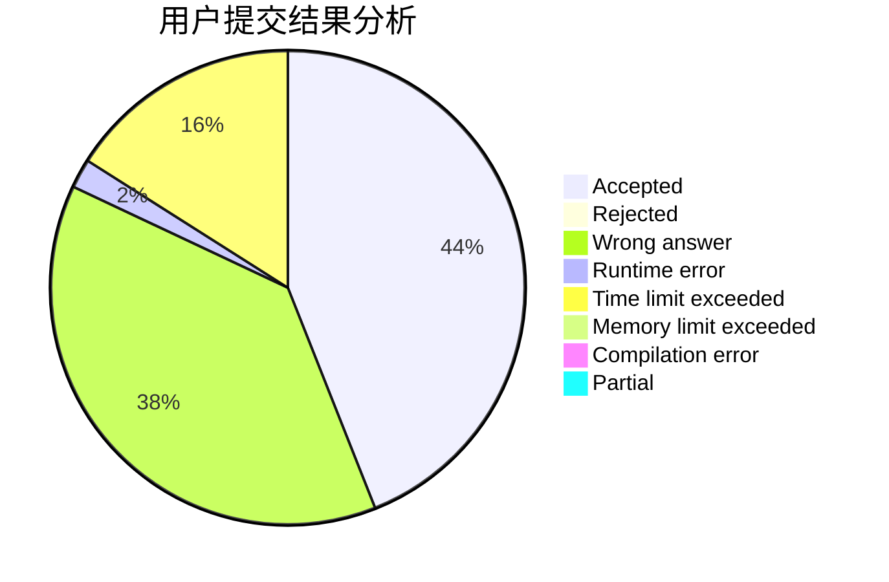
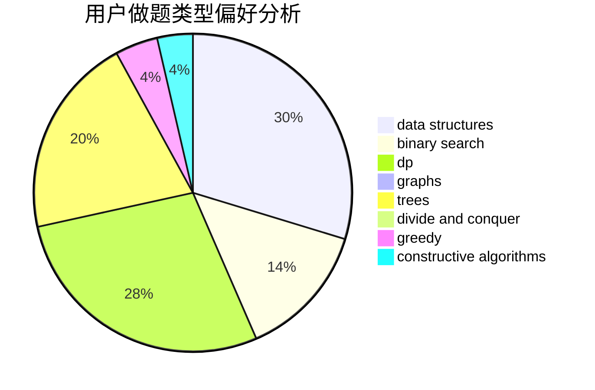
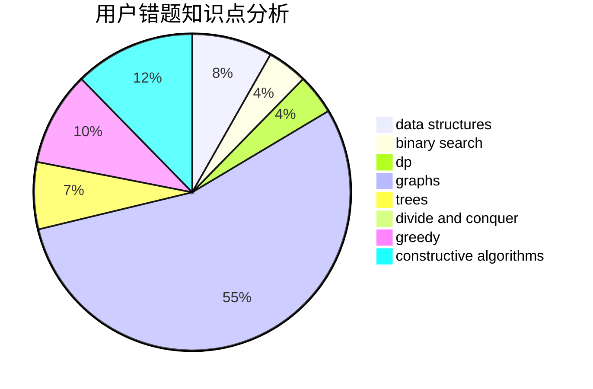

# ET2819

<!-- tabs:start -->

#### **用户提交结果分析**

#### **用户做题类型偏好分析**

#### **用户错题知识点分析**

<!-- tabs:end -->
# 推荐题目
[1381E](https://codeforces.com/contest/1381/problem/E)		geometry,
                        math,
                        sortings		  
[144D](https://codeforces.com/contest/144/problem/D)		data structures,
                        dfs and similar,
                        graphs,
                        shortest paths		  
[1424I](https://codeforces.com/contest/1424/problem/I)		dsu,graphs,sortings,trees		  
[1447A](https://codeforces.com/contest/1447/problem/A)		constructive algorithms,
                        math		  
[1434B](https://codeforces.com/contest/1434/problem/B)		dsu,graphs,sortings,trees		  
[757F](https://codeforces.com/contest/757/problem/F)		data structures,
                        graphs,
                        shortest paths		  
[21D](https://codeforces.com/contest/21/problem/D)		bitmasks,
                        graph matchings,
                        graphs		  
[339D](https://codeforces.com/contest/339/problem/D)		data structures,
                        trees		  
[803E](https://codeforces.com/contest/803/problem/E)		dp,
                        graphs		  
[1371E2](https://codeforces.com/contest/1371E/problem/2)		binary search,
                        combinatorics,
                        dp,
                        math,
                        number theory,
                        sortings		  
