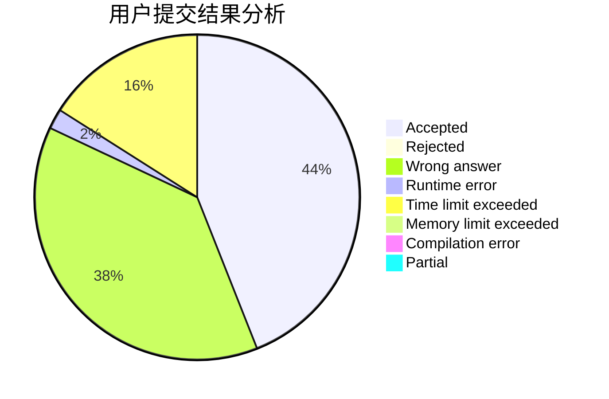
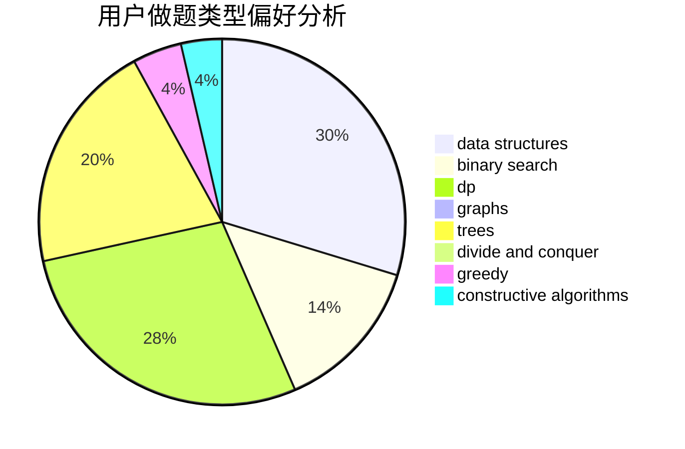
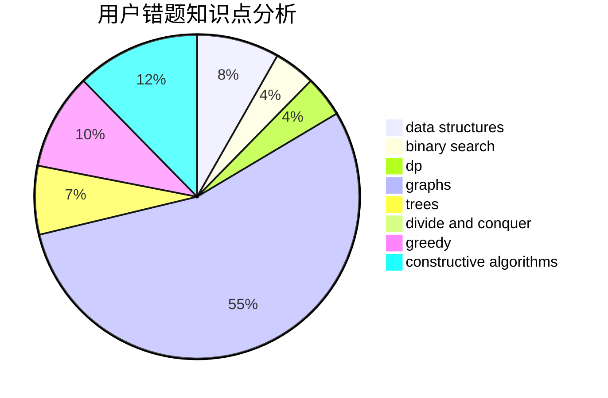

# ET2819
<!-- tabs:start -->
#### **用户提交结果分析**

#### **用户做题类型偏好分析**

#### **用户错题知识点分析**

<!-- tabs:end -->
# 推荐题目
[Traveling Graph](http://codeforces.com/problemset/problem/21/D)		bitmasks,
                        graph matchings,
                        graphs		  
[Anton and Fairy Tale](http://codeforces.com/problemset/problem/785/C)		binary search,
                        math		  
[Missile Silos](http://codeforces.com/problemset/problem/144/D)		data structures,
                        dfs and similar,
                        graphs,
                        shortest paths		  
[Bubble Cup hypothesis](https://codeforces.com/contest/1424/problem/I)		bitmasks,
                        constructive algorithms,
                        dp,
                        math		  
[Mars rover](http://codeforces.com/problemset/problem/1010/D)		dfs and similar,
                        graphs,
                        implementation,
                        trees		  
[Roma and Poker](http://codeforces.com/problemset/problem/803/E)		dp,
                        graphs		  
[Frames](http://codeforces.com/problemset/problem/152/D)		brute force		  
[AB-string](http://codeforces.com/problemset/problem/1238/D)		binary search,
                        combinatorics,
                        dp,
                        strings		  
[Points in Segments](http://codeforces.com/problemset/problem/1015/A)		implementation		  
[Elevator](http://codeforces.com/problemset/problem/117/A)		implementation,
                        math		  
<!-- tabs:start -->
#### **data structures**
[Traveling Graph](http://codeforces.com/problemset/problem/144/D)		data structures,
                        dfs and similar,
                        graphs,
                        shortest paths		  
[Anton and Fairy Tale](http://codeforces.com/problemset/problem/757/F)		data structures,
                        graphs,
                        shortest paths		  
[Missile Silos](http://codeforces.com/problemset/problem/339/D)		data structures,
                        trees		  
[Bubble Cup hypothesis](http://codeforces.com/problemset/problem/1290/A)		brute force,
                        data structures,
                        implementation		  
[Mars rover](https://codeforces.com/contest/1434/problem/B)		data structures,
                        greedy,
                        implementation		  
[Roma and Poker](http://codeforces.com/problemset/problem/1492/C)		binary search,
                        data structures,
                        dp,
                        greedy,
                        two pointers		  
[Frames](http://codeforces.com/problemset/problem/1490/G)		binary search,
                        data structures,
                        math		  
[AB-string](http://codeforces.com/problemset/problem/1479/D)		binary search,
                        bitmasks,
                        brute force,
                        data structures,
                        probabilities,
                        trees		  
[Points in Segments](http://codeforces.com/problemset/problem/1497/A)		brute force,
                        data structures,
                        greedy,
                        sortings		  
[Elevator](http://codeforces.com/problemset/problem/1491/C)		brute force,
                        data structures,
                        dp,
                        greedy,
                        implementation		  
#### **binary search**
[Traveling Graph](http://codeforces.com/problemset/problem/785/C)		binary search,
                        math		  
[Anton and Fairy Tale](http://codeforces.com/problemset/problem/1238/D)		binary search,
                        combinatorics,
                        dp,
                        strings		  
[Missile Silos](http://codeforces.com/problemset/problem/1371/E2)		binary search,
                        combinatorics,
                        dp,
                        math,
                        number theory,
                        sortings		  
[Bubble Cup hypothesis](http://codeforces.com/problemset/problem/1418/E)		binary search,
                        combinatorics,
                        probabilities		  
[Mars rover](http://codeforces.com/problemset/problem/1492/C)		binary search,
                        data structures,
                        dp,
                        greedy,
                        two pointers		  
[Roma and Poker](http://codeforces.com/problemset/problem/1463/D)		binary search,
                        constructive algorithms,
                        greedy,
                        two pointers		  
[Frames](http://codeforces.com/problemset/problem/1490/G)		binary search,
                        data structures,
                        math		  
[AB-string](http://codeforces.com/problemset/problem/1479/D)		binary search,
                        bitmasks,
                        brute force,
                        data structures,
                        probabilities,
                        trees		  
[Points in Segments](http://codeforces.com/problemset/problem/1436/E)		binary search,
                        data structures,
                        two pointers		  
[Elevator](http://codeforces.com/problemset/problem/1461/D)		binary search,
                        brute force,
                        data structures,
                        divide and conquer,
                        implementation,
                        sortings		  
#### **dp**
[Traveling Graph](https://codeforces.com/contest/1424/problem/I)		bitmasks,
                        constructive algorithms,
                        dp,
                        math		  
[Anton and Fairy Tale](http://codeforces.com/problemset/problem/803/E)		dp,
                        graphs		  
[Missile Silos](http://codeforces.com/problemset/problem/1238/D)		binary search,
                        combinatorics,
                        dp,
                        strings		  
[Bubble Cup hypothesis](http://codeforces.com/problemset/problem/1371/E2)		binary search,
                        combinatorics,
                        dp,
                        math,
                        number theory,
                        sortings		  
[Mars rover](http://codeforces.com/problemset/problem/1492/C)		binary search,
                        data structures,
                        dp,
                        greedy,
                        two pointers		  
[Roma and Poker](https://codeforces.com/contest/1457/problem/C)		brute force,
                        dp,
                        implementation		  
[Frames](http://codeforces.com/problemset/problem/1491/C)		brute force,
                        data structures,
                        dp,
                        greedy,
                        implementation		  
[AB-string](http://codeforces.com/problemset/problem/1437/C)		dp,
                        flows,
                        graph matchings,
                        greedy,
                        math,
                        sortings		  
[Points in Segments](http://codeforces.com/problemset/problem/1499/B)		brute force,
                        dp,
                        greedy,
                        implementation		  
[Elevator](http://codeforces.com/problemset/problem/1491/D)		bitmasks,
                        constructive algorithms,
                        dp,
                        greedy,
                        math		  
#### **graph**
[Traveling Graph](http://codeforces.com/problemset/problem/21/D)		bitmasks,
                        graph matchings,
                        graphs		  
[Anton and Fairy Tale](http://codeforces.com/problemset/problem/144/D)		data structures,
                        dfs and similar,
                        graphs,
                        shortest paths		  
[Missile Silos](http://codeforces.com/problemset/problem/1010/D)		dfs and similar,
                        graphs,
                        implementation,
                        trees		  
[Bubble Cup hypothesis](http://codeforces.com/problemset/problem/803/E)		dp,
                        graphs		  
[Mars rover](http://codeforces.com/problemset/problem/20/C)		graphs,
                        shortest paths		  
[Roma and Poker](http://codeforces.com/problemset/problem/757/F)		data structures,
                        graphs,
                        shortest paths		  
[Frames](http://codeforces.com/problemset/problem/1009/G)		bitmasks,
                        flows,
                        graph matchings,
                        graphs,
                        greedy		  
[AB-string](http://codeforces.com/problemset/problem/1368/E)		constructive algorithms,
                        graphs,
                        greedy		  
[Points in Segments](http://codeforces.com/problemset/problem/1487/C)		brute force,
                        constructive algorithms,
                        dfs and similar,
                        graphs,
                        greedy,
                        implementation,
                        math		  
[Elevator](http://codeforces.com/problemset/problem/1437/C)		dp,
                        flows,
                        graph matchings,
                        greedy,
                        math,
                        sortings		  
#### **trees**
[Traveling Graph](http://codeforces.com/problemset/problem/1010/D)		dfs and similar,
                        graphs,
                        implementation,
                        trees		  
[Anton and Fairy Tale](http://codeforces.com/problemset/problem/339/D)		data structures,
                        trees		  
[Missile Silos](http://codeforces.com/problemset/problem/1479/D)		binary search,
                        bitmasks,
                        brute force,
                        data structures,
                        probabilities,
                        trees		  
[Bubble Cup hypothesis](http://codeforces.com/problemset/problem/1511/C)		brute force,
                        data structures,
                        implementation,
                        trees		  
[Mars rover](http://codeforces.com/problemset/problem/1499/F)		combinatorics,
                        dfs and similar,
                        dp,
                        trees		  
[Roma and Poker](http://codeforces.com/problemset/problem/1491/E)		brute force,
                        dfs and similar,
                        divide and conquer,
                        number theory,
                        trees		  
[Frames](http://codeforces.com/problemset/problem/1466/D)		data structures,
                        greedy,
                        sortings,
                        trees		  
[AB-string](http://codeforces.com/problemset/problem/1495/D)		combinatorics,
                        dfs and similar,
                        graphs,
                        math,
                        shortest paths,
                        trees		  
[Points in Segments](http://codeforces.com/problemset/problem/1303/G)		data structures,
                        divide and conquer,
                        geometry,
                        trees		  
[Elevator](http://codeforces.com/problemset/problem/1454/E)		combinatorics,
                        dfs and similar,
                        graphs,
                        trees		  
#### **divide and conquer**
[Traveling Graph](http://codeforces.com/problemset/problem/1461/D)		binary search,
                        brute force,
                        data structures,
                        divide and conquer,
                        implementation,
                        sortings		  
[Anton and Fairy Tale](http://codeforces.com/problemset/problem/1466/G)		combinatorics,
                        divide and conquer,
                        hashing,
                        math,
                        string suffix structures,
                        strings		  
[Missile Silos](http://codeforces.com/problemset/problem/1490/D)		dfs and similar,
                        divide and conquer,
                        implementation		  
[Bubble Cup hypothesis](https://codeforces.com/contest/1483/problem/C)		data structures,
                        divide and conquer,
                        dp		  
[Mars rover](http://codeforces.com/problemset/problem/1491/E)		brute force,
                        dfs and similar,
                        divide and conquer,
                        number theory,
                        trees		  
[Roma and Poker](http://codeforces.com/problemset/problem/1303/G)		data structures,
                        divide and conquer,
                        geometry,
                        trees		  
[Frames](http://codeforces.com/problemset/problem/1494/D)		constructive algorithms,
                        data structures,
                        dfs and similar,
                        divide and conquer,
                        dsu,
                        greedy,
                        sortings,
                        trees		  
[AB-string](http://codeforces.com/problemset/problem/1482/E)		data structures,
                        divide and conquer,
                        dp		  
[Points in Segments](http://codeforces.com/problemset/problem/566/C)		dfs and similar,
                        divide and conquer,
                        trees		  
[Elevator](http://codeforces.com/problemset/problem/1428/F)		binary search,
                        data structures,
                        divide and conquer,
                        dp,
                        two pointers		  
#### **greedy**
[Traveling Graph](http://codeforces.com/problemset/problem/1062/A)		greedy,
                        implementation		  
[Anton and Fairy Tale](http://codeforces.com/problemset/problem/1009/G)		bitmasks,
                        flows,
                        graph matchings,
                        graphs,
                        greedy		  
[Missile Silos](http://codeforces.com/problemset/problem/1249/D1)		greedy		  
[Bubble Cup hypothesis](http://codeforces.com/problemset/problem/1368/E)		constructive algorithms,
                        graphs,
                        greedy		  
[Mars rover](http://codeforces.com/problemset/problem/1509/B)		greedy		  
[Roma and Poker](https://codeforces.com/contest/1434/problem/B)		data structures,
                        greedy,
                        implementation		  
[Frames](https://codeforces.com/contest/1457/problem/B)		brute force,
                        brute force,
                        greedy		  
[AB-string](http://codeforces.com/problemset/problem/1492/C)		binary search,
                        data structures,
                        dp,
                        greedy,
                        two pointers		  
[Points in Segments](https://codeforces.com/contest/1496/problem/C)		geometry,
                        greedy,
                        math,
                        sortings		  
[Elevator](http://codeforces.com/problemset/problem/1493/A)		constructive algorithms,
                        greedy		  
#### **constructive algorithms**
[Traveling Graph](https://codeforces.com/contest/1424/problem/I)		bitmasks,
                        constructive algorithms,
                        dp,
                        math		  
[Anton and Fairy Tale](https://codeforces.com/contest/1347/problem/E)		constructive algorithms,
                        probabilities		  
[Missile Silos](http://codeforces.com/problemset/problem/1368/E)		constructive algorithms,
                        graphs,
                        greedy		  
[Bubble Cup hypothesis](http://codeforces.com/problemset/problem/1447/A)		constructive algorithms,
                        math		  
[Mars rover](http://codeforces.com/problemset/problem/1493/A)		constructive algorithms,
                        greedy		  
[Roma and Poker](http://codeforces.com/problemset/problem/1463/D)		binary search,
                        constructive algorithms,
                        greedy,
                        two pointers		  
[Frames](https://codeforces.com/contest/1456/problem/B)		bitmasks,
                        brute force,
                        constructive algorithms		  
[AB-string](http://codeforces.com/problemset/problem/1492/D)		bitmasks,
                        constructive algorithms,
                        greedy,
                        math		  
[Points in Segments](https://codeforces.com/contest/1504/problem/D)		constructive algorithms,
                        games,
                        interactive		  
[Elevator](https://codeforces.com/contest/1483/problem/A)		brute force,
                        constructive algorithms,
                        greedy,
                        implementation		  
#### **sortings**
[Traveling Graph](http://codeforces.com/problemset/problem/1381/E)		geometry,
                        math,
                        sortings		  
[Anton and Fairy Tale](http://codeforces.com/problemset/problem/1371/E2)		binary search,
                        combinatorics,
                        dp,
                        math,
                        number theory,
                        sortings		  
[Missile Silos](https://codeforces.com/contest/1496/problem/C)		geometry,
                        greedy,
                        math,
                        sortings		  
[Bubble Cup hypothesis](http://codeforces.com/problemset/problem/1495/A)		geometry,
                        greedy,
                        math,
                        sortings		  
[Mars rover](http://codeforces.com/problemset/problem/1497/A)		brute force,
                        data structures,
                        greedy,
                        sortings		  
[Roma and Poker](http://codeforces.com/problemset/problem/1427/A)		math,
                        sortings		  
[Frames](http://codeforces.com/problemset/problem/1461/D)		binary search,
                        brute force,
                        data structures,
                        divide and conquer,
                        implementation,
                        sortings		  
[AB-string](http://codeforces.com/problemset/problem/1437/C)		dp,
                        flows,
                        graph matchings,
                        greedy,
                        math,
                        sortings		  
[Points in Segments](http://codeforces.com/problemset/problem/1473/A)		greedy,
                        implementation,
                        math,
                        sortings		  
[Elevator](http://codeforces.com/problemset/problem/1486/B)		binary search,
                        geometry,
                        shortest paths,
                        sortings		  
<!-- tabs:end -->
