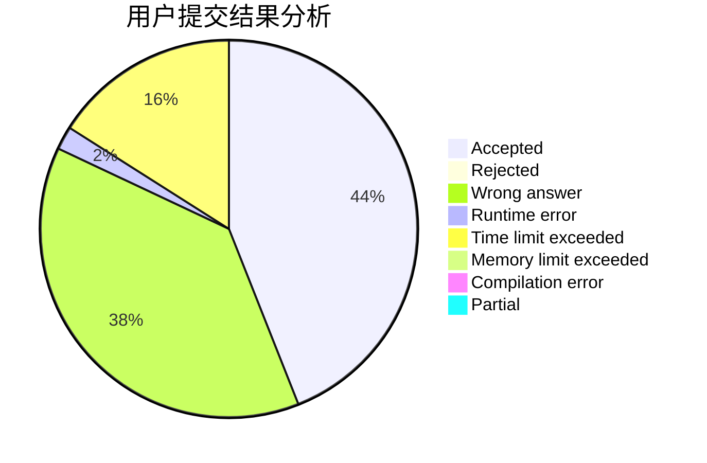
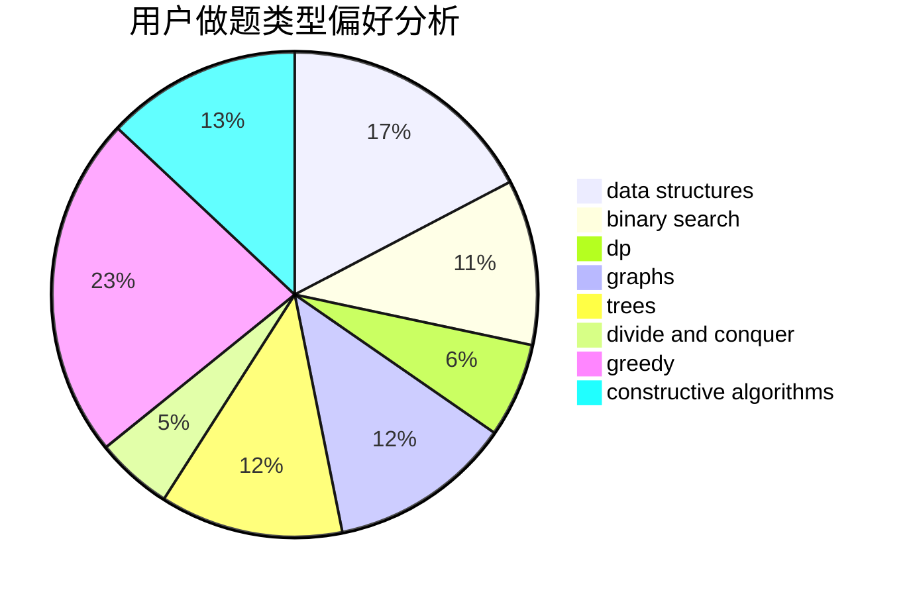
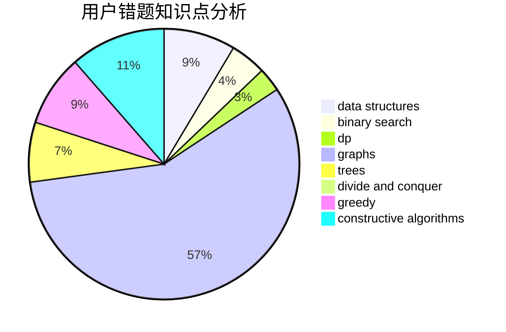

# ET2819

<!-- tabs:start -->

#### **用户提交结果分析**

#### **用户做题类型偏好分析**

#### **用户错题知识点分析**

<!-- tabs:end -->
# 推荐题目
[1392B](https://codeforces.com/contest/1392/problem/B)		implementation,
                        math		  
[1458A](https://codeforces.com/contest/1458/problem/A)		math,
                        number theory		  
[1433A](https://codeforces.com/contest/1433/problem/A)		implementation,
                        math		  
[1456C](https://codeforces.com/contest/1456/problem/C)		dsu,graphs,sortings,trees		  
[1444B](https://codeforces.com/contest/1444/problem/B)		combinatorics,
                        math,
                        sortings		  
[776E](https://codeforces.com/contest/776/problem/E)		math,
                        number theory		  
[23B](https://codeforces.com/contest/23/problem/B)		constructive algorithms,
                        graphs,
                        math		  
[366D](https://codeforces.com/contest/366/problem/D)		binary search,
                        data structures,
                        dfs and similar,
                        dsu,
                        shortest paths,
                        two pointers		  
[819D](https://codeforces.com/contest/819/problem/D)		number theory		  
[1380D](https://codeforces.com/contest/1380/problem/D)		constructive algorithms,
                        greedy,
                        implementation,
                        math,
                        two pointers		  
