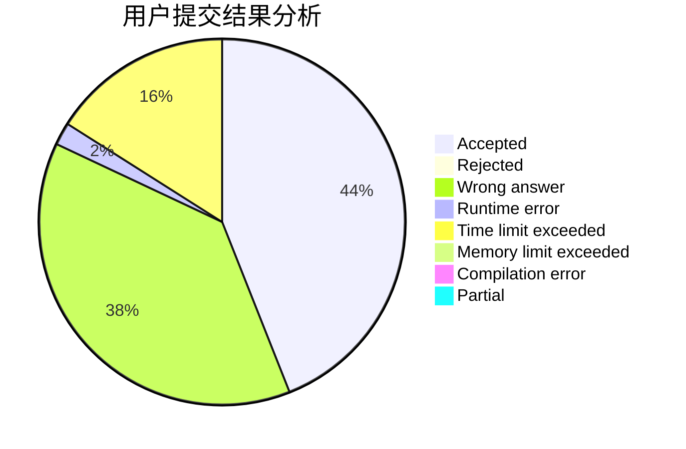
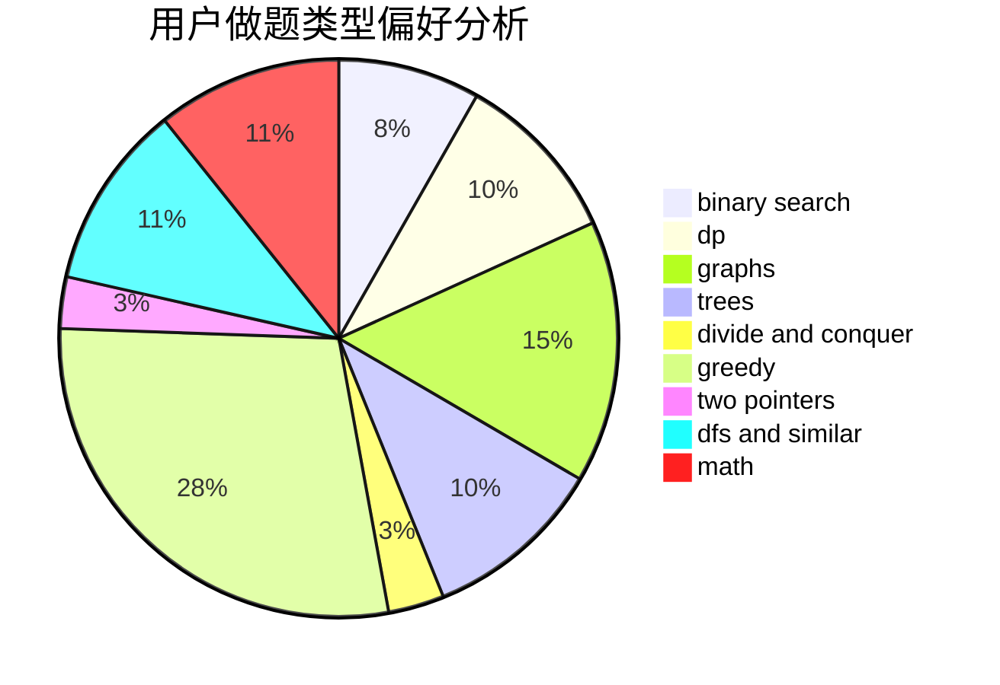

# ET2819

<!-- tabs:start -->

#### **用户提交结果分析**

#### **用户做题类型偏好分析**

<!-- tabs:end -->
# 推荐题目
[1392B](https://codeforces.com/contest/1392/problem/B)
[1458A](https://codeforces.com/contest/1458/problem/A)
[1433A](https://codeforces.com/contest/1433/problem/A)
[1456C](https://codeforces.com/contest/1456/problem/C)
[1444B](https://codeforces.com/contest/1444/problem/B)
[776E](https://codeforces.com/contest/776/problem/E)
[23B](https://codeforces.com/contest/23/problem/B)
[366D](https://codeforces.com/contest/366/problem/D)
[819D](https://codeforces.com/contest/819/problem/D)
[1380D](https://codeforces.com/contest/1380/problem/D)
