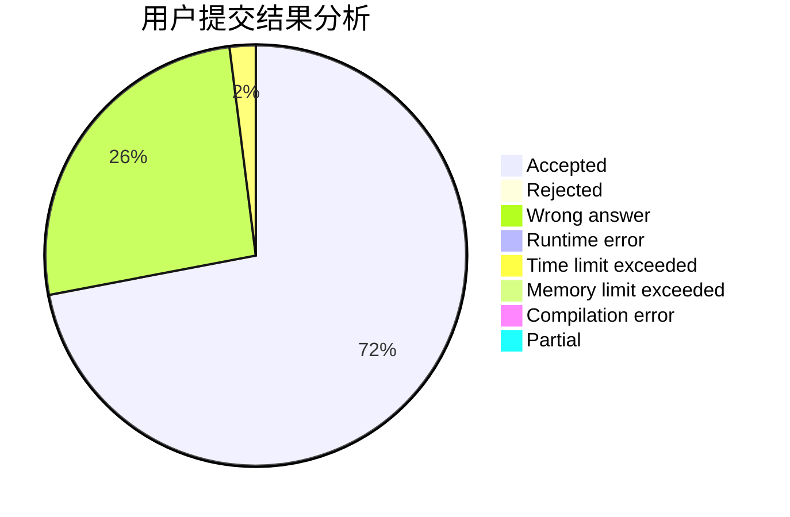
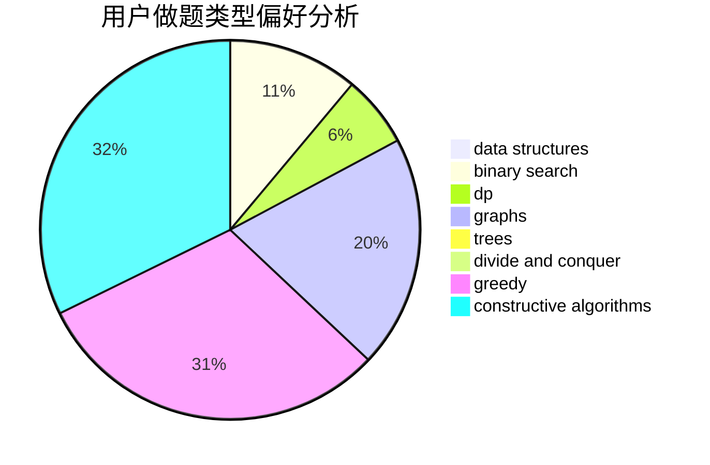
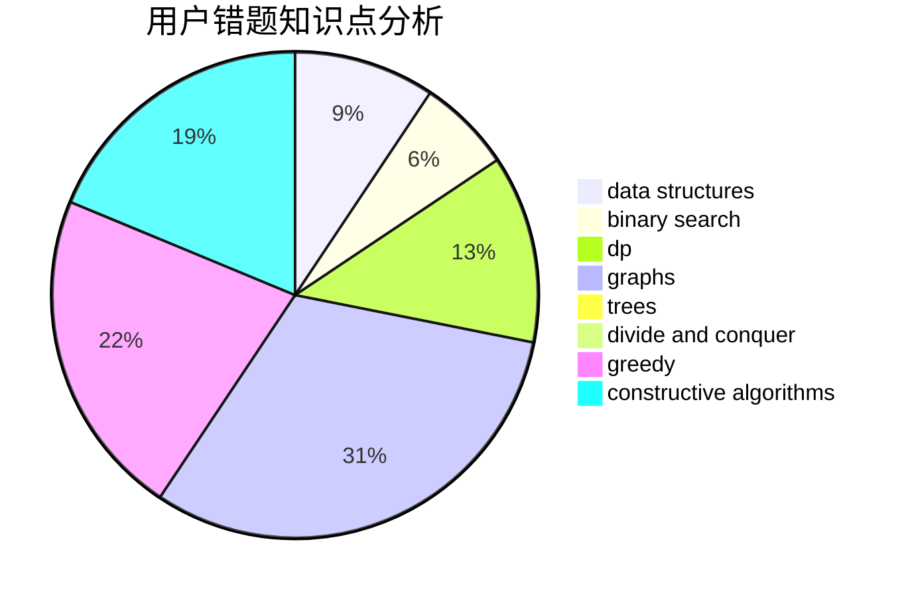

# ETK.

<!-- tabs:start -->

#### **用户提交结果分析**

#### **用户做题类型偏好分析**

#### **用户错题知识点分析**

<!-- tabs:end -->
# 推荐题目
[1152F2](https://codeforces.com/contest/1152F/problem/2)		bitmasks,
                        dp,
                        matrices		  
[1220B](https://codeforces.com/contest/1220/problem/B)		math,
                        number theory		  
[424B](https://codeforces.com/contest/424/problem/B)		binary search,
                        greedy,
                        implementation,
                        sortings		  
[1376B2](https://codeforces.com/contest/1376B/problem/2)		dsu,graphs,sortings,trees		  
[558A](https://codeforces.com/contest/558/problem/A)		brute force,
                        implementation,
                        sortings		  
[706C](https://codeforces.com/contest/706/problem/C)		dp,
                        strings		  
[121D](https://codeforces.com/contest/121/problem/D)		binary search,
                        implementation,
                        two pointers		  
[803G](https://codeforces.com/contest/803/problem/G)		data structures		  
[1078B](https://codeforces.com/contest/1078/problem/B)		dsu,graphs,sortings,trees		  
[576A](https://codeforces.com/contest/576/problem/A)		math,
                        number theory		  
