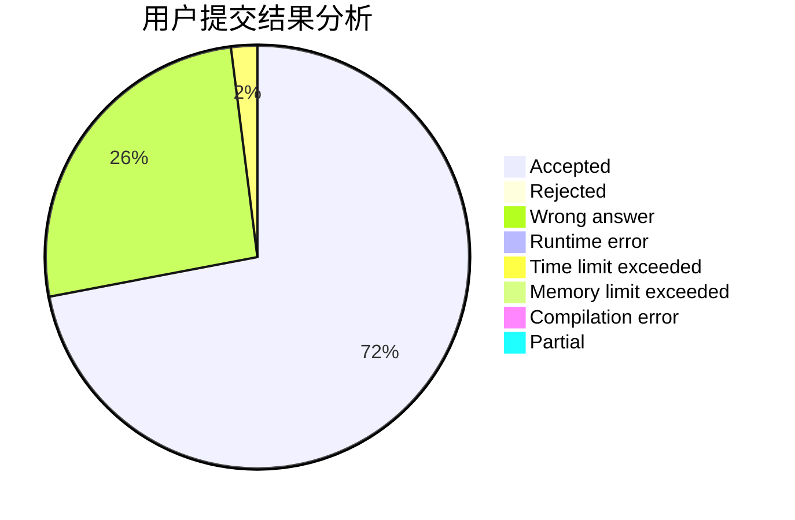
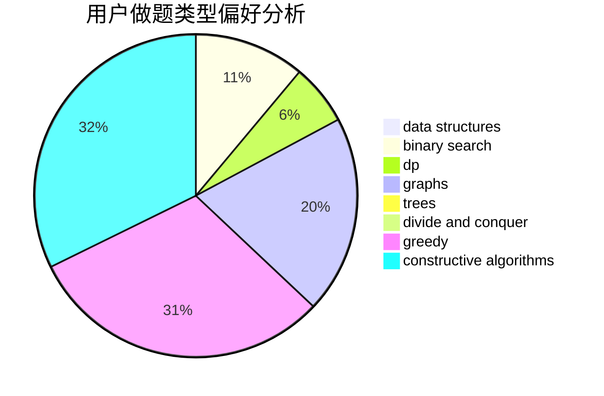
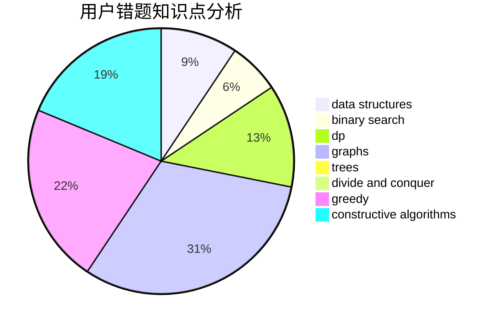

# ETK.
<!-- tabs:start -->
#### **用户提交结果分析**

#### **用户做题类型偏好分析**

#### **用户错题知识点分析**

<!-- tabs:end -->
# 推荐题目
[Multiplication Table](http://codeforces.com/problemset/problem/1220/B)		math,
                        number theory		  
[Lala Land and Apple Trees](http://codeforces.com/problemset/problem/558/A)		brute force,
                        implementation,
                        sortings		  
[Megacity](http://codeforces.com/problemset/problem/424/B)		binary search,
                        greedy,
                        implementation,
                        sortings		  
[Maximal Independent Set](https://codeforces.com/contest/1376/problem/B2)		nan		  
[Lucky Segments](http://codeforces.com/problemset/problem/121/D)		binary search,
                        implementation,
                        two pointers		  
[Neko Rules the Catniverse (Large Version)](http://codeforces.com/problemset/problem/1152/F2)		bitmasks,
                        dp,
                        matrices		  
[Hard problem](http://codeforces.com/problemset/problem/706/C)		dp,
                        strings		  
[The Unbearable Lightness of Weights](https://codeforces.com/contest/1078/problem/B)		dp,
                        math		  
[Chamber of Secrets](http://codeforces.com/problemset/problem/173/B)		dfs and similar,
                        shortest paths		  
[Au Pont Rouge](https://codeforces.com/contest/1314/problem/C)		binary search,
                        dp,
                        strings		  
<!-- tabs:start -->
#### **data structures**
[Multiplication Table](http://codeforces.com/problemset/problem/803/G)		data structures		  
[Lala Land and Apple Trees](http://codeforces.com/problemset/problem/519/E)		binary search,
                        data structures,
                        dfs and similar,
                        dp,
                        trees		  
[Megacity](http://codeforces.com/problemset/problem/1197/E)		binary search,
                        combinatorics,
                        data structures,
                        dp,
                        shortest paths,
                        sortings		  
[Maximal Independent Set](http://codeforces.com/problemset/problem/1490/E)		binary search,
                        data structures,
                        greedy		  
[Lucky Segments](http://codeforces.com/problemset/problem/1450/D)		binary search,
                        data structures,
                        greedy,
                        implementation,
                        two pointers		  
[Neko Rules the Catniverse (Large Version)](http://codeforces.com/problemset/problem/1492/C)		binary search,
                        data structures,
                        dp,
                        greedy,
                        two pointers		  
[Hard problem](http://codeforces.com/problemset/problem/1490/G)		binary search,
                        data structures,
                        math		  
[The Unbearable Lightness of Weights](http://codeforces.com/problemset/problem/1479/D)		binary search,
                        bitmasks,
                        brute force,
                        data structures,
                        probabilities,
                        trees		  
[Chamber of Secrets](http://codeforces.com/problemset/problem/1497/A)		brute force,
                        data structures,
                        greedy,
                        sortings		  
[Au Pont Rouge](http://codeforces.com/problemset/problem/1491/C)		brute force,
                        data structures,
                        dp,
                        greedy,
                        implementation		  
#### **binary search**
[Multiplication Table](http://codeforces.com/problemset/problem/424/B)		binary search,
                        greedy,
                        implementation,
                        sortings		  
[Lala Land and Apple Trees](http://codeforces.com/problemset/problem/121/D)		binary search,
                        implementation,
                        two pointers		  
[Megacity](https://codeforces.com/contest/1314/problem/C)		binary search,
                        dp,
                        strings		  
[Maximal Independent Set](http://codeforces.com/problemset/problem/1098/E)		binary search,
                        implementation,
                        math,
                        number theory		  
[Lucky Segments](http://codeforces.com/problemset/problem/519/E)		binary search,
                        data structures,
                        dfs and similar,
                        dp,
                        trees		  
[Neko Rules the Catniverse (Large Version)](http://codeforces.com/problemset/problem/1197/E)		binary search,
                        combinatorics,
                        data structures,
                        dp,
                        shortest paths,
                        sortings		  
[Hard problem](https://codeforces.com/contest/1471/problem/C)		binary search,
                        dp,
                        greedy,
                        sortings,
                        two pointers		  
[The Unbearable Lightness of Weights](http://codeforces.com/problemset/problem/1490/E)		binary search,
                        data structures,
                        greedy		  
[Chamber of Secrets](http://codeforces.com/problemset/problem/1450/D)		binary search,
                        data structures,
                        greedy,
                        implementation,
                        two pointers		  
[Au Pont Rouge](http://codeforces.com/problemset/problem/1492/C)		binary search,
                        data structures,
                        dp,
                        greedy,
                        two pointers		  
#### **dp**
[Multiplication Table](http://codeforces.com/problemset/problem/1152/F2)		bitmasks,
                        dp,
                        matrices		  
[Lala Land and Apple Trees](http://codeforces.com/problemset/problem/706/C)		dp,
                        strings		  
[Megacity](https://codeforces.com/contest/1078/problem/B)		dp,
                        math		  
[Maximal Independent Set](https://codeforces.com/contest/1314/problem/C)		binary search,
                        dp,
                        strings		  
[Lucky Segments](https://codeforces.com/contest/477/problem/C)		dp,
                        strings		  
[Neko Rules the Catniverse (Large Version)](http://codeforces.com/problemset/problem/1450/G)		bitmasks,
                        dp,
                        trees		  
[Hard problem](http://codeforces.com/problemset/problem/519/E)		binary search,
                        data structures,
                        dfs and similar,
                        dp,
                        trees		  
[The Unbearable Lightness of Weights](http://codeforces.com/problemset/problem/1197/E)		binary search,
                        combinatorics,
                        data structures,
                        dp,
                        shortest paths,
                        sortings		  
[Chamber of Secrets](https://codeforces.com/contest/1471/problem/C)		binary search,
                        dp,
                        greedy,
                        sortings,
                        two pointers		  
[Au Pont Rouge](http://codeforces.com/problemset/problem/1510/H)		dp		  
#### **graph**
[Multiplication Table](http://codeforces.com/problemset/problem/1487/C)		brute force,
                        constructive algorithms,
                        dfs and similar,
                        graphs,
                        greedy,
                        implementation,
                        math		  
[Lala Land and Apple Trees](http://codeforces.com/problemset/problem/1437/C)		dp,
                        flows,
                        graph matchings,
                        greedy,
                        math,
                        sortings		  
[Megacity](http://codeforces.com/problemset/problem/1470/D)		constructive algorithms,
                        dfs and similar,
                        graph matchings,
                        graphs,
                        greedy		  
[Maximal Independent Set](http://codeforces.com/problemset/problem/1476/C)		dp,
                        graphs,
                        greedy		  
[Lucky Segments](http://codeforces.com/problemset/problem/1304/D)		constructive algorithms,
                        graphs,
                        greedy,
                        two pointers		  
[Neko Rules the Catniverse (Large Version)](http://codeforces.com/problemset/problem/1475/C)		combinatorics,
                        graphs,
                        math		  
[Hard problem](http://codeforces.com/problemset/problem/553/E)		dp,
                        fft,
                        graphs,
                        math,
                        probabilities		  
[The Unbearable Lightness of Weights](http://codeforces.com/problemset/problem/1495/C)		constructive algorithms,
                        graphs		  
[Chamber of Secrets](http://codeforces.com/problemset/problem/1510/K)		brute force,
                        graphs,
                        implementation		  
[Au Pont Rouge](http://codeforces.com/problemset/problem/1511/D)		brute force,
                        constructive algorithms,
                        graphs,
                        greedy,
                        strings		  
#### **trees**
[Multiplication Table](http://codeforces.com/problemset/problem/1450/G)		bitmasks,
                        dp,
                        trees		  
[Lala Land and Apple Trees](http://codeforces.com/problemset/problem/519/E)		binary search,
                        data structures,
                        dfs and similar,
                        dp,
                        trees		  
[Megacity](http://codeforces.com/problemset/problem/1479/D)		binary search,
                        bitmasks,
                        brute force,
                        data structures,
                        probabilities,
                        trees		  
[Maximal Independent Set](http://codeforces.com/problemset/problem/1511/C)		brute force,
                        data structures,
                        implementation,
                        trees		  
[Lucky Segments](http://codeforces.com/problemset/problem/1499/F)		combinatorics,
                        dfs and similar,
                        dp,
                        trees		  
[Neko Rules the Catniverse (Large Version)](http://codeforces.com/problemset/problem/1491/E)		brute force,
                        dfs and similar,
                        divide and conquer,
                        number theory,
                        trees		  
[Hard problem](http://codeforces.com/problemset/problem/1466/D)		data structures,
                        greedy,
                        sortings,
                        trees		  
[The Unbearable Lightness of Weights](http://codeforces.com/problemset/problem/1495/D)		combinatorics,
                        dfs and similar,
                        graphs,
                        math,
                        shortest paths,
                        trees		  
[Chamber of Secrets](http://codeforces.com/problemset/problem/1303/G)		data structures,
                        divide and conquer,
                        geometry,
                        trees		  
[Au Pont Rouge](http://codeforces.com/problemset/problem/1454/E)		combinatorics,
                        dfs and similar,
                        graphs,
                        trees		  
#### **divide and conquer**
[Multiplication Table](http://codeforces.com/problemset/problem/1461/D)		binary search,
                        brute force,
                        data structures,
                        divide and conquer,
                        implementation,
                        sortings		  
[Lala Land and Apple Trees](http://codeforces.com/problemset/problem/1466/G)		combinatorics,
                        divide and conquer,
                        hashing,
                        math,
                        string suffix structures,
                        strings		  
[Megacity](http://codeforces.com/problemset/problem/1490/D)		dfs and similar,
                        divide and conquer,
                        implementation		  
[Maximal Independent Set](https://codeforces.com/contest/1483/problem/C)		data structures,
                        divide and conquer,
                        dp		  
[Lucky Segments](http://codeforces.com/problemset/problem/1491/E)		brute force,
                        dfs and similar,
                        divide and conquer,
                        number theory,
                        trees		  
[Neko Rules the Catniverse (Large Version)](http://codeforces.com/problemset/problem/1303/G)		data structures,
                        divide and conquer,
                        geometry,
                        trees		  
[Hard problem](http://codeforces.com/problemset/problem/1494/D)		constructive algorithms,
                        data structures,
                        dfs and similar,
                        divide and conquer,
                        dsu,
                        greedy,
                        sortings,
                        trees		  
[The Unbearable Lightness of Weights](http://codeforces.com/problemset/problem/1482/E)		data structures,
                        divide and conquer,
                        dp		  
[Chamber of Secrets](http://codeforces.com/problemset/problem/566/C)		dfs and similar,
                        divide and conquer,
                        trees		  
[Au Pont Rouge](http://codeforces.com/problemset/problem/1428/F)		binary search,
                        data structures,
                        divide and conquer,
                        dp,
                        two pointers		  
#### **greedy**
[Multiplication Table](http://codeforces.com/problemset/problem/424/B)		binary search,
                        greedy,
                        implementation,
                        sortings		  
[Lala Land and Apple Trees](http://codeforces.com/problemset/problem/1409/D)		greedy,
                        math		  
[Megacity](http://codeforces.com/problemset/problem/1205/A)		constructive algorithms,
                        greedy,
                        math		  
[Maximal Independent Set](http://codeforces.com/problemset/problem/804/A)		constructive algorithms,
                        greedy,
                        math		  
[Lucky Segments](https://codeforces.com/contest/1471/problem/C)		binary search,
                        dp,
                        greedy,
                        sortings,
                        two pointers		  
[Neko Rules the Catniverse (Large Version)](http://codeforces.com/problemset/problem/1490/E)		binary search,
                        data structures,
                        greedy		  
[Hard problem](https://codeforces.com/contest/1330/problem/C)		constructive algorithms,
                        greedy,
                        implementation,
                        math		  
[The Unbearable Lightness of Weights](http://codeforces.com/problemset/problem/1450/D)		binary search,
                        data structures,
                        greedy,
                        implementation,
                        two pointers		  
[Chamber of Secrets](http://codeforces.com/problemset/problem/1428/D)		constructive algorithms,
                        greedy,
                        implementation		  
[Au Pont Rouge](http://codeforces.com/problemset/problem/1492/C)		binary search,
                        data structures,
                        dp,
                        greedy,
                        two pointers		  
#### **constructive algorithms**
[Multiplication Table](http://codeforces.com/problemset/problem/1205/A)		constructive algorithms,
                        greedy,
                        math		  
[Lala Land and Apple Trees](http://codeforces.com/problemset/problem/1407/A)		constructive algorithms,
                        math		  
[Megacity](http://codeforces.com/problemset/problem/804/A)		constructive algorithms,
                        greedy,
                        math		  
[Maximal Independent Set](http://codeforces.com/problemset/problem/1451/F)		constructive algorithms,
                        games		  
[Lucky Segments](https://codeforces.com/contest/1330/problem/C)		constructive algorithms,
                        greedy,
                        implementation,
                        math		  
[Neko Rules the Catniverse (Large Version)](http://codeforces.com/problemset/problem/1428/D)		constructive algorithms,
                        greedy,
                        implementation		  
[Hard problem](http://codeforces.com/problemset/problem/1493/A)		constructive algorithms,
                        greedy		  
[The Unbearable Lightness of Weights](http://codeforces.com/problemset/problem/1463/D)		binary search,
                        constructive algorithms,
                        greedy,
                        two pointers		  
[Chamber of Secrets](https://codeforces.com/contest/1456/problem/B)		bitmasks,
                        brute force,
                        constructive algorithms		  
[Au Pont Rouge](http://codeforces.com/problemset/problem/1492/D)		bitmasks,
                        constructive algorithms,
                        greedy,
                        math		  
#### **sortings**
[Multiplication Table](http://codeforces.com/problemset/problem/558/A)		brute force,
                        implementation,
                        sortings		  
[Lala Land and Apple Trees](http://codeforces.com/problemset/problem/424/B)		binary search,
                        greedy,
                        implementation,
                        sortings		  
[Megacity](http://codeforces.com/problemset/problem/1197/E)		binary search,
                        combinatorics,
                        data structures,
                        dp,
                        shortest paths,
                        sortings		  
[Maximal Independent Set](https://codeforces.com/contest/1471/problem/C)		binary search,
                        dp,
                        greedy,
                        sortings,
                        two pointers		  
[Lucky Segments](https://codeforces.com/contest/1496/problem/C)		geometry,
                        greedy,
                        math,
                        sortings		  
[Neko Rules the Catniverse (Large Version)](http://codeforces.com/problemset/problem/1495/A)		geometry,
                        greedy,
                        math,
                        sortings		  
[Hard problem](http://codeforces.com/problemset/problem/1497/A)		brute force,
                        data structures,
                        greedy,
                        sortings		  
[The Unbearable Lightness of Weights](http://codeforces.com/problemset/problem/1427/A)		math,
                        sortings		  
[Chamber of Secrets](http://codeforces.com/problemset/problem/1461/D)		binary search,
                        brute force,
                        data structures,
                        divide and conquer,
                        implementation,
                        sortings		  
[Au Pont Rouge](http://codeforces.com/problemset/problem/1437/C)		dp,
                        flows,
                        graph matchings,
                        greedy,
                        math,
                        sortings		  
<!-- tabs:end -->
