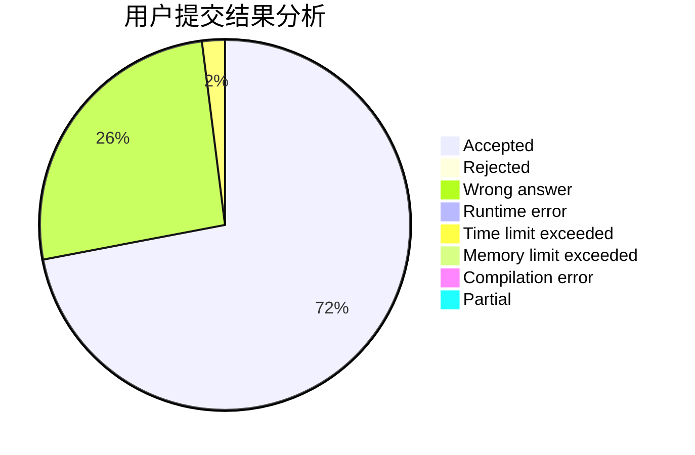
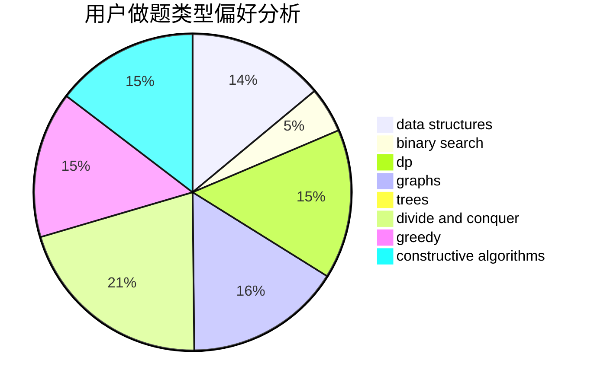
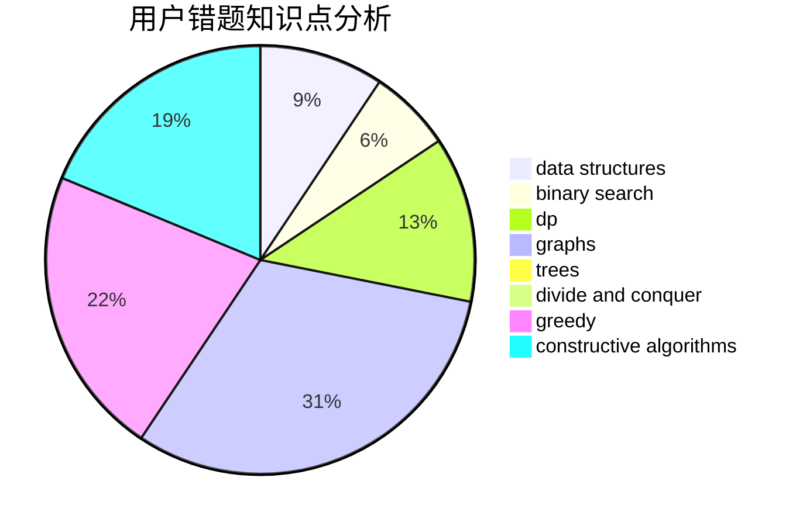

# ETK.

<!-- tabs:start -->

#### **用户提交结果分析**

#### **用户做题类型偏好分析**

#### **用户错题知识点分析**

<!-- tabs:end -->
# 推荐题目
[1154G](https://codeforces.com/contest/1154/problem/G)		brute force,
                        greedy,
                        math,
                        number theory		  
[1228B](https://codeforces.com/contest/1228/problem/B)		implementation,
                        math		  
[447A](https://codeforces.com/contest/447/problem/A)		implementation		  
[1385F](https://codeforces.com/contest/1385/problem/F)		data structures,
                        greedy,
                        implementation,
                        trees		  
[581A](https://codeforces.com/contest/581/problem/A)		implementation,
                        math		  
[724G](https://codeforces.com/contest/724/problem/G)		bitmasks,
                        graphs,
                        math,
                        number theory,
                        trees		  
[1227B](https://codeforces.com/contest/1227/problem/B)		constructive algorithms		  
[81C](https://codeforces.com/contest/81/problem/C)		greedy,
                        math,
                        sortings		  
[1078E](https://codeforces.com/contest/1078/problem/E)		constructive algorithms		  
[598B](https://codeforces.com/contest/598/problem/B)		implementation,
                        strings		  
